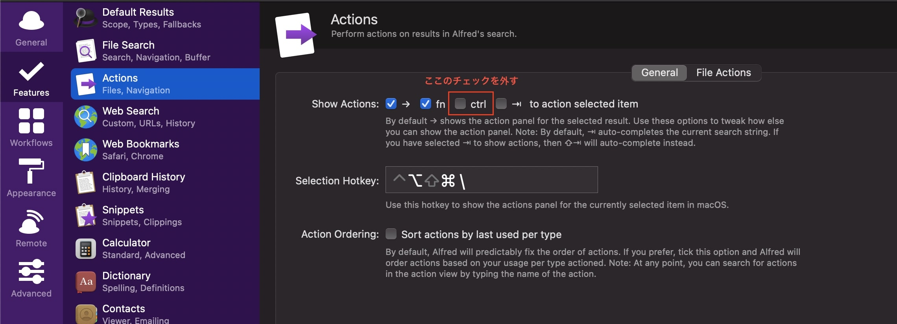

## Problem

I use Emacs key bindings in my daily work. In Alfred's search results, when I press Ctrl+N to move the cursor down, it selects a package instead of moving the cursor. This was a problem for me.

## Solution

In Alfred settings, go to Features > Actions > Show Actions and uncheck the "ctrl" checkbox. This fixes the problem.

