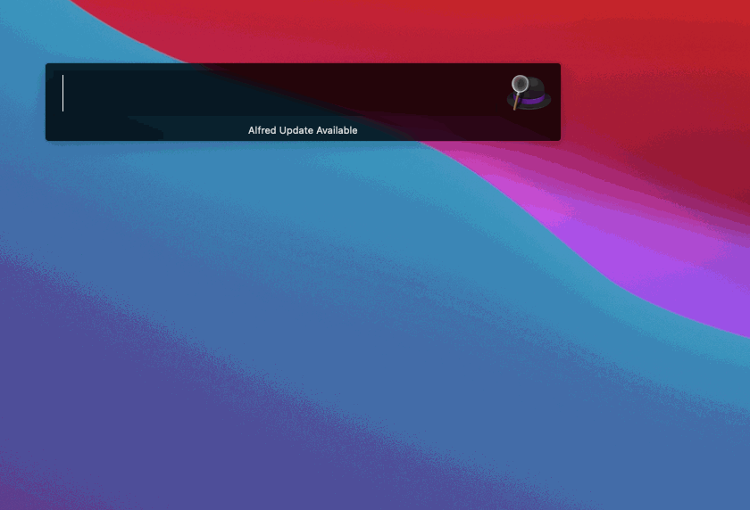
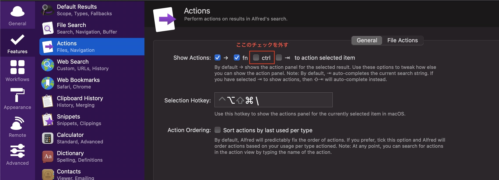

## 問題
自分は普段 Emacs キーバインドを利用しているのですが、Alfred の検索結果でカーソル移動をするために Ctrl + N をタイプするとカーソル移動せずにパッケージが選択される問題に悩まされていました。

## 解決策
Alfredの設定で Features > Actions > Show Actions で ctrl のチェックボックスを外せば問題は解消しました。

