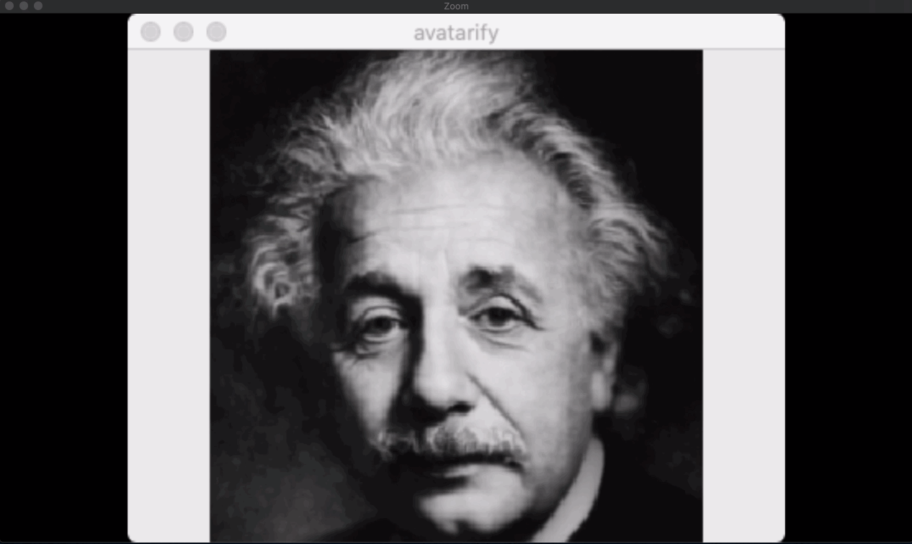

[alievk/avatarify: Avatars for Zoom and Skype](https://github.com/alievk/avatarify)

This article describes the setup steps for macOS.
The steps are different depending on your OS. For Linux or Windows, please check the README.md in the repository.

**Environment**
OS: MacOS Catalina 10.15.3
Device: MacBook Pro 2017
Processor: 2.3 GHz Dual-Core Intel Core i5
Memory: 16 GB 2133 MHz LPDDR3
Graphics: Intel Iris Plus Graphics 640 1536 MB
GPU: None

## Installation

### Install miniconda3

[Installing on macOS — conda documentation](https://docs.conda.io/projects/conda/en/latest/user-guide/install/macos.html#installing-on-macos)

Download the installer from [Miniconda — Conda documentation](https://docs.conda.io/en/latest/miniconda.html#macosx-installers).

```bash
# An interactive shell will start. Follow the steps to install.
$ zsh Miniconda3-latest-MacOSX-x86_64.sh
$ export PATH="$HOME/miniconda3/bin:$PATH"
```

### Clone and install the avatarify repository

```bash
$ git clone https://github.com/alievk/avatarify.git
$ cd avatarify
$ zsh scripts/install_mac.sh
$ conda activate avatarify
```

### Download the pre-trained model vox-adv-cpk.pth.tar

Download it from [Google Drive](https://drive.google.com/file/d/1L8P-hpBhZi8Q_1vP2KlQ4N6dvlzpYBvZ/view) and place it in the avatarify directory.
Note: Do not extract the tar file. Place it as is.

### Download CamTwist

Download it from [here](http://camtwiststudio.com/download/).

## Running

### Start avatarify

If you get a "Cannot open camera" error, change CAMID in scripts/settings.sh from 0 to 1, 2, etc.
In my case, changing it to 1 made it work correctly.

```bash
$ zsh run_mac.sh
```

### Start CamTwist

2.1 Select "Desktop+" and click "Select"
2.2 In the Settings section, select "Confine to Application Window" and choose "Python(avatarify)" from the dropdown

In the window showing the avatar, press number keys 1, 2, etc. to switch between avatars.

### Enable virtual camera in Zoom

Zoom v4.6.8 and later on Mac does not allow virtual cameras. Remove the library signature to enable virtual camera use.

```bash
$ codesign --remove-signature /Applications/zoom.us.app
```

### Start Zoom

4.1 In Zoom settings, go to Settings > Camera > CamTwist



Without a GPU, performance is about ~1 FPS, so it does run but is not fun at all. 😢
