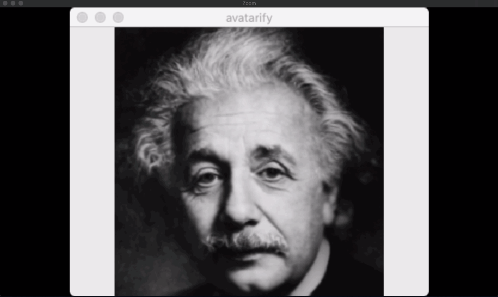

[alievk/avatarify: Avatars for Zoom and Skype](https://github.com/alievk/avatarify)

この記事は MacOS でのセットアップ方法を記述しています。  
環境でセットアップ手順が異なるので、LinuxやWindowsの場合はリポジトリのREADME.mdを参照してください。

【環境】  
OS: MacOS Catalina 10.15.3  
端末: MacBook Pro 2017  
プロセッサ: 2.3 GHz デュアルコアIntel Core i5  
メモリ: 16 GB 2133 MHz LPDDR3  
グラッフィックス: Intel Iris Plus Graphics 640 1536 MB  
GPU: なし

## インストール

### miniconda3 をインストール  
[Installing on macOS — conda 4\.8\.3\.post14\+07a113d8 documentation](https://docs.conda.io/projects/conda/en/latest/user-guide/install/macos.html#installing-on-macos)

[Miniconda — Conda documentation](https://docs.conda.io/en/latest/miniconda.html#macosx-installers) よりインストーラーをダウンロードする。  

```bash
# 対話シェルが起動するので、内容に沿ってインストールを進める。
$ zsh Miniconda3-latest-MacOSX-x86_64.sh
$ export PATH="$HOME/miniconda3/bin:$PATH"
```

### avatarify のリポジトリをクローンしてインストール

```bash
$ git clone https://github.com/alievk/avatarify.git
$ cd avatarify
$ zsh scripts/install_mac.sh
$ conda activate avatarify
```

### 学習済みモデル vox\-adv\-cpk\.pth\.tar をダウンロード  
[Google ドライブ](https://drive.google.com/file/d/1L8P-hpBhZi8Q_1vP2KlQ4N6dvlzpYBvZ/view)からダウンロードして avatarify ディレクトリ配置する。  
※ tarファイルは解凍せずにそのまま配置する

### CamTwist をダウンロード  
[ここ](http://camtwiststudio.com/download/)からダウンロードする

## 実行

### avatify を起動  
"Cannot open camera" のエラーが発生したら、scripts/settings.sh の CAMID を 0 から 1, 2, ... に変更する。  
自分の場合は 1 に変更したら、正常に起動しました。

```bash
$ zsh run_mac.sh
```

### CamTwistを起動

2.1 「Desktop+」 を選んで Select をクリック  
2.2 Settingsの項目内で 「Confine to Application Window」を選択してセレクトボックスで「Python(avatarify)」を選ぶ  

アバターが表示されたウィンドウで 1, 2, ... と数字キーを押せばアバターの切替えができます。

### Zoomdでバーチャルカメラを利用できるようにする  
Mac の Zoom v4.6.8 以降のバージョンでは仮想カメラが使えないようになっているので、ライブラリ署名を削除して仮想カメラを利用できるようにする。

```bash
$ codesign --remove-signature /Applications/zoom.us.app
```

### Zoomを起動
4.1 Zoom で 設定 > カメラ > CamTwist を選択



GPUが無いと ~1FPS しかパフォーマンスが出ないので、動いてはいるのですが全く楽しめないです。😢  
