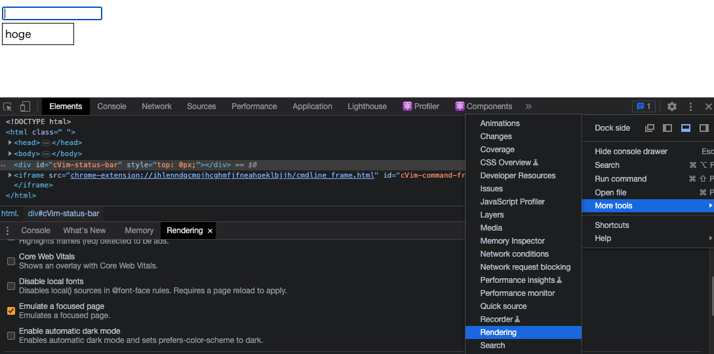

I got stuck debugging a popup that only shows when an element is focused in React. Here is the solution.

## The problem

Consider a situation where you want to debug the CSS of a popup that only shows when an input element is focused, like this:

<iframe width="100%" height="400px" src="https://stackblitz.com/edit/react-ts-gnwa6a?embed=1&file=App.tsx&view=preview"></iframe>

When the popup is visible and you click on a DOM element in DevTools, the focus moves away and the popup disappears.

In React, DOM elements are often not rendered when a certain state is inactive. In this case, the popup's DOM element disappears from the DOM tree, making it impossible to check the CSS.

## Enable "Emulate a focused page"

You can fix this problem by enabling More tools > Rendering > Emulate a focused page.

With this setting enabled, the entire page stays in a focused state. So even when you click in DevTools, the popup remains visible and you can debug it.

