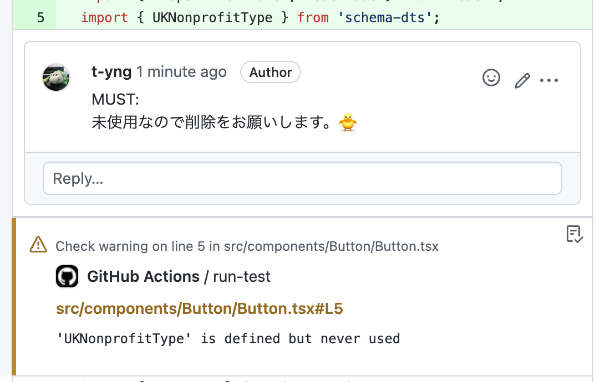

This article is for Day 2 of the [YAMAP Engineer Advent Calendar 2022](https://qiita.com/advent-calendar/2022/yamap-engineers).

## Conclusion

You can fix this problem by running ESLint with `--max-warnings=0` in a commit hook.

Below is a real example of this problem and sample code for the commit hook.

## The problem: pull requests created with unresolved ESLint warnings

When ESLint is set up, developers often create pull requests with ESLint warnings they forgot to fix. GitHub automatically adds warning messages as comments on the code diff in CI, but developers often don't look at the diff of their own pull request. So they don't notice the automatic comments, and the reviewer ends up leaving the same comments again — wasted work.



## Sometimes warnings are missed even in review

If the reviewer catches it, the warning gets removed. But sometimes reviewers miss it too, the pull request gets merged as-is, and suddenly there are several warnings left in the codebase. GitHub adds warning comments one after another at the end of the diff, so the diff page grows longer. This can make you feel like there are more changes than there really are, and leaves developers with a small nagging feeling.

This kind of "not harmful but slightly annoying" state slowly hurts developer morale and leads to repeated wasted work.

1. Warnings are forgotten and the PR is merged
2. Several ESLint warnings accumulate
3. Someone notices and cleans up all the warnings
4. Back to step 1 (repeat)

## Use --max-warnings=0 to keep warnings at zero

ESLint has an option called `--max-warnings` that limits the maximum number of warnings. Running `eslint --max-warnings=0` makes ESLint fail if even one warning exists.

By running ESLint with `--max-warnings=0` in a commit hook, commits with warnings are automatically blocked. This prevents pull requests from being created with any warnings.

After introducing this system, ESLint warnings in pull requests — which were happening regularly in our team — dropped to zero completely. 🎉

```json
"lint-staged": {
  "*.{js,jsx,ts,tsx}": [
    "eslint --max-warnings=0"
  ]
},
```
