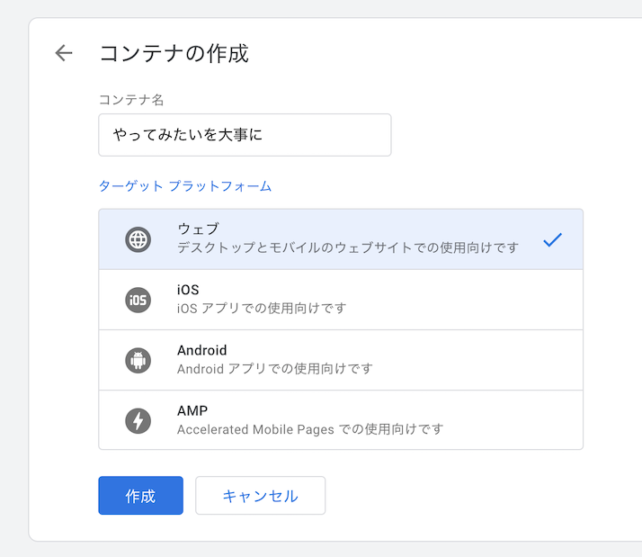
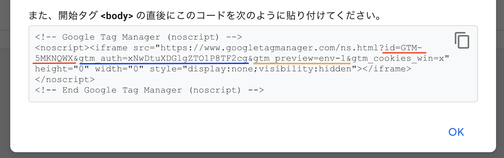
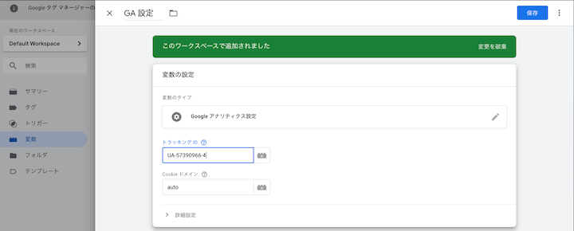
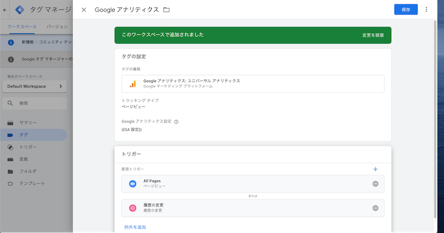

I added Google Analytics to my blog for access analysis.
Since releasing every time I add a new event tracking would be annoying, I set up Google Tag Manager so I can change analytics settings without a new release.

Here is how to set up Google Tag Manager in a Gatsby blog.

## Create a Google Tag Manager container

First, create a container in Google Tag Manager.



## Set up Google Analytics

Go to Admin > +Create Property to create a new property for tracking.

## Add the plugin

### gatsby-plugin-google-tagmanager

Use [gatsby-plugin-google-tagmanager](https://www.gatsbyjs.org/packages/gatsby-plugin-google-tagmanager/) to embed Google Tag Manager in the page.
(I couldn't figure out how to embed the `<script>` tag directly in `<head>`, so I used the official plugin.)

### Installation

```bash
$ yarn add gatsby-plugin-google-tagmanager
```

Add the plugin settings to `gatsby-config.js`.

```javascript
{
  resolve: `gatsby-plugin-google-tagmanager`,
  options: {
    id: `GTM-5MKNQWX`,

    // Include GTM in development.
    // Defaults to false meaning GTM will only be loaded in production.
    includeInDevelopment: false,

    // datalayer to be set before GTM is loaded
    // should be an object or a function that is executed in the browser
    // Defaults to null
    defaultDataLayer: { platform: "gatsby" },

    // Specify optional GTM environment details.
    gtmAuth: "xNwDtuXDGlgZTO1P8TF2cg",
    gtmPreview: "env-1",
    dataLayerName: 'dataLayer',
  }
}
```

You can find the values from Admin > Live > Get code in the embed code.



## Google Tag Manager settings

### Create a trigger

Since GatsbyJS is a SPA running with CSR, create a trigger based on history changes.

### Create a variable

Create a Google Analytics Settings variable with the GA tracking ID.



### Create a tag

Create a tag to send page views to Google Analytics.

Set the Google Analytics Settings to the variable created above, and set two triggers: "Page View" and "History Change."

"Page View" is also included to trigger on the initial page load.



## Check before release

You can use Google Tag Manager's preview mode to check that the embedding works correctly on your local machine.

Click Workspace > Preview to enter preview mode, then open the page locally.

At that time, change the following setting to `true`.

```javascript
// Include GTM in development.
// Defaults to false meaning GTM will only be loaded in production.
includeInDevelopment: true,
```

After entering preview mode, start the local server and open the page.

If the tag is embedded correctly, you will see the Google Tag Manager preview panel at the bottom of the locally displayed page.

## Release

Once all settings are complete, publish the changes in Google Tag Manager and deploy the plugin addition to the production environment. Setup is complete.

## Bonus

To exclude my own access from tracking, I use the [Google Analytics Opt-out Browser Add-on (by Google)](https://chrome.google.com/webstore/detail/google-analytics-opt-out/fllaojicojecljbmefodhfapmkghcbnh).
The description says "works with ga.js..." but it also worked correctly when going through Google Tag Manager.
