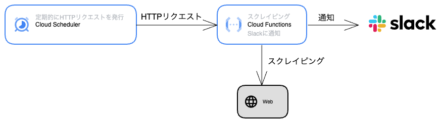

I had the chance to join the G.I.G program at my company. As a learning exercise, I built a bot on Google Cloud that regularly scrapes the web and sends results to Slack.

## Overall Architecture

A Cloud Functions HTTP function runs the scraping and sends the results to Slack. A Cloud Scheduler job sends regular HTTP requests to the Cloud Functions function, which creates the bot.



## Implement the Scraping

First, implement the code that runs the scraping locally.
I use [axios](https://axios-http.com/) and [cheerio](https://cheerio.js.org/) to fetch and parse HTML.

```javascript
const cheerio = require('cheerio');
const axios = require('axios');

const scrape = async () => {
  const res = await axios.get(
    'https://xxxx/xxxx'
  );
  const $ = cheerio.load(res.data);

  // (omitted)

  return 'Scraping result';
};

const main = async () => {
  const result = await scrape();
  console.log(result);
}

main();
```

## Implement the Slack Notification

Next, implement the part that sends the scraping result to Slack.
To send messages to Slack, generate a Webhook URL using [Incoming Webhook](https://slack.com/intl/en-jp/help/articles/115005265063-Incoming-webhooks-for-Slack) and send a POST request.

```javascript
const notifyToSlack = (message) => {
  return axios.post(
    "https://hooks.slack.com/services/xxxxx/xxxxxx/xxxxx",
    {
      text: message,
    }
  );
}

const main = async () => {
  const result = await scrape();
  notifyToSlack(result);
}

main();
```

## Install the Google Cloud CLI

Before setting up Google Cloud, install the CLI tool for terminal operations.
I install it with Homebrew here, but any method works.

```shell
$ brew install --cask google-cloud-sdk
```

Login to authenticate so you can use the `gcloud` command to operate Google Cloud.

```shell
$ gcloud auth login
```

## Create a Project

Create a project in Google Cloud to build the services.

## Implement the Cloud Functions HTTP Handler

Now build the application on Google Cloud.
For details on Cloud Functions, see the [official guide](https://cloud.google.com/functions/docs/how-to).

To run a function in Cloud Functions, you need to register an HTTP request handler function using the [Functions Framework for Node.js](https://github.com/GoogleCloudPlatform/functions-framework-nodejs).

First, install `@google-cloud/functions-framework`.

```shell
$ yarn add @google-cloud/functions-framework
```

Then register the scraping and notification logic as an HTTP handler function.

```javascript
const functions = require("@google-cloud/functions-framework");
const cheerio = require("cheerio");

functions.http("checkReservation", async (_req, res) => {
  const result = await scrape();
  await notifyToSlack(result);
  res.send("ok");
});

// (omitted)
```

Before deploying, start a test server locally to check that the function runs.

```json
{
  "scripts": {
    "start": "functions-framework --target=checkReservation"
  }
}
```

```shell
$ yarn start
Serving function...
Function: checkReservation
Signature type: http
URL: http://localhost:8080/
```

Send an HTTP request and confirm that a message is sent to Slack.

```shell
# Run in another tab
$ curl http://localhost:8080/checkReservation
ok
```

## Deploy to Cloud Functions

See [Deploying Cloud Functions](https://cloud.google.com/functions/docs/deploy) in the official guide for details.

Run the `gcloud functions deploy` command to deploy the function.

```shell
$ gcloud functions deploy YOUR_FUNCTION_NAME \
[--gen2] \
--region=YOUR_REGION \
--runtime=YOUR_RUNTIME \
--source=YOUR_SOURCE_LOCATION \
--entry-point=YOUR_CODE_ENTRYPOINT \
TRIGGER_FLAGS
```

Since I want to trigger via HTTP request, I created this deploy command:
- `--gen2` specifies deploying to 2nd generation Cloud Functions
- `--trigger-http` triggers the function on HTTP requests
- `--allow-unauthenticated` allows calling the function without authentication. Cloud Functions requires authentication by default, so this flag is needed.

```shell
$ gcloud functions deploy reservation-notify \
  --gen2 
  --region=asia-northeast1 \
  --runtime=nodejs16 \
  --source=. \
  --entry-point=checkReservation \
  --trigger-http \
  --allow-unauthenticated \
  --project=reservation-notify
```

Register this as an npm script and run the deploy.

```json
{
  "scripts": {
    "deploy": "gcloud functions deploy reservation-notify --gen2 --region=asia-northeast1 --runtime=nodejs16 --source=. --entry-point=checkReservation --trigger-http --allow-unauthenticated --project=reservation-notify"
  }
}
```

```shell
$ yarn deploy
...
uri: https://reservation-vacancy-notify-xxxxxx.run.app
```

After a successful deploy, you can see the generated URL. Send an HTTP request to it.
If a message is sent to Slack, the deployment was successful.

```shell
$ curl https://reservation-vacancy-notify-xxxxxx.run.app
ok
```

## Run Regularly with Cloud Scheduler

The `gcloud scheduler jobs create http` command creates a job that sends HTTP requests.
The schedule uses crontab format. For the timezone, use a timezone from the [List of tz database time zones](https://en.wikipedia.org/wiki/List_of_tz_database_time_zones).

I created a job that sends an HTTP request to the Cloud Functions above every 5 minutes.

Wait about 5 minutes and confirm that a message arrives in Slack.

```shell
$ gcloud scheduler jobs create http check-reservation \
  --schedule="*/5 * * * *" \
  --time-zone=Asia/Tokyo \
  --location=asia-northeast1 \
  --uri="https://reservation-vacancy-notify-rkqokacy7q-an.a.run.app" \
  --http-method=GET \
  --project="reservation-notify" \
```
