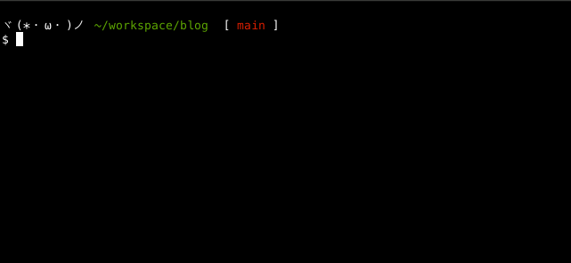
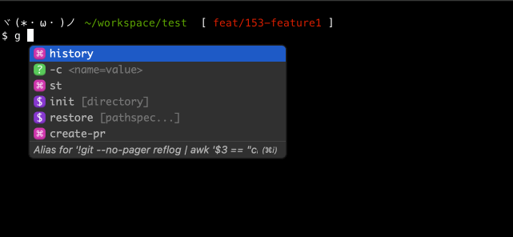
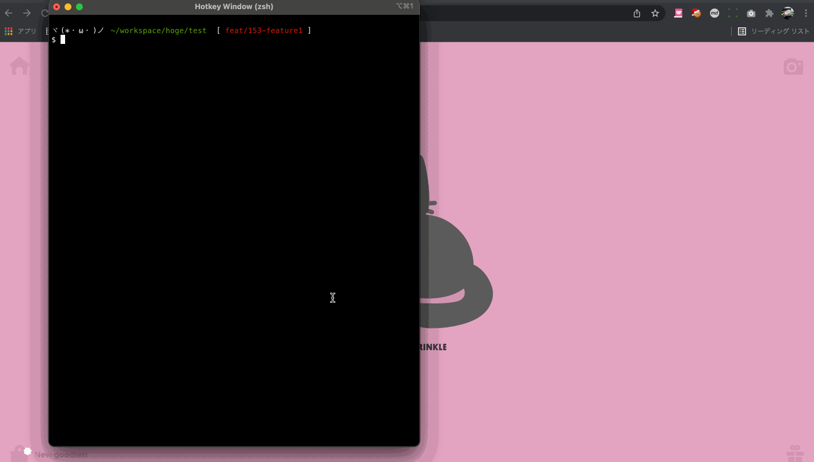
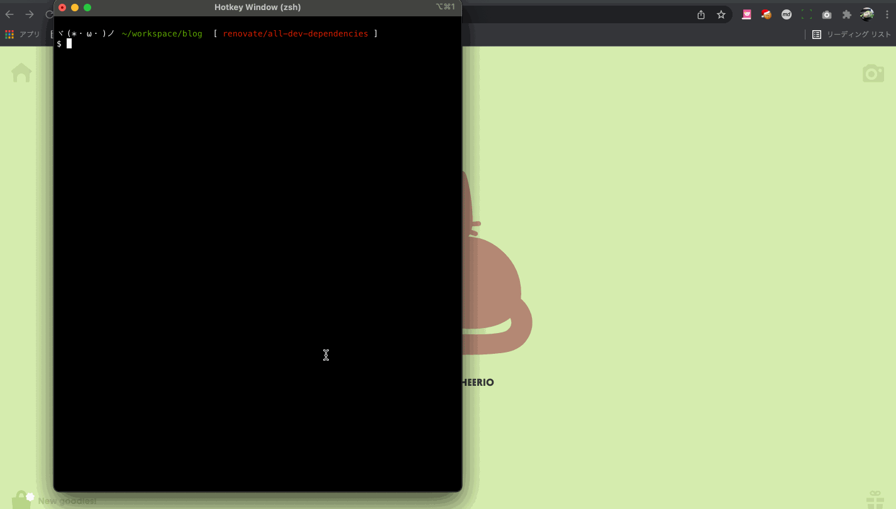

This article is for Day 23 of the [YAMAP Engineer Advent Calendar 2021](https://qiita.com/advent-calendar/2021/yamap-engginers).

I use git in the terminal every day. I often spend time on small git operations — switching between many branches while doing development and reviews in parallel, for example. After setting up various git aliases to make things more efficient, things improved a lot. Here is a summary.

## git switch-pr

### Problem

When switching to a branch to review a PR, I often did: "copy the branch name from GitHub, paste it into the terminal..." This was annoying when doing 3 or 4+ PR reviews a day.

### Improvement



`git switch-pr` is an alias that switches branches by selecting from a list of pull requests in the remote repository.

This removes the need to copy and paste branch names, making PR reviews much more comfortable!

I use [GitHub CLI](https://github.com/cli/cli) to get the list of pull requests.

I created `switch-pr` as the main alias for clarity, and then set `swpr` as a shorter alias for it.

```shell
// ~/.gitconfig
[alias]
  switch-pr = !gh pr list | awk '{print $(NF-1)}' | peco | xargs git switch
  swpr = switch-pr
```

## git history

### Problem

When working on a feature branch while doing PR reviews, I sometimes switch between 3 or 4 branches a day.
Switching between multiple branches requires remembering branch names, which is annoying.
Especially when branch names include ticket numbers, typing becomes even harder.

### Improvement



`git history` is an alias that lets you select from a list of recently visited branches and switch to one.

Using `peco` to select from the list makes it easy to switch without remembering branch names.

```shell
// ~/.gitconfig
[alias]
  history = !git --no-pager reflog | awk '$3 == \"checkout:\" && /moving from/ {print $8}' | awk '!a[$0]++' | head | peco | xargs git checkout
```

## push.default current

### Problem

When pushing a branch for the first time, I had to type `git push origin feat/123-feature1`.
This was needed because there was no upstream branch linked.

### Improvement

The behavior of `git push` without arguments is controlled by `push.default`. Setting `push.default current` makes git push to a remote branch with the same name as the current branch.

With this setting, even the first push only needs `git push`.

```shell
$ g config --global push.default current

~/.gitconfig
[push]
	default = current
```

## git create-pr

### Problem

When creating a pull request on GitHub, the terminal shows a URL to create the PR on the first push. But on subsequent pushes, this URL is not shown and you have to go to GitHub to create the PR.
I already found clicking that URL once annoying, so having to click through several steps on GitHub was even more bothersome.

### Improvement



`git create-pr` is an alias that opens the GitHub page for creating a PR for the current branch in the browser.
A single command in the terminal gets you ready to create a PR. Very convenient.

The implementation just registers a GitHub CLI command as an alias — nothing complex.

```shell
~/.gitconfig
[alias]
  create-pr = !gh pr create --web
```

## git open-pr

### Problem

When checking code locally during a code review, or after fixing issues pointed out in a review, it can be annoying to navigate back to the PR on GitHub through the browser.

### Improvement



`git open-pr` is an alias that opens the PR for the current branch in the browser.

This also just registers a GitHub CLI command as an alias.

```shell
~/.gitconfig
[alias]
  open-pr = !gh pr view --web
```
