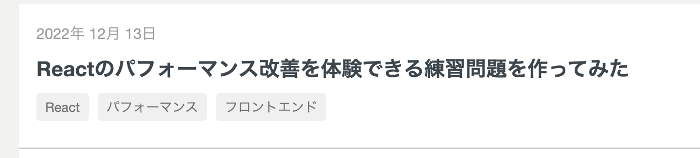
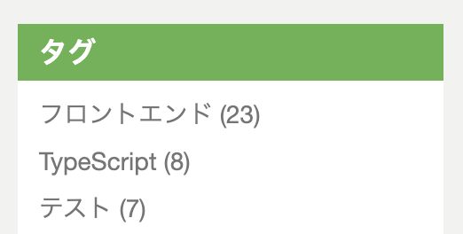
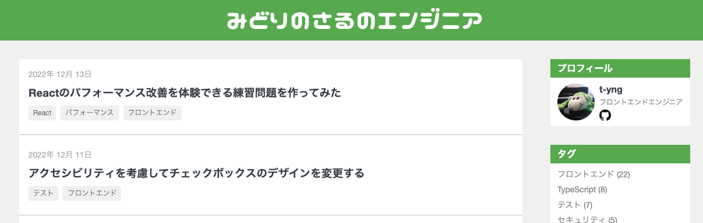
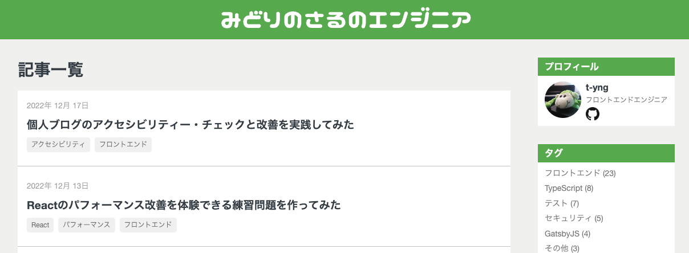
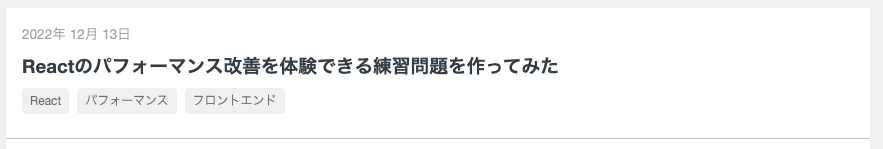
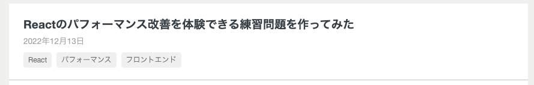

This article is for Day 17 of the [Accessibility Advent Calendar 2022 - Adventar](https://adventar.org/calendars/7377).

Recently, I read an accessibility book in a team book club at work and lost my fear of accessibility. I wanted to apply what I learned by writing about it, so I decided to improve the accessibility of this blog.

## Checking accessibility

First, to understand the current state, I used the [Accessibility Checklist](https://a11y-guidelines.freee.co.jp/checks/index.html) published by freee, and checked the "Product: Web" items against this blog.

Some examples of items that failed:
- Screen reader cannot clearly understand the intent of link text
  - Example: "<" and ">" in pagination are not read clearly
- The title does not show the purpose of the page
  - Example: Article list page for a specific tag
- Images used as buttons or links are not large enough
  - Example: GitHub link icon is 20x20px

All the check results are available in the [published check results](https://docs.google.com/spreadsheets/d/1Dqt5a1pR5uZmq3D7UilTUCz0QthAFu--LCnBT4IrYi0/edit#gid=676282354). Items that changed from NG to OK are shown with a blue background.

After doing the check, I found that many items were hard to judge without specialist knowledge. For example, the item "Can link areas be identified in grayscale?" raised the question of what exactly makes a link area identifiable. I read the [WCAG 2.1 failure example for 1.4.1](https://waic.jp/docs/WCAG21/Techniques/failures/F73) and interpreted it in my own way to continue the check.

## Improving accessibility

You can see all the changes in the [improvement pull request](https://github.com/t-yng/blog/pull/427).

### Make link intent clear

#### Pagination

The "<" and ">" in pagination gave no clear intent when read by a screen reader, so I added labels.

```tsx
export const NextPage: FC<NextPageProps> = ({ page }) => (  
    <Link href={`/page/${page}`} decoration={false} aria-label="Next page">
        <PageItem>{'>'}</PageItem>
    </Link>
);
```

#### Tags

When the tags on an article were read by a screen reader, it said "link, Frontend" without indicating that it was a tag.



I added a label like "tag, Frontend" so it is clear that it is a tag.
I considered whether to describe the link destination like "Frontend article list," but I wanted to convey the information that the article is tagged, so I went with this approach.

While working on this, I realized that the "this is a tag" information was completely dependent on the visual design.

```tsx
export const Tag: FC<TagProps> = ({ name }) => (
    <Link
        href={createTagLink(name)}
        decoration={false}
        aria-label={`tag, ${name}`} // Added
    >
        <div className={style.tag}>{name}</div>
    </Link>
);
```

#### Tag list

The tag list links in the sidebar were also read as "link, Frontend (22)" which was hard to understand.



I added a label like "Frontend article list, 22 items" to make the destination page content clear.

```tsx
<Link
    key={tag.name}
    decoration={false}
    href={createTagLink(tag.name)}
    aria-label={`${tag.name} article list, ${tag.count} items`} // Added
>{`${tag.name} (${tag.count})`}</Link>
```

### Set appropriate page titles

The title for the tag article list page and the paginated pages was just "midori no saru engineer," which did not match the purpose of the page.

Also, this blog is built with Next.js and page navigation happens on the client side. Even when clicking a tag link, the screen reader did not read the new page title, so screen reader users could not know that the page had changed.

Next.js has a feature called [Route Announcements](https://nextjs.org/docs/accessibility#route-announcements). When navigating with `next/link`, it checks `document.title` and notifies the screen reader when the title changes. So by setting a unique title for each page, screen reader users will automatically be notified of page transitions.

### Add page headings

Without page headings, a screen reader would suddenly start reading article information with no context. I added page headings to make the structure clearer.





### Change the position of the post date in article lists

In the article list, the post date appeared above the title. When read by a screen reader, the date was read before the title, which was slightly confusing.

Since the article title is the most important information, I reordered them to show the title first, then the date.





### Change icon size

Following the checklist, I changed the GitHub link icon size to 24x24px.

### Reset focus on page navigation

In SPAs, page navigation does not reload the window. When clicking a tag link in the sidebar to go to the tag article list, the focus stays at the link's position.

The article [It's Not Too Late! React and Accessibility](https://zenn.dev/neet/articles/8b4d8d42fb2a5e#client-side-routing) also mentions this problem. The article suggests focusing the `main` element, but doing that caused strange scroll behavior when pressing the back button. So I changed it to focus the `body` element instead.

In `_document.tsx`, I added `tabIndex={-1}` to the `body` element to make it focusable with JS. In `_app.tsx`, I added logic to focus the `body` element when the router finishes navigating.

```tsx
// pages/_app.tsx
const router = useRouter();

const handleRouteChange = () => {
    const body = document.querySelector('body');
    body?.focus();
};

useEffect(() => {
    router.events.on('routeChangeComplete', handleRouteChange);
    return () => {
        router.events.off('routeChangeComplete', handleRouteChange);
    };
}, [router.events]);

// pages/_document.tsx
<body tabIndex={-1}>
```

## Automatic code checking with eslint-plugin-jsx-a11y

The freee checklist also has a "Code: Web" sheet, but manually checking the code would be very time-consuming. So I introduced [eslint-plugin-jsx-a11y](https://github.com/jsx-eslint/eslint-plugin-jsx-a11y) for automatic code checking.

Install the package.

```shell
$ yarn add -D eslint-plugin-jsx-a11y
```

Add settings to `.eslintrc`. Use the plugin's recommended settings.

```json
{
  "plugins": ["jsx-a11y"],
  "extends": ["plugin:jsx-a11y/recommended"]
}
```

Running eslint found one error: an `img` element missing an `alt` attribute.

```shell
$ yarn eslint --ext tsx ./src
/Users/t-yng/workspace/blog/src/components/common/Sidebar/SidebarProfile.tsx
  28:25  error  img elements must have an alt prop, either with meaningful text, or an empty string for decorative images  jsx-a11y/alt-text

✖ 1 problem (1 error, 0 warnings)
```

Looking at the code, it had `aria-hidden="true"` set, which is why the `alt` attribute was missing.

With `aria-hidden="true"`, screen readers ignore the element, so adding `alt` seemed unnecessary. There is an [issue](https://github.com/jsx-eslint/eslint-plugin-jsx-a11y/issues/803) about this — it seems the error is intentional to account for browsers that support `alt` but not `aria-*`.

```tsx

```

Rather than disabling the `alt` check, I simply added the `alt` attribute.

```tsx

```

## Closing

Even for a very simple personal blog, I found many things to improve. I also had the chance to read parts of WCAG and learned a lot. Actually using a screen reader to check the behavior before and after the changes made the improvements feel meaningful!

There are still areas like ARIA landmarks and contrast ratios that I haven't improved yet, so I'll continue working on them.
٩( 'ω' )و
