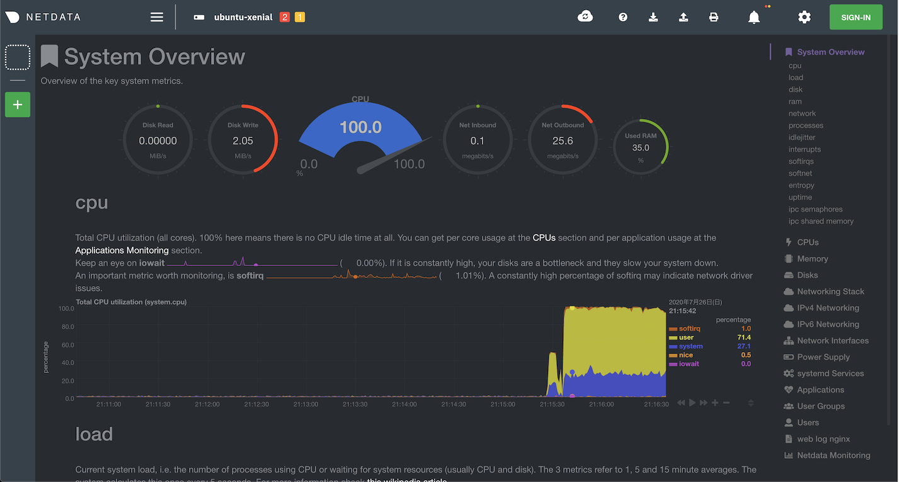

I worked through [ISUCON Summer Course 2017](http://isucon.net/archives/50648750.html) as practice for ISUCON10. Here I summarize only the basic data collection steps for finding bottlenecks.

## Environment Setup

I used VirtualBox as the virtual machine and the [isucon7 qualifying problem](https://github.com/matsuu/vagrant-isucon/tree/master/isucon7-qualifier).

```shell
# Specify the private network IP address
$ vi Vagrantfile
   # Create a private network, which allows host-only access to the machine
   # using a specific IP.
-  config.vm.network "private_network", ip: "192.168.33.10"
+  config.vm.network "private_network", ip: "192.168.33.10"

# Build the virtual environment
$ git clone https://github.com/matsuu/vagrant-isucon.git
$ cd vagrant-isucon/isucon7-qualifier
$ vagrant up
$ vagrant halt # The app did not start on the image VM on the first boot
$ vagrant up 
```

## Run the Benchmark

First, check the IP address assigned to the application server VM.

```shell
$ vagrant ssh image
$ ifconfig 
...
enp0s9    Link encap:Ethernet  HWaddr 08:00:27:4a:09:63
          inet addr:172.28.128.8  Bcast:172.28.128.255  Mask:255.255.255.0
...
```

Run the benchmark against the confirmed IP address.

```shell
$ vagrant ssh bench
$ cd /home/isucon/isubata/bench
$ bin/bench -remotes 172.28.128.8 # Specify the image machine's IP address
[isu7q-bench] 2020/07/26 09:33:46.171614 dataset.go:37: datapath ./data
[isu7q-bench] 2020/07/26 09:33:47.656776 bench.go:472: Remotes [172.28.128.8]
...
[isu7q-bench] 2020/07/26 09:34:02.557313 bench.go:260: Cannot increase Load Level. Reason: RecentErr 2020-07-26 09:34:02.336753948 +0000 UTC m=+16.304791155 Request timed out (POST /message) Before 220.553901ms
```

## Check the Application

Open http://192.168.33.10 in your browser to check the app. Since there is no data before running the benchmark, it is recommended to run the benchmark first. You can create a new account and log in.

## Connect to MySQL in the Virtual Environment

Check the SSH config. The MySQL connection info was found in the [ansible config file](https://github.com/matsuu/ansible-isucon/blob/master/isucon7-qualifier/roles/mysql/tasks/main.yml).

```shell
$ vagrant ssh-config image
Host image
  HostName 127.0.0.1
  User vagrant
  Port 2222
  ...
  IdentityFile /Users/tomohiro/workspace/isucon/vagrant-isucon/isucon7-qualifier/.vagrant/machines/image/virtualbox/private_key
```

Connect to MySQL with these settings:

```
MySQL Host: 127.0.0.1
Username: isucon
Password: isucon
Database: isubata
SSH Host: 192.168.33.10
SSH User: vagrant
Private Key: ~/isucon7-qualifier/.vagrant/machines/image/virtualbox/private_key
```

## Change the Implementation Language

ISUCON allows you to choose your preferred language from several options. Here I switch to JavaScript (Node.js). I referenced [ISUCON7 Qualifying Manual](https://gist.github.com/941/8c64842b71995a2d448315e2594f62c2) for switching the reference implementation.

```shell
# Work on the application server
$ vagrant ssh image

# Check the list of services
$ ls -l /etc/systemd/system/ | grep isubata
-rw-r--r-- 1 root root  331 Jul 26 09:01 isubata.golang.service
-rw-r--r-- 1 root root  363 Jul 26 09:01 isubata.nodejs.service
...
-rw-r--r-- 1 root root  382 Jul 26 09:01 isubata.ruby.service

# Check the currently running implementation
vagrant@ubuntu-xenial:~$ systemctl list-unit-files --type=service | grep isubata
isubata.golang.service                     disabled
isubata.nodejs.service                     disabled
isubata.perl.service                       disabled
isubata.php.service                        disabled
isubata.python.service                     enabled
isubata.ruby.service                       disabled

# Change the implementation language
$ sudo systemctl stop isubata.python.service
$ sudo systemctl disable isubata.python.service
$ sudo systemctl start isubata.nodejs.service
$ sudo systemctl enable isubata.nodejs.service
```

Verify it started:

```shell
$ service isubata.nodejs status
● isubata.nodejs.service - isucon7 qualifier main application in nodejs
   Loaded: loaded (/etc/systemd/system/isubata.nodejs.service; enabled; vendor preset: enabled)
   Active: active (running) since Sun 2020-07-26 12:24:52 UTC; 2min 59s ago
```

## Measuring Bottlenecks

### Install Monitoring Tools

Choose and install any of these tools:

* htop
* dstat
* glances
* netdata

```shell
$ sudo apt install htop
$ sudo apt install dstat
$ sudo apt install glances
$ bash <(curl -Ss https://my-netdata.io/kickstart-static64.sh)
```

### Monitoring During Benchmark

These tools let you visualize CPU, memory, and other resources while the benchmark is running.

#### glances

```shell
$ glances
ubuntu-xenial (Ubuntu 16.04 64bit / Linux 4.4.0-184-generic)                 Uptime: 3:06:11

CPU      99.7%  nice:     0.2%     LOAD    2-core       MEM     53.6%  active:    1.51G
user:    74.7%  irq:      0.0%     1 min:    7.61       total:  1.95G  inactive:   262M
system:  23.1%  iowait:   0.2%     5 min:    6.71       used:   1.05G  buffers:   54.1M
idle:     0.3%  steal:    0.0%     15 min:   3.86       free:    928M  cached:     779M
...
```

#### netdata

Access http://<image machine IP>:19999 in your browser. In this case, http://172.28.128.8:19999/.



## Analyzing Access Logs with alp

### Install alp

```shell
$ wget https://github.com/tkuchiki/alp/releases/download/v1.0.3/alp_linux_amd64.zip
$ sudo apt install unzip
$ unzip alp_linux_amd64.zip
$ sudo install ./alp /usr/local/bin
```

### Add alp Output Format to nginx

```shell
$ sudo vi /etc/nginx/nginx.conf
http {
        ...
        log_format ltsv "time:$time_local"
                        "\thost:$remote_addr"
                        "\treq:$request"
                        "\tstatus:$status"
                        "\tmethod:$request_method"
                        "\turi:$request_uri"
                        "\tsize:$body_bytes_sent"
                        "\treqtime:$request_time"
                        "\tapptime:$upstream_response_time"
                        "\tvhost:$host";

        access_log /var/log/nginx/access.log ltsv;

$ sudo rm /var/log/nginx/access.log && sudo systemctl reload nginx
```

### Analyze Access Logs with alp

After running the benchmark, aggregate the access logs with alp. Looking at the results sorted by total time in descending order, access to `/message` and `/fetch` is taking the most time. The responses for images under `/icons` are also notable.
Hold back the urge to fix things and move on to analyzing MySQL queries.

```shell
$ alp ltsv -r --sort sum --file /var/log/nginx/access.log
+-------+-----+-----+-----+-----+-----+--------+------------------------------------------------------+-------+--------+---------+--------+...
| COUNT | 1XX | 2XX | 3XX | 4XX | 5XX | METHOD |                         URI                          |  MIN  |  MAX   |   SUM   |  AVG   |...
+-------+-----+-----+-----+-----+-----+--------+------------------------------------------------------+-------+--------+---------+--------+...
|    90 |   0 |  60 |   0 |  30 |   0 | GET    | /message                                             | 0.002 | 10.216 | 397.354 |  4.415 |...
|    44 |   0 |   7 |   0 |  37 |   0 | GET    | /fetch                                               | 0.002 | 10.085 | 350.770 |  7.972 |...
|    18 |   0 |   5 |   0 |  13 |   0 | GET    | /icons/7598595abd317f5ae637300a27f95e3c700376a7.png  | 0.820 | 10.028 | 143.519 |  7.973 |...
...
```

## MySQL Query Analysis

Add slow query log output settings, rerun the benchmark, and output the log. If setup is correct, `/var/log/mysql/mysql-slow.log` will be created.

```shell
$ sudo vi /etc/mysql/mysql.conf.d/mysqld.cnf
[mysqld]
slow_query_log = 1
log_slow_queries = /var/log/mysql/mysql-slow.log
long_query_time = 0

$ sudo systemctl restart mysql
$ sudo systemctl restart isubata.nodejs.service
```

### Install pt-query-digest

[pt-query-digest](https://www.percona.com/doc/percona-toolkit/LATEST/pt-query-digest.html) is a support tool for aggregating MySQL query logs.

Note: Installing via apt gives an old version with bugs.
[Stack Overflow reference](https://stackoverflow.com/questions/38245395/pipeline-process-5-iteration-caused-an-error-redundant-argument-in-sprintf-at)

```shell
$ wget percona.com/get/percona-toolkit.tar.gz
$ tar xf percona-toolkit.tar.gz
$ cd percona-toolkit-3.2.0
$ perl Makefile.PL && make && sudo make install
$ sudo pt-query-digest --help
```

### View Slow Query Logs

Use `pt-query-digest` to analyze slow query logs.

It looks like `SELECT * FROM image WHERE name = 'c434098fec37fd0d2c1e646d104220f6ffabbea7.png'` is taking very long.

```shell
$ sudo pt-query-digest --limit 10 /var/log/mysql/mysql-slow.log
# Profile
# Rank Query ID                      Response time  Calls R/Call V/M   Ite
# ==== ============================= ============== ===== ====== ===== ===
#    1 0x086EF2D69E0CA10C16A13978... 989.3391 93.5%   751 1.3174  0.09 SELECT image
#    2 0xB36405B8C0D2F0C74866C96B...  47.8231  4.5%  4012 0.0119  0.02 SELECT message
...
# EXPLAIN /*!50100 PARTITIONS*/
SELECT * FROM image WHERE name = 'c434098fec37fd0d2c1e646d104220f6ffabbea7.png'\G
```
