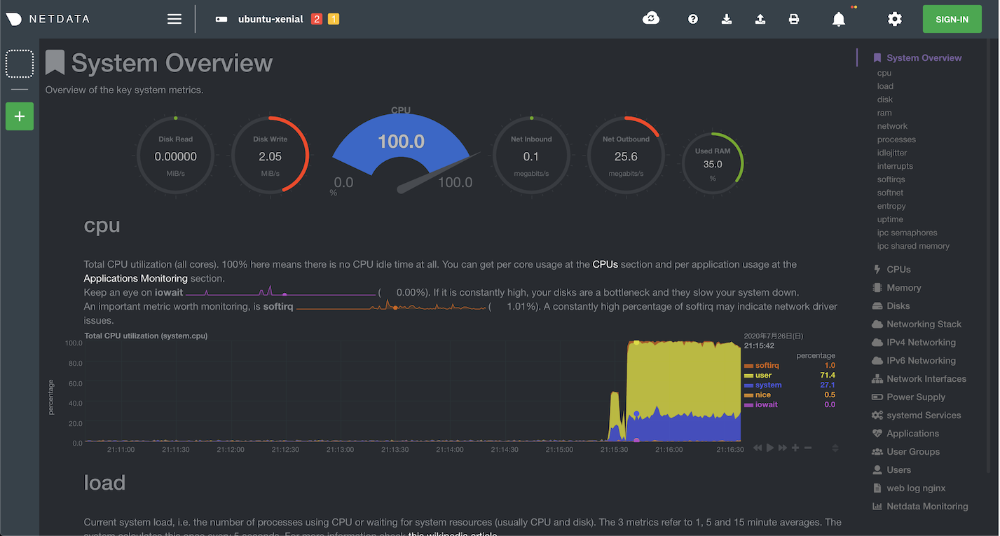

ISUCON10に向けた復習として [ISUCON 夏季講習 2017](http://isucon.net/archives/50648750.html) をやりました。ボトルネック発見のための基本的なデータ収集の部分だけまとめています。

## 環境構築
仮想マシンとしてVirtualBoxを用いて、問題は [isucon7の予選問題](https://github.com/matsuu/vagrant-isucon/tree/master/isucon7-qualifier) を利用します。

```shell
# プライベートネットワークのIPアドレスを指定
$ vi Vagrantfile
   # Create a private network, which allows host-only access to the machine
   # using a specific IP.
-  config.vm.network "private_network", ip: "192.168.33.10"
+  config.vm.network "private_network", ip: "192.168.33.10"

# 仮想環境を構築
$ g clone https://github.com/matsuu/vagrant-isucon.git
$ cd vagrant-isucon/icuon7-qualifier
$ vagrant up
$ vagrant halt # 初回起動だとimageの仮想マシンでアプリケーションが起動しなかった
$ vagrant up 
```

## ベンチマークを実行

最初にアプリケーションサーバーの仮想マシンに割り当てられたIPアドレスを確認する。

```shell
$ vagrant ssh image
$ ifconfig 
...
enp0s9    Link encap:Ethernet  HWaddr 08:00:27:4a:09:63
          inet addr:172.28.128.8  Bcast:172.28.128.255  Mask:255.255.255.0
          inet6 addr: fe80::a00:27ff:fe4a:963/64 Scope:Link
          UP BROADCAST RUNNING MULTICAST  MTU:1500  Metric:1
          RX packets:11 errors:0 dropped:0 overruns:0 frame:0
          TX packets:10 errors:0 dropped:0 overruns:0 carrier:0
          collisions:0 txqueuelen:1000
          RX bytes:4968 (4.9 KB)  TX bytes:1332 (1.3 KB)
...          
```

確認したIPアドレスに対してベンチを実行する。

```shell
$ vagrant ssh bench
$ cd /home/isucon/isubata/bench
$ bin/bench -remotes 172.28.128.8 # imageマシンのIPアドレスを指定
[isu7q-bench] 2020/07/26 09:33:46.171614 dataset.go:37: datapath ./data
[isu7q-bench] 2020/07/26 09:33:47.656776 bench.go:472: Remotes [172.28.128.8]
[isu7q-bench] 2020/07/26 09:33:47.656810 bench.go:346: State.Init()
[isu7q-bench] 2020/07/26 09:33:47.663825 bench.go:348: State.Init() Done
[isu7q-bench] 2020/07/26 09:33:47.663853 bench.go:350: requestInitialize()
[isu7q-bench] 2020/07/26 09:33:47.756337 bench.go:358: requestInitialize() Done
[isu7q-bench] 2020/07/26 09:33:47.756358 bench.go:363: preTest()
[isu7q-bench] 2020/07/26 09:33:58.556061 bench.go:371: preTest() Done
[isu7q-bench] 2020/07/26 09:33:58.556186 bench.go:380: validationMain()
[isu7q-bench] 2020/07/26 09:33:59.560581 bench.go:267: Increase Load Level.
[isu7q-bench] 2020/07/26 09:34:00.557278 bench.go:263: Cannot increase Load Level. Reason: SlowPath /message Before 11.790899ms
[isu7q-bench] 2020/07/26 09:34:01.557413 bench.go:263: Cannot increase Load Level. Reason: SlowPath /profile/yamaoka_shinsuke Before 415.740187ms
[isu7q-bench] 2020/07/26 09:34:02.557313 bench.go:260: Cannot increase Load Level. Reason: RecentErr 2020-07-26 09:34:02.336753948 +0000 UTC m=+16.304791155 リクエストがタイムアウトしました (POST /message ) Before 220.553901ms
```

## アプリケーションの動作確認

ブラウザで [http://192.168.33.10](http://192.168.33.10) にアクセスすれば動作確認ができます。ベンチマーク実行前の場合はデータが無く動作確認がやり辛いので、ベンチマークを先に実行しておく事をオススメします。アカウントは適当に新規登録してログインしてください。

## 仮想環境のMySQLに接続する

sshの設定を確認する。MySQLの接続情報は [ansibleの設定ファイル](https://github.com/matsuu/ansible-isucon/blob/master/isucon7-qualifier/roles/mysql/tasks/main.yml) を参照しました。

```shell
$ vagrant ssh-config image
Host image
  HostName 127.0.0.1
  User vagrant
  Port 2222
  UserKnownHostsFile /dev/null
  StrictHostKeyChecking no
  PasswordAuthentication no
  IdentityFile /Users/tomohiro/workspace/isucon/vagrant-isucon/isucon7-qualifier/.vagrant/machines/image/virtualbox/private_key
  IdentitiesOnly yes
  LogLevel FATAL
```

MySQLクライアントで次の設定でMySQLに接続します。

```
MySQLホスト: 127.0.0.1
ユーザー名: isucon
パスワード: isucon
データベース: isubata
SSHホスト: 192.168.33.10
SSHユーザー: vagrant
秘密鍵: ~/isucon7-qualifier/.vagrant/machines/image/virtualbox/private_key
```

## 実装言語を変更する
ISUCONでは複数の言語から自分たちが好きな言語を利用できます。ここでは、JavaScript(Node.js)に実装言語を変更します。参考実装の切り替えは、[ISUCON7 予選マニュアル](https://gist.github.com/941/8c64842b71995a2d448315e2594f62c2)を参照しました。

```shell
# アプリケーションサーバーで作業
$ vagrant ssh image

# サービスの一覧を確認
$ ls -l /etc/systemd/system/ | grep isubata
-rw-r--r-- 1 root root  331 Jul 26 09:01 isubata.golang.service
-rw-r--r-- 1 root root  363 Jul 26 09:01 isubata.nodejs.service
-rw-r--r-- 1 root root  367 Jul 26 09:01 isubata.perl.service
-rw-r--r-- 1 root root  386 Jul 26 09:01 isubata.php.service
-rw-r--r-- 1 root root  386 Jul 26 09:01 isubata.python.service
-rw-r--r-- 1 root root  382 Jul 26 09:01 isubata.ruby.service

# 実行中の参考実装を確認
vagrant@ubuntu-xenial:~$ systemctl list-unit-files --type=service | grep isubata
isubata.golang.service                     disabled
isubata.nodejs.service                     disabled
isubata.perl.service                       disabled
isubata.php.service                        disabled
isubata.python.service                     enabled
isubata.ruby.service                       disabled

# 参考実装の言語を変更
$ sudo systemctl stop isubata.python.service
$ sudo systemctl disable isubata.python.service
$ sudo systemctl start isubata.nodejs.service
$ sudo systemctl enable isubata.nodejs.service
```

起動を確認する。

```shell
$ service isubata.nodejs status
● isubata.nodejs.service - isucon7 qualifier main application in nodejs
   Loaded: loaded (/etc/systemd/system/isubata.nodejs.service; enabled; vendor preset: enabled)
   Active: active (running) since Sun 2020-07-26 12:24:52 UTC; 2min 59s ago
 Main PID: 5901 (node)
   CGroup: /system.slice/isubata.nodejs.service
           └─5901 /home/isucon/local/node/bin/node /home/isucon/isubata/webapp/nodejs
```

## ボトルネック計測

### 監視ツールのインストール
以下のツールから好きなのを選んでインストールします。

* htop
* dstat
* glances
* netdata

```shell
$ sudo apt install htop
$ sudo apt isntall dstat
$ sudo apt install glances
$ bash <(curl -Ss https://my-netdata.io/kickstart-static64.sh)
```

### 監視ツール実行の様子

ベンチマーク実行中のCPUやメモリなどのリソース状況を可視化できます。

#### glances

```shell
$ glances
ubuntu-xenial (Ubuntu 16.04 64bit / Linux 4.4.0-184-generic)                                                     Uptime: 3:06:11

CPU      99.7%  nice:     0.2%             LOAD    2-core             MEM     53.6%  active:    1.51G             SWAP      0.0%
user:    74.7%  irq:      0.0%             1 min:    7.61             total:  1.95G  inactive:   262M             total:       0
system:  23.1%  iowait:   0.2%             5 min:    6.71             used:   1.05G  buffers:   54.1M             used:        0
idle:     0.3%  steal:    0.0%             15 min:   3.86             free:    928M  cached:     779M             free:        0

NETWORK     Rx/s   Tx/s   TASKS 123 (228 thr), 1 run, 122 slp, 0 oth sorted automatically by cpu_percent, flat view
enp0s3       6Kb    6Kb
enp0s8        0b     0b     CPU%  MEM%  VIRT   RES   PID USER        NI S    TIME+ IOR/s IOW/s Command
enp0s9     133Kb 40.1Mb    179.3  20.1 1.52G  402M  1225 mysql        0 S 20:15.77     0     0 /usr/sbin/mysqld
lo         550Mb  550Mb     12.8  22.8 1.53G  456M  5901 isucon       0 S  1:12.94     0     0 /home/isucon/local/node/bin/node
                             2.9   1.4 89.8M 27.6M  6345 vagrant      0 R  0:00.83     0     0 /usr/bin/python3 /usr/bin/glances
DISK I/O     R/s    W/s
sda1           0   359K
sdb            0      0   Warning or critical alerts (lasts 4 entries)
                          2020-07-26 12:38:07 (ongoing) - CPU_SYSTEM (99.7)
FILE SYS    Used  Total   2020-07-26 12:37:55 (ongoing) - CPU_USER (74.8)
/ (sda1)   3.68G  9.63G   2020-07-26 12:37:51 (0:00:04) - WARNING on CPU_SYSTEM (81.2)
2020-07-26 12:38:07       2020-07-26 12:37:36 (ongoing) - LOAD (1.9)
```

#### netdata
ブラウザで http://<imageマシンのIPアドレス>:19999 にアクセスします。今回の場合は、http://172.28.128.8:19999/ にアクセスすれば確認ができます。



## alpでアクセスログを解析

### alpをインストール

```shell
$ wget https://github.com/tkuchiki/alp/releases/download/v1.0.3/alp_linux_amd64.zip
$ sudo apt install unzip
$ unzip alp_linux_amd64.zip
$ sudo install ./alp /usr/local/bin
```

### nginxにalp用の出力を追加

```shell
$ sudo vi /etc/nginx/nginx.conf
http {
        ...

        ##
        # Logging Settings
        ##

        log_format ltsv "time:$time_local"
                        "\thost:$remote_addr"
                        "\tforwardedfor:$http_x_forwarded_for"
                        "\treq:$request"
                        "\tstatus:$status"
                        "\tmethod:$request_method"
                        "\turi:$request_uri"
                        "\tsize:$body_bytes_sent"
                        "\treferer:$http_referer"
                        "\tua:$http_user_agent"
                        "\treqtime:$request_time"
                        "\tcache:$upstream_http_x_cache"
                        "\truntime:$upstream_http_x_runtime"
                        "\tapptime:$upstream_response_time"
                        "\tvhost:$host";

        access_log /var/log/nginx/access.log ltsv;
        error_log /var/log/nginx/error.log;

$ sudo rm /var/log/nginx/access.log && sudo systemctl reload nginx
```

### alpでアクセスログを解析
ベンチマークを実行後にalpでアクセスログを集計して計測結果を見てみます。処理時間の合計で降順ソートした結果を見てみると、 `/message` と `/fetch` へのアクセスに時間を要しています。また、 `/icons` 配下の画像のレスポンスも気になりますね。  
ここで修正した気持ちをグッと抑えて次はMySQLのクエリ解析を実施していきます。

```shell
$ alp ltsv -r --sort sum --file /var/log/nginx/access.log
+-------+-----+-----+-----+-----+-----+--------+------------------------------------------------------+-------+--------+---------+--------+--------+--------+--------+--------+------------+------------+--------------+------------+
| COUNT | 1XX | 2XX | 3XX | 4XX | 5XX | METHOD |                         URI                          |  MIN  |  MAX   |   SUM   |  AVG   |   P1   |  P50   |  P99   | STDDEV | MIN(BODY)  | MAX(BODY)  |  SUM(BODY)   | AVG(BODY)  |
+-------+-----+-----+-----+-----+-----+--------+------------------------------------------------------+-------+--------+---------+--------+--------+--------+--------+--------+------------+------------+--------------+------------+
|    90 |   0 |  60 |   0 |  30 |   0 | GET    | /message                                             | 0.002 | 10.216 | 397.354 |  4.415 |  0.003 |  3.236 | 10.084 |  4.455 |      5.000 |  52648.000 |  1261915.000 |  14021.278 |
|    44 |   0 |   7 |   0 |  37 |   0 | GET    | /fetch                                               | 0.002 | 10.085 | 350.770 |  7.972 |  0.002 | 10.001 |  0.002 |  3.769 |      0.000 |   3098.000 |    21687.000 |    492.886 |
|    18 |   0 |   5 |   0 |  13 |   0 | GET    | /icons/7598595abd317f5ae637300a27f95e3c700376a7.png  | 0.820 | 10.028 | 143.519 |  7.973 |  0.820 | 10.002 |  7.973 |  2.878 |      0.000 | 437319.000 |  2186261.000 | 121458.944 |
|    17 |   0 |   6 |   0 |  11 |   0 | GET    | /icons/c434098fec37fd0d2c1e646d104220f6ffabbea7.png  | 0.132 | 10.009 | 137.344 |  8.079 |  0.132 | 10.005 |  7.973 |  2.903 |      0.000 | 103218.000 |   619208.000 |  36424.000 |
|    17 |   0 |   5 |   0 |  12 |   0 | GET    | /icons/61463cd868570a29cc1b74232000e84d3276e315.png  | 0.228 | 10.130 | 136.311 |  8.018 |  0.228 | 10.015 | 10.000 |  3.084 |      0.000 | 381286.000 |  1905666.000 | 112098.000 |
|    18 |   0 |   6 |   0 |  12 |   0 | GET    | /icons/5e981ef46ec0f47bdc2f188673325b85078f5235.png  | 0.144 | 10.043 | 135.467 |  7.526 |  0.144 | 10.000 |  9.019 |  2.927 |      0.000 | 769314.000 |  4613375.000 | 256298.611 |
|    17 |   0 |   7 |   0 |  10 |   0 | GET    | /icons/158fa9df919970ac8bc3bc2724ed5b02fe30968d.png  | 0.140 | 10.047 | 125.555 |  7.386 |  0.140 | 10.047 |  9.999 |  3.542 |      0.000 | 115188.000 |   806284.000 |  47428.471 |
|    14 |   0 |   3 |   0 |  11 |   0 | GET    | /icons/0614f0cea1b70fb71b4c3b88545a42327157a41e.jpg  | 4.715 | 10.138 | 125.212 |  8.944 |  4.958 | 10.021 | 10.047 |  2.104 |      0.000 | 559681.000 |  1678461.000 | 119890.071 |
|    14 |   0 |   5 |   0 |   9 |   0 | GET    | /icons/ba2d2384f825a83862f3b61302468b2e07f0a0f7.png  | 3.736 | 10.026 | 119.459 |  8.533 |  3.736 | 10.026 | 10.025 |  2.271 |      0.000 | 294773.000 |  1473311.000 | 105236.500 |
|    14 |   0 |   4 |   0 |  10 |   0 | GET    | /icons/65ea5a70b1fcf8f5f816b01b87f2aca2251315b0.png  | 2.330 | 10.039 | 117.397 |  8.386 |  2.330 | 10.039 |  9.191 |  2.362 |      0.000 | 299543.000 |  1197726.000 |  85551.857 |
```

## MySQLのクエリ解析

スロークエリログの出力設定を追加して、改めてベンチマークを実行してログを出力します。設定が正常に完了していれば、 `/var/log/mysql/mysql-slow.log` が出力されます。

```shell
$ sudo vi /etc/mysql/mysql.conf.d/mysqld.cnf
[mysqld]
slow_query_log = 1
log_slow_queries = /var/log/mysql/mysql-slow.log
long_query_time = 0

$ sudo systemctl restart mysql
$ sudo sytemtctl restart isubata.nodejs.service
```

### pt-query-digestのインストール
[pt-query-digest](https://www.percona.com/doc/percona-toolkit/LATEST/pt-query-digest.html) はMySQLのクエリログを集計するサポートツールです。

apt 経由でインストールするとパッケージのバージョンが古くバグが存在するので注意してください。  
[mariadb \- Pipeline process 5 \(iteration\) caused an error: Redundant argument in sprintf at /usr/bin/pt\-query\-digest line 2556 \- Stack Overflow](https://stackoverflow.com/questions/38245395/pipeline-process-5-iteration-caused-an-error-redundant-argument-in-sprintf-at)

```shell
$ wget percona.com/get/percona-toolkit.tar.gz
$ tar xf percona-toolkit.tar.gz
$ cd percona-toolkit-3.2.0
$ perl Makefile.PL && make && sudo make install
$ sudo pt-query-digest --help
```

### スロークエリのログを見る

`pt-query-digest` でスロークエリログを見ていきます。

`SELECT * FROM image WHERE name = 'c434098fec37fd0d2c1e646d104220f6ffabbea7.png'\G` の実行が非常に時間が掛かってるっぽいですね。

```shell
$ sudo pt-query-digest --limit 10 /var/log/mysql/mysql-slow.log
# Profile
# Rank Query ID                      Response time  Calls R/Call V/M   Ite
# ==== ============================= ============== ===== ====== ===== ===
#    1 0x086EF2D69E0CA10C16A13978... 989.3391 93.5%   751 1.3174  0.09 SELECT image
#    2 0xB36405B8C0D2F0C74866C96B...  47.8231  4.5%  4012 0.0119  0.02 SELECT message
#    3 0x23E986FD32D530D2691DE3FA...   5.1509  0.5%  5077 0.0010  0.02 SELECT user
#    4 0xDF664753A9FC79D32CF41F09...   3.3720  0.3%  4000 0.0008  0.01 SELECT haveread
#    5 0xE8390778DC20D4CC04FE01C5...   2.6107  0.2% 11863 0.0002  0.01 ADMIN PING
#    6 0xEC97B582BC15F46A85799218...   2.4980  0.2%    89 0.0281  0.04 SELECT message
#    7 0x6CB85ADF7C155CAA91283C30...   2.0849  0.2%    49 0.0425  0.03 SELECT message
#    8 0xE1F097E42A11604ECA5E8124...   0.9187  0.1%    17 0.0540  0.02 INSERT image
#    9 0x34E80BA8226FB17741883793...   0.8466  0.1%   268 0.0032  0.07 SELECT user
#   10 0x98584C6216E0B67546AAE7D3...   0.7411  0.1%    89 0.0083  0.02 INSERT UPDATE haveread
# MISC 0xMISC                          2.2539  0.2%   838 0.0027   0.0 <16 ITEMS>

# Query 1: 11.92 QPS, 15.70x concurrency, ID 0x086EF2D69E0CA10C16A13978F3B7FCFA at byte 13991086
# Scores: V/M = 0.09
# Time range: 2020-08-02T06:11:47 to 2020-08-02T06:12:50
# Attribute    pct   total     min     max     avg     95%  stddev  median
# ============ === ======= ======= ======= ======= ======= ======= =======
# Count          2     751
# Exec time     93    989s   121ms      3s      1s      2s   338ms      1s
# Lock time      6   154ms    23us    35ms   205us   287us     1ms    76us
# Rows sent     25  11.77k       1      25   16.04   22.53    3.89   15.25
# Rows examine   1 745.91k    1001    1018 1017.06 1012.63    8.50 1012.63
# Query size     0  57.81k      46      80   78.83   76.28    2.31   76.28
# String:
# Databases    isubata
# Hosts        localhost
# Users        isucon
# Query_time distribution
#   1us
#  10us
# 100us
#   1ms
#  10ms
# 100ms  #######
#    1s  ################################################################
#  10s+
# Tables
#    SHOW TABLE STATUS FROM `isubata` LIKE 'image'\G
#    SHOW CREATE TABLE `isubata`.`image`\G
# EXPLAIN /*!50100 PARTITIONS*/
SELECT * FROM image WHERE name = 'c434098fec37fd0d2c1e646d104220f6ffabbea7.png'\G

...
```