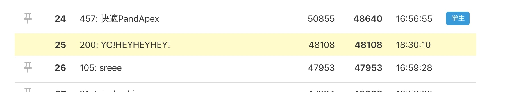

I participated in [ISUCON11](https://isucon.net/archives/55706291.html) again this year as team "YO!HEYHEYHEY!" with [@money166](https://twitter.com/money166) and [@tatsuo48](https://github.com/tatsuo48).

It was a very enjoyable experience again this year.
Thank you to all the organizers!

## Result

Our qualifying score was 47258 as a reference score, ranking 80th out of 598 teams.
[ISUCON11 Online Qualifying — Scores for All Teams (Reference Values) : ISUCON Official Blog](https://isucon.net/archives/56021246.html)

After 17:00 on the fixed dashboard, we rose to 25th place momentarily, which was exciting, but the top teams were still out of reach.



I participated every year for 5 years and could never significantly improve from the initial score. This year, the 6th year, we made a very big step forward and I was very happy!

## Theme

The theme of this year's app was a web service for monitoring the condition of chairs you own.
Registered chairs periodically send their status to the server, and users can check their chairs' condition through the web service.

In other words, IoT.

As you might guess from the service description, this year large amounts of data were constantly being sent to the server and written to the DB, keeping DB CPU usage very high. (When we ran the benchmark, CPU was already at 150% from the start.)
The key challenge was how to handle this DB load.

## Retrospective

### What Went Well

- This year we connected via Zoom and worked online, using screen sharing to collaborate effectively as a team
- When a benchmark run showed no improvement, we thoroughly reverted to the previous state, so we never had the app break
- We mostly worked in pairs of 2+, which helped us notice more things (like bottleneck causes)
- We carefully read the manual and understood the scoring rules, which helped us decide on approach
- We used Miro for task management so everyone knew what others were doing

### What Needs Improvement

- We hadn't studied Go enough and it took a long time to modify the app
- Due to lack of preparation, we couldn't set up New Relic DB monitoring
- After the score improved, we couldn't think of the next step and hit a ceiling

## What the Team Did

- Set up the initial infrastructure and launched the servers
- Read the contest manual and app manual carefully
- Ran the app manually to understand all its features
- Set up the deploy environment to the contest servers
- Added New Relic agents to the app
- Organized the DB schema
- Checked HTTP requests in the New Relic dashboard to find bottlenecks and decide on approach
- **==== ↓ Bottleneck fixes from here ====**
- Changed server configuration to Server 1: DB, Server 2: App: 1000 => 8000
- Fixed isu table query to not select image column: score unchanged
- Distributed chair condition data sending across 3 servers: score unchanged
- Changed chair condition DB writes to bulk insert: implementation failed
- Changed server config to Server 1: DB, Server 2: App, Server 3: Chair condition receiver: score unchanged
- Reconsidered the approach
- Added index to isu_condition.jia_isu_uuid: 8000 => 25000
- Added index to isu_condition.timestamp: 25000 => 28000
- Changed data drop ratio from 90% to 75%: 28000 => 33000
- Tried to cache images on the client: implementation failed
- Stopped nginx and app debug logging: 33000 => 35000
- Redirected /api/trend requests to Server 3: 35000 => 47000

### Understanding App Features by Running the App

The app this year seemed smaller in scale than previous years, so it was easy to understand the whole picture.
The pre-event service introduction in the opening also helped us understand the overview.

### Adding the New Relic Go Agent

I added the agent as an Echo middleware, referencing these docs:
- [Install New Relic for Go | New Relic Documentation](https://docs.newrelic.com/jp/docs/agents/go-agent/installation/install-new-relic-go/)
- [Go agent compatibility and requirements | New Relic Documentation](https://docs.newrelic.com/jp/docs/agents/go-agent/get-started/go-agent-compatibility-requirements/)

### Checking HTTP Requests and Finding Bottlenecks

Most requests were `POST /api/condition/:jia_isu_uuid`, which is the API endpoint that receives chair condition and writes to the DB. This was as expected.

`GET /api/trend` had a maximum response time of 60 seconds and an average of 20 seconds.

We focused on these two endpoints, checked the implementation details, and decided on a bottleneck approach.

### Change Server Config: Server 1: DB, Server 2: App — Score: 1000 => 8000

DB CPU load was very high at 150-180%, so we dedicated Server 1 to DB and moved request handling to Server 2.

Score improved by about 7000 points.

### Don't Query Image Column in isu Table

The isu_conditions table stored images as binary data.
`/api/trend` was doing `SELECT * FROM isu`, which included the image column even though it was not needed. We predicted this was causing slow reads, so we changed the query to only select needed columns. The improvement was not significant.

```go
- "SELECT * FROM `isu` WHERE `character` = ?",
+ "SELECT `id`, `jia_isu_uuid` FROM `isu` WHERE `character` = ?",
```

### Distribute Chair Condition Data Sending Across 3 Servers

Since large amounts of chair condition data were being sent, we thought other requests might be waiting. We tried distributing requests across 3 servers, but it had little effect.

```go
- postIsuConditionTargetBaseURL string
+ postIsuConditionTargetBaseURLs []string
```

### Change Server Config Again

We still thought chair condition HTTP requests were causing other requests like /api/trend to wait, so we moved all POST /api/condition/:jia_isu_uuid requests to a separate server.

There was no score improvement, but CPU load was distributed.

- Server 1: DB
- Server 2: App
- Server 3: Chair condition receiver

### Reconsider the Approach

We tried various approaches based on our initial guesses but didn't get results, so we reconsidered.

Looking at the benchmark logs, we found a suspicious message: "Many timeouts are occurring, so the service reputation has dropped and no more users will increase."
Checking the `user` table after the benchmark run, there were only 13 registered users.

Re-reading the scoring rules in the manual:
> Points are added when a user checks the ISU condition or score.

So the scenario was:
- New users first access the TOP page
- => TOP page trend info is requested
- => Request times out and the user leaves
- => User is not registered, so users don't increase
- => Score doesn't grow

Timeouts happening a lot
- => Users can't make scoring requests
- => Score doesn't grow

Based on these two scenarios, we concluded we needed to increase users to improve the score.

To do that, we needed to fix the timeouts. The obvious timeout culprit was `/api/trend`, so we continued bottleneck analysis focusing on that endpoint.

### Add Index to isu_condition.jia_isu_uuid — Score: 8000 => 25000

While thinking about the `/api/trend` bottleneck, I realized that constant writes to `isu_condition` might be causing table locks, making reads from `isu_condition` wait.

Looking it up:
> InnoDB uses row locking, but searching a column without a unique constraint or index causes a table lock.

[Investigating When InnoDB Uses Row Locks vs Table Locks](https://bluerabbit.hatenablog.com/entry/2013/12/07/075759)

`/api/trend` reads data with:
```sql
SELECT * FROM `isu_condition` WHERE `jia_isu_uuid` = ? ORDER BY timestamp DESC
```

Since table locks might be causing read waits, we added an index to the search column.

```sql
CREATE INDEX jia_isucon_uuid_index ON isu_condition(jia_isu_uuid);
```

This improved `/api/trend` response time and the score increased significantly.

### Add Index to isu_condition.timestamp — Score: 25000 => 28000

For the same reason, we also added an index to `timestamp` in `isu_condition`.

```sql
CREATE INDEX jia_isucon_uuid_timestamp_index ON isu_condition(jia_isu_uuid, timestamp);
```

### Change Data Drop Ratio from 90% to 75% — Score: 28000 => 33000

The initial implementation dropped 90% of received chair condition data.

```go
// TODO: Temporarily dropping a percentage of requests; ideally should handle all requests
dropProbability := 0.9
if rand.Float64() <= dropProbability {
	c.Logger().Warnf("drop post isu condition request")
	return c.NoContent(http.StatusAccepted)
}
```

Since points are added when users check new conditions, dropping chair condition data significantly reduces scoring opportunities. We adjusted the drop ratio to 75% and the score improved.

```go
- dropProbability := 0.9
+ dropProbability := 0.75
```

### Cache Images on the Client

After these improvements, `GET /api/isu/:jia_isu_uuid/icon` emerged as a new bottleneck endpoint.

This was clearly caused by storing images as binary data in the DB. We tried caching images on the client, but couldn't implement it successfully.

### Stop Logging — Score: 33000 => 35000

As the contest was nearing the end, we stopped nginx and app debug log output.
I don't remember exactly, but the score seemed to improve slightly.

### Redirect Trend Requests to Server 3 — Score: 35000 => 47000

Looking at overall CPU usage, Server 2 (App) was under high load while Server 3 (Chair condition receiver) had low load. To distribute the load, we boldly added a redirect for `/api/trend` requests to Server 3.

This worked perfectly — CPU load was distributed and the score increased significantly.

### Contest End

Final score on the dashboard with updates stopped at 17:00:


