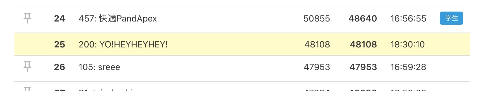

[@money166](https://twitter.com/money166)  
[@tatsuo48](https://github.com/tatsuo48)  
と一緒に今年も YO!HEYHEYHEY! として [ISUCON11](https://isucon.net/archives/55706291.html)に参加してきました。

今年も非常に楽しく参加できました。  
運営の皆さま、ありがとうございました！

## 結果
予選の結果は参考スコアで 47258 で全参加チーム598チーム中80位でした。  
[ISUCON11 オンライン予選 全てのチームのスコア（参考値） : ISUCON公式Blog](https://isucon.net/archives/56021246.html)

17:00以降の固定ダッシュボードで25位まで上昇していたので、これは！？と思ったのですが、壁は厚かったです。



5年間毎年参加して、ずっと初期実装のスコアから大きく点数を上げられなかったので、6年目の今年は非常に大きな進歩があって嬉しかったです！

## テーマ
今年のアプリケーションのテーマは自分が持っている椅子の状態を監視するWebサービスでした。  
登録している椅子が定期的にサーバーに自身の状態を送信して、ユーザーはその状態をWebサービスで確認することで椅子の状態を管理できます。

いわゆる IoT です。

サービスの説明からも予想できる通り、今年は常に大量のデーターがサーバーに送信されDBに書き込まれ続けるので、DBのCPU負荷が常に高い状態でした。（ベンチ回したら最初からCPU負荷が150%とか出ていました）  
このDB負荷をどう処理するかが問題のキーとなっている印象でした。

## 振り返り
### 良かった点
- 今年はZoomで繋いでオンラインで作業をしており、画面共有などでチームでの作業がやりやすかった
- ベンチ回して効果が無い場合は前の状態に戻す徹底できたので、アプリケーションが動かなくなる問題が発生しなかった
- 基本は2人以上のペアプロを意識して進めたので、それによって気付ける事が多かった
	- ボトルネックの原因とか
- しっかりマニュアルを読み込んでスコア計算の仕様を意識して対応方針が決められた
- Miroでタスク管理して誰が何をやっているか把握しながら進められた

### 反省点
- Go言語をあまり勉強しておらずアプリケーションの修正に時間がかかった
- 勉強不足で New Relic での DB の監視を導入できなかった
- 全体的にスコア上がってから次の一手が思いつかず頭打ちになった

## チームでやったこと
- インフラ環境の初期構築をしてサーバーを立ち上げ
- 当日マニュアルやアプリケーションマニュアルを熟読
- アプリケーションを実際に動かして機能一覧を把握
- 競技用サーバーへのデプロイ環境の整備
- アプリケーションに New Relic のエージェントを追加
- DBのスキーマ情報を整理
- New Relic のダッシュボードでHTTPリクエストを確認してボトルネックを調査して対応方針を検討
- **==== ↓ ここからボトルネック対応 ====**
- サーバー構成を サーバー1:DB, サーバー2: アプリケーション に変更: 1000 => 8000
- isu テーブルで画像カラムをクエリしない修正を追加: スコア変わらず
- 椅子の状態のデータ送信をサーバー3台に分散: スコア変わらず
- 椅子の状態のDBへの書き込みをバルクインサートに変更: 上手く実装できず
- サーバー構成を サーバー1: DB, サーバー2: アプリケーション, サーバー3: 椅子状態のデータ受信 に変更: スコア変わらず
- 対応方針を再検討
- isu_condition の jia_isu_uuid にインデックスを追加: 8000 => 25000
- isu_condition の timestamp にインデックスを追加: 25000 => 28000
- データを捨てる割合を 90% => 75% に変更: 28000 => 33000
- 画像をクライアントにキャッシュさせる: 対応が上手くできなかった
- Nginx や アプリケーション のデバッグログを停止: 33000 => 35000 （影響あった気がする）
- /api/trend のリクエストもサーバー3に流すように変更: 35000 => 47000

### アプリケーションを実際に動かして機能一覧を把握
今回は例年と比べてアプリケーション規模が小さい？印象だったので、全体の把握がスムーズにできた。  
オープニングでの事前のサービス紹介で概要が掴めたのも大きかった。

### New Relic の Go エージェントの追加
次のドキュメントを参考に echo のミドルウェアとしてエージェントを追加した
- [Go向けNew Relicのインストール \| New Relic Documentation](https://docs.newrelic.com/jp/docs/agents/go-agent/installation/install-new-relic-go/)
- [Goエージェントの互換性と要件 \| New Relic Documentation](https://docs.newrelic.com/jp/docs/agents/go-agent/get-started/go-agent-compatibility-requirements/)

### HTTPリクエストを確認してボトルネックを調査して対応方針を検討
リクエストの大半は `POST /api/condition/:jia_isu_uuid` が占めていた。  
これは椅子の状態を受け取ってDBに書き込むAPIエンドポイントなので、当初の想定通り。

`GET /api/trend` が最大で60sec、平均しても20secのレスポンス時間となっていた。

上記2つのAPIエンドポイントに絞って、実装の詳細を確認しながらボトルネックの調査と対応方針を決めた。

### サーバー構成を サーバー1:DB, サーバー2: アプリケーション に変更: 1000 => 8000
DBのCPU負荷が150~180%とかなり高かったので、サーバー1をDB専用にして、リクエストをサーバー２で捌くように変更した。

7000点ほどスコアが上昇

### isu テーブルで画像カラムをクエリしない
isu_conditions テーブルには画像がバイナリで含まれていた。  
/api/trend では `SELECT * FROM isu` と未使用にも関わらず画像カラムも取得していたので、これで読み込みに時間がかかってレスポンス時間に影響していると予測して、必要なカラムだけをクエリするようにしたが、大きな変化は無かった。

```go
- "SELECT * FROM `isu` WHERE `character` = ?",
+ "SELECT `id`, `jia_isu_uuid` FROM `isu` WHERE `character` = ?",
```

### 椅子の状態のデータ送信をサーバー3台に分散
椅子状態のデータ送信が大量にリクエストされているので、これにより他のリクエストが待機状態で捌かれていないのでは？と思い3台にリクエストを分散してみた。  
あまり効果は無かった。

```go
- postIsuConditionTargetBaseURL string // JIAへのactivate時に登録する，ISUがconditionを送る先のURL
+ postIsuConditionTargetBaseURLs []string // JIAへのactivate時に登録する，ISUがconditionを送る先のURL

=======

- postIsuConditionTargetBaseURL = os.Getenv("POST_ISUCONDITION_TARGET_BASE_URL")
- if postIsuConditionTargetBaseURL == "" {
-	e.Logger.Fatalf("missing: POST_ISUCONDITION_TARGET_BASE_URL")
	return
}

+ postIsuConditionTargetBaseURLs = strings.Split(os.Getenv("POST_ISUCONDITION_TARGET_BASE_URLS"), ",")
+ if postIsuConditionTargetBaseURLs == nil {
+	e.Logger.Fatalf("missing: POST_ISUCONDITION_TARGET_BASE_URLS")
		return
}
```

### サーバー構成を変更
引き続き椅子状態のHTTPリクエストにより /api/trend などの他のリクエストが待ち状態になっていると推測して、POST /api/condition/:jia_isu_uuid へのリクエストだけを全て別サーバーで処理するように変更した。

スコアへの影響は無かったが、CPU負荷は分散された。

- サーバー1: DB
- サーバー2: アプリケーション
- サーバー3: 椅子状態のデータ受信とDBへの書き込み

### 対応方針を再検討
最初に目星をつけた対応を色々と試したが結果が出なかったので、改めて対応方針を検討した。

ベンチマークをログを見ていると「タイムアウトが多く発生しているため、サービスの評判が下がりこれ以上ユーザーは増えません」という怪しげなログを発見。  
ベンチマーク実行後の `user` テーブルを見てみると、ユーザー数が13人しか登録されていなかった。

改めて当日マニュアルのスコア計算の仕様を読み直すと  
> スコアはユーザーがISUのコンディションやスコアを確認すると加点されます。

との事なので、

新規ユーザーは最初にTOPページにアクセスする  
=> TOPページのトレンド情報がリクエストされる  
=> リクエストがタイムアウトしてユーザーが離脱  
=> ユーザー登録されずにユーザーが増えない  
=> スコアが伸びない  

タイムアウトが大量に発生  
=> ユーザーが加点となるリクエストができない  
=> スコアが増えない  

という2つのシナリオを仮定して、スコアを伸ばすためにはユーザーを増やす必要がありそうと判断

そのためには、ログにも出ているタイムアウトを改善する必要があり、タイムアウトとなっているリクエストは明らかに `/api/trend` だったので、このエンドポイントを改善する方針でボトルネック調査を継続

### isu_condition の jia_isu_uuid にインデックスを追加: スコア改善: 8000 => 25000
改めて `/api/trend` のボトルネックを考えていたら `isu_condition` への書き込みが常に発生しているので、テーブルロックが発生して `isu_condition` の読み込みが待ち状態になっている影響で時間がかかっているのでは？と推測

実際に調べてみたら
> InnoDBは行ロックだが、ユニーク制約 or インデックスが張られていないカラムで検索した場合はテーブルロックになってしまう。  

[InnoDBで行ロック/テーブルロックになる条件を調べた \#mysqlcasual Advent Calendar 2013 \- あおうさ＠日記](https://bluerabbit.hatenablog.com/entry/2013/12/07/075759)

という情報を発見  

`/api/trend` は以下のクエリでデータを読み込んでおり、テーブルロックによるりデータの読み込みが待ち状態になっている可能性がありそうだったので、検索カラムにインデックスを追加した。

```sql
SELECT * FROM `isu_condition` WHERE `jia_isu_uuid` = ? ORDER BY timestamp DESC
```

```sql
+ CREATE INDEX jia_isucon_uuid_index ON isu_condition(jia_isu_uuid);
```

この修正 `/api/trend` のレスポンス時間が改善されて、スコアが大幅に上昇した。

### isu_condition の timestamp にインデックスを追加: 25000 => 28000
同様の理由で `isu_condition` の `timestamp` にもインデックを追加して、スコアが上昇

```sql
+ CREATE INDEX jia_isucon_uuid_timestamp_index ON isu_condition(jia_isu_uuid, timestamp);
```

### データを捨てる割合を 90% => 75% に変更: 28000 => 33000
初期実装では受信した椅子の状態の90%を捨てる実装になっていた。

```go
// TODO: 一定割合リクエストを落としてしのぐようにしたが、本来は全量さばけるようにすべき
dropProbability := 0.9
if rand.Float64() <= dropProbability {
	c.Logger().Warnf("drop post isu condition request")
	return c.NoContent(http.StatusAccepted)
}
```

> ISU のコンディション確認（GET /api/condition/:jia_isu_uuid）で、ユーザが前回確認したコンディションより新しいコンディションを確認した際に加点

スコア計算では、ユーザーが新しい状態を確認した時に加点の対象となるため、椅子の状態を捨てていると加点の機会を大きく損なってしまうので、ここの割合を75%に減少させる調整を実施して、スコアが上昇した。

```go
- dropProbability := 0.9
+ dropProbability := 0.75
```

### 画像をクライアントにキャッシュさせる
ここまでの改善で新たに椅子の画像を取得する `GET /api/isu/:jia_isu_uuid/icon` が新たなボトルネックのエンドポイントとして浮上してきた。

ここは明らかにDBにバイナリで画像を保存している事による影響だと考えて、クライアント側に画像をキャッシュさせる対応を試みたが、上手く対応できなかった。

### ログの停止: 33000 => 35000
競技も終盤になっていたので、Nignx や アプリケーションのデバッグログ出力を停止した。  
ちゃんと覚えてないが、スコアが僅かに改善した気がする。

### トレンドのリクエストもサーバー3に流すように変更: 35000 => 47000
全体のCPU負荷を見ていて、サーバー2: アプリケーション のCPU負荷が高く、 サーバー3: 椅子の状態受信 のCPU負荷が低かったので、負荷を分散するために思い切って `/api/trend` のリクエストをサーバー3へリダイレクトする対応を追加

これが見事に成功してCPU負荷が分散されて、スコアが大幅に上昇した。

### 競技終了
17:00で更新が停止された状態でのダッシュボード上での最終スコア  


