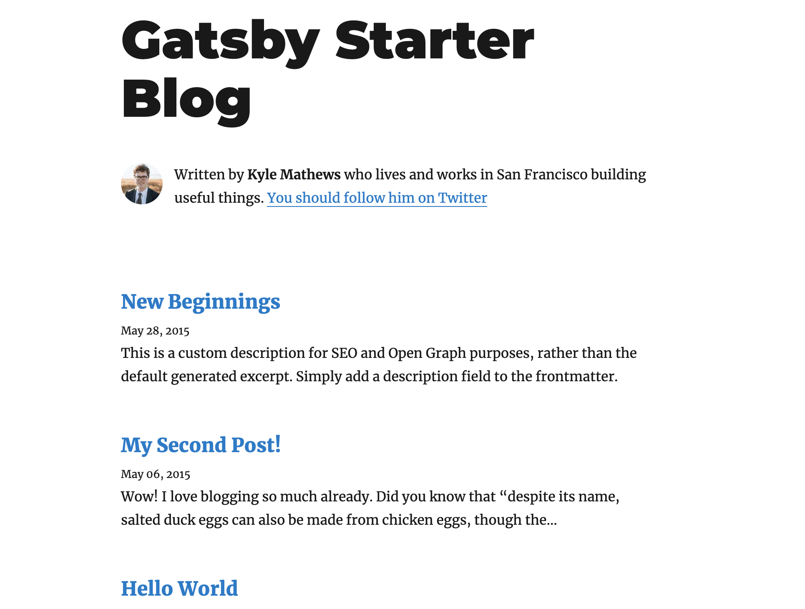

## What is Netlify CMS?

Netlify CMS is a CMS tool provided by Netlify that can be used with any static site generator.
It provides a web-based UI with features like text editing, preview, and image upload.
It uses the GitHub API internally, so the flow of writing an article in the admin panel → pushing to GitHub → deploying to Netlify is done automatically.

## Creating a Blog from a GatsbyJS Template

We can't do anything without a blog to set up.

First, use [gatsbyjs/gatsby-starter-blog](https://github.com/gatsbyjs/gatsby-starter-blog) to create a blog from a template.

```shell
$ yarn add global gatsby-cli
$ gatsby new blog https://github.com/gatsbyjs/gatsby-starter-blog
```

The blog is ready with just two lines!
If I start fixing the design and other things, I know from experience that I'll give up halfway. So my only goal for now is to get it published.

We can fix the design slowly later.

### Installing Netlify CMS

Next, install Netlify CMS.

```shell
$ cd blog
$ yarn add netlify-cms-app gatsby-plugin-netlify-cms
```

Create the file `static/admin/gatsby-config.yml` and paste the following content.

```yaml
backend:
  name: git-gateway
  branch: master

media_folder: static/images/uploaded
public_folder: /images/uploaded

collections:
  - name: "blog"
    label: "Blog"
    folder: "content/blog"
    create: true
    slug: "{{year}}-{{month}}-{{day}}-{{slug}}"
    editor:
      preview: true # Enable preview
    publish_mode: editorial_workflow # Enable workflow management
    fields:
      - { label: "Title", name: "title", widget: "string" }
      - { label: "Publish Date", name: "date", widget: "datetime" }
      - { label: "Description", name: "description", widget: "string" }
      - { label: "Body", name: "body", widget: "markdown" }
```

Add an empty directory for uploading images.

```shell
$ mkdir -p static/images/uploaded
$ touch static/images/uploaded/.gitkeep
```

Finally, add the plugin to `gatsby-config.js`.

```
plugins: [`gatsby-plugin-netlify-cms`]
```

That's all for installing the CMS. It's surprisingly simple.

Let's check it in the local environment.

```
$ yarn development
```

If you go to http://localhost:8000/admin and see the CMS login screen, you're good to go.

To log in, you need to set up Netlify authentication, which is described later.

### Publishing the Blog

Now it's time to publish the blog to Netlify.

First, push to GitHub.

```shell
$ git add .
$ git commit -m "Initial Commit"
$ git remote add origin https://github.com/YOUR_USERNAME/NEW_REPO_NAME.git
$ git push -u origin master
```

Then go to the Netlify page, select `New Site From Git`, and follow the steps to publish the blog.

Set the build settings as follows.

```
Build Command: gatsby build
Publish directory: public/
```

You can view the admin panel by going to `<your blog domain>/admin`.



It's still the template, but my blog is now published!

## Creating a CMS Admin User

To log in to the CMS admin panel, set up Netlify authentication and create an admin user. Select the published site from the Netlify dashboard and follow these steps.

1. Go to Settings > Identity > Enable Identity
2. Go to Registration preferences > Edit Settings > Invite only. Without this setting, anyone can create an account and log in to the admin panel, so it is recommended to set this unless you have a good reason not to.
3. Click Services > Git Gateway > Enable Git Gateway
4. Go to the Identity tab > Click Invite users. Enter your own email address to invite yourself as an admin, then create an account from the invitation email.

You can now log in to the CMS admin panel.

## Writing a Post

Finally, let's write the first post in the CMS.

1. Go to /admin and log in to the admin panel
2. Click `new blog`
3. Write your article and click `Save`
4. If everything looks good, click Publish

The article is now published.
