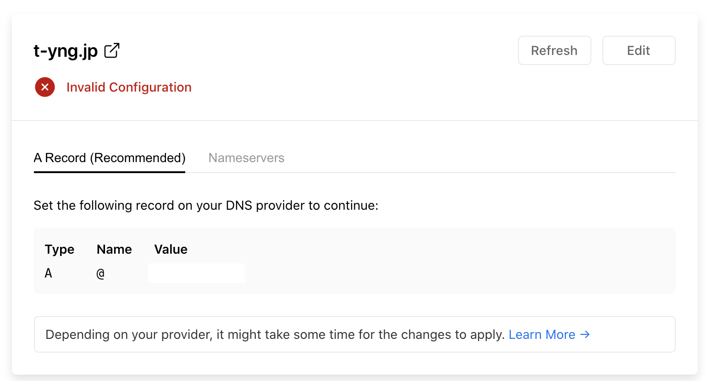
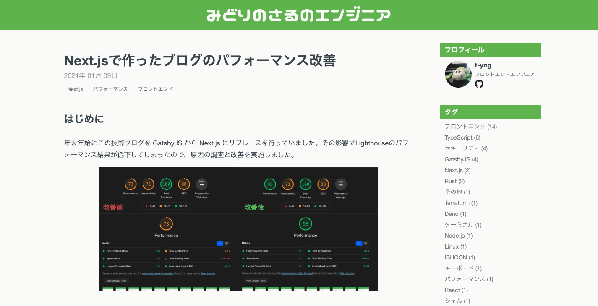

This tech blog is hosted on Netlify, but I had been concerned about reports that Netlify's free plan has no CDN edge servers in Japan, causing latency and slow speeds.

- [Netlify is slow from Japan - id:anatoo's blog](https://blog.anatoo.jp/2020-08-03)
- [Considering migration from Netlify to Vercel](https://www.suzu6.net/posts/268-blog-server/)

## Speed Comparison

I hosted the same blog on Vercel too, and compared the response speed for a 1.3MB image between Netlify and Vercel, following the approach from those articles.
The test was run around 12:00 on a Wednesday.

Netlify gave: response speed 629ms/req, transfer speed 2.07MB/sec. Honestly, just looking at these numbers, I wasn't sure if that was fast or slow.

```
# Netlify response speed (requesting a 1.3MB image)
$ ab -n 10 -c 1 -k https://t-yng.jp/images/posts/nextjs-perf-improvement/bundle-analyzer-result.png

This is ApacheBench, Version 2.3 <$Revision: 1843412 $>
Copyright 1996 Adam Twiss, Zeus Technology Ltd, http://www.zeustech.net/
Licensed to The Apache Software Foundation, http://www.apache.org/

Benchmarking t-yng.jp (be patient).....done


Server Software:        Netlify
Server Hostname:        t-yng.jp
Server Port:            443
SSL/TLS Protocol:       TLSv1.2,ECDHE-ECDSA-AES256-GCM-SHA384,256,256
Server Temp Key:        ECDH X25519 253 bits
TLS Server Name:        t-yng.jp

Document Path:          /images/posts/nextjs-perf-improvement/bundle-analyzer-result.png
Document Length:        1337519 bytes

Concurrency Level:      1
Time taken for tests:   6.294 seconds
Complete requests:      10
Failed requests:        0
Keep-Alive requests:    10
Total transferred:      13378950 bytes
HTML transferred:       13375190 bytes
Requests per second:    1.59 [#/sec] (mean)
Time per request:       629.442 [ms] (mean)
Time per request:       629.442 [ms] (mean, across all concurrent requests)
Transfer rate:          2075.71 [Kbytes/sec] received

(omitted)
```

For Vercel: response speed 172ms/req, transfer speed 7.5MB/sec — about 4 times faster than Netlify.
I didn't expect such a clear difference, so I was surprised.

```
$ ab -n 10 -c 1 -k https://blog-eta-beryl.vercel.app/images/posts/nextjs-perf-improvement/bundle-analyzer-result.png

This is ApacheBench, Version 2.3 <$Revision: 1843412 $>
Copyright 1996 Adam Twiss, Zeus Technology Ltd, http://www.zeustech.net/
Licensed to The Apache Software Foundation, http://www.apache.org/

Benchmarking blog-eta-beryl.vercel.app (be patient).....done


Server Software:        Vercel
Server Hostname:        blog-eta-beryl.vercel.app
Server Port:            443
SSL/TLS Protocol:       TLSv1.2,ECDHE-RSA-AES256-GCM-SHA384,2048,256
Server Temp Key:        ECDH X25519 253 bits
TLS Server Name:        blog-eta-beryl.vercel.app

Document Path:          /images/posts/nextjs-perf-improvement/bundle-analyzer-result.png
Document Length:        1337519 bytes

Concurrency Level:      1
Time taken for tests:   1.721 seconds
Complete requests:      10
Failed requests:        0
Keep-Alive requests:    10
Total transferred:      13380710 bytes
HTML transferred:       13375190 bytes
Requests per second:    5.81 [#/sec] (mean)
Time per request:       172.050 [ms] (mean)
Time per request:       172.050 [ms] (mean, across all concurrent requests)
Transfer rate:          7594.93 [Kbytes/sec] received

(omitted)
 ```

## Why is Netlify Slow?

As I mentioned at the beginning, the CDN edge servers are not in Japan. Requests are routed through servers in Singapore or other countries outside Japan, which causes network latency.

When I checked the routing path to the Netlify-hosted domain, I could see it was going through a server that appeared to be in Singapore.

```zsh
$ traceroute t-yng.jp

traceroute: Warning: t-yng.jp has multiple addresses; using 104.248.158.121
traceroute to t-yng.jp (104.248.158.121), 64 hops max, 52 byte packets
 1  192.168.0.1 (192.168.0.1)  2.072 ms  1.227 ms  1.110 ms
 2  192.168.24.1 (192.168.24.1)  1.391 ms  1.580 ms  1.406 ms
 3  153.153.253.241 (153.153.253.241)  6.315 ms  7.216 ms  7.145 ms
 4  153.153.253.133 (153.153.253.133)  5.132 ms  4.885 ms  5.025 ms
 5  118.23.46.65 (118.23.46.65)  7.509 ms  12.750 ms  8.127 ms
 6  180.8.119.137 (180.8.119.137)  8.569 ms  6.889 ms  5.825 ms
 7  153.149.219.49 (153.149.219.49)  14.854 ms  15.650 ms  20.858 ms
 8  153.149.219.146 (153.149.219.146)  22.481 ms  21.862 ms  27.293 ms
 9  ae-12.r02.osakjp02.jp.bb.gin.ntt.net (61.200.80.9)  15.422 ms  18.149 ms  23.293 ms
10  ae-3.r25.osakjp02.jp.bb.gin.ntt.net (129.250.2.129)  17.947 ms
    ae-2.r25.osakjp02.jp.bb.gin.ntt.net (129.250.7.32)  18.441 ms  19.506 ms
11  ae-9.r22.sngpsi07.sg.bb.gin.ntt.net (129.250.2.66)  84.407 ms  90.269 ms  88.346 ms
12  ae-0.a00.sngpsi07.sg.bb.gin.ntt.net (129.250.2.74)  85.529 ms  87.029 ms
    ae-0.a01.sngpsi07.sg.bb.gin.ntt.net (129.250.2.122)  91.914 ms
13  ae-0.digital-ocean.sngpsi07.sg.bb.gin.ntt.net (116.51.17.166)  86.345 ms
    ae-1.digital-ocean.sngpsi07.sg.bb.gin.ntt.net (116.51.17.194)  86.923 ms  88.386 ms
14  138.197.245.9 (138.197.245.9)  90.475 ms * *
```

## Migrating to Vercel

### Remove Netlify Integration

First, I removed the GitHub repository integration with Netlify to stop automatic deploys.
Go to your GitHub repository, then Settings > Integrations > Netlify, and delete it.

### Deploy to Vercel

Since the blog is built with Next.js, I followed the [official Next.js documentation](https://nextjs.org/docs/deployment#vercel-recommended).
Basically, you just go to the Vercel website and click through to import your GitHub repository as a Vercel project.

### Remove Custom Domain from Netlify

Change the custom domain from pointing to Netlify to pointing to Vercel.
To set a custom domain on Netlify, I had changed the nameservers in my domain registrar. I reverted those nameservers back to the default ones from my domain registrar.

### Add Custom Domain to Vercel

After that, go to your project on Vercel and add the custom domain under Settings > Domains.
After adding the custom domain, DNS record settings are displayed. Register those DNS records with your domain registrar.



That completes the migration from Netlify to Vercel.

The page load speed, including image loading, is noticeably much faster now!

**Page loading on Netlify**


**Page loading on Vercel**


