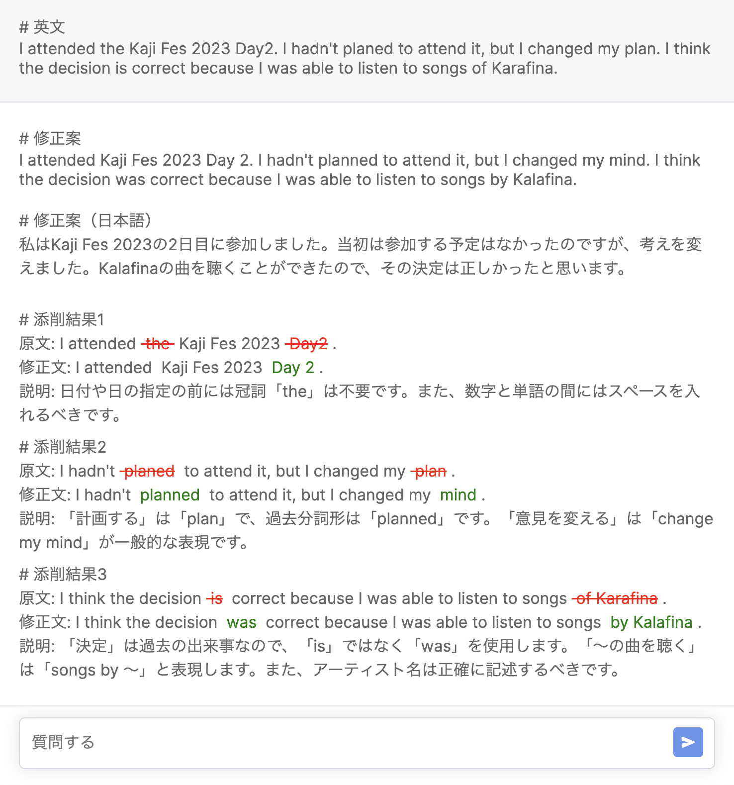

This article is the 11th entry in the [YAMAP Advent Calendar](https://qiita.com/advent-calendar/2023/yamap-engineers).

## Introduction

Recently, as part of learning English, I have been writing diary entries in English. I wanted feedback on my English writing, so I built my own English correction tool using the OpenAI Chat API.
The application uses API Routes so it runs entirely on Next.js. When I tried hosting it on Vercel's free plan, I ran into a problem. In this article, I'll explain the issues with free hosting for Next.js + ChatGPT apps, and introduce a PaaS service I recommend for free hosting.

[t-yng/language-teacher](https://github.com/t-yng/language-teacher)

## Conclusion First

I tried three hosting services: [Vercel](https://vercel.com), [Fly.io](https://fly.io/), and [Render](https://render.com/).
Vercel and Fly.io both had problems on the free plan, so I ended up using Render.

## PaaS Comparison

| PaaS | Execution Limits | Resources | Ease of Deployment |
|---|---|---|---|
| Vercel | Yes | ◎ | ◎ |
| Fly.io | None in particular | △ | △ |
| Render | None in particular | ○ | ◎ |

Overall, Render had the best balance.

### Problem with Vercel

Vercel has a [usage limit that times out external proxy requests after 30 seconds](https://vercel.com/docs/limits/overview).
The GPT-4 model takes quite a long time to respond to API calls, and sometimes it can take more than 30 seconds. So when hosting on Vercel, this limit can cause timeout errors.

Using the API in streaming mode might solve the timeout problem since results come back quickly. However, in my case I wanted to receive the result as JSON and process it, so streaming mode was not an option, and I sadly gave up on hosting with Vercel.

### Problem with Fly.io

Fly.io does not have the same proxy request limit as Vercel, so the timeout problem did not occur and I could run the application at a basic level.

However, the [free plan](https://fly.io/docs/about/pricing/#free-allowances) limits machine memory to 256MB. With this amount of memory, the machine frequently went down due to running out of memory while using the application.
This might be a problem I could fix by improving memory management in the app, but I have always had the impression that Next.js tends to use a fair amount of memory, so I didn't investigate further.

Another downside of Fly.io is that, unlike Vercel, there is no system to automatically set up a deployment environment by linking a repository. You need to run commands from the CLI like Heroku, which makes setting up the deployment environment a bit more work.

### Problem Solved with Render

Render, like Fly.io, has no proxy request limits, and the free plan gives 512MB of memory — twice as much as Fly.io.
Since I was just barely running out of memory at 256MB, moving to Render solved the memory problem and the app became stable.

Also, Render works just like Vercel — you just link your GitHub repository and it automatically builds and deploys. So the deployment setup issue I had with Fly.io was not a problem at all.

Even better, Render also supports pull request previews, just like Vercel!

### Downsides of Render

Of course, Render also has [usage limits on the free plan](https://render.com/docs/free#free-web-services):
- If the application has no activity for 15 minutes, it goes to sleep
- Instance uptime is limited to 750 hours/month
- Build pipeline processing time is limited to 500 min/month

The limits on instance uptime and pipeline processing time were not a big problem for personal use.
The sleep limit is a bit frustrating because the first access after the app has gone to sleep takes a noticeable amount of time. So it's hard to say I'm completely satisfied.
(There might be a way to prevent sleep by accessing it periodically.)

## Conclusion

Recently, the Next.js + Vercel combination had been working fine on the free plan, so it had been a while since I looked into PaaS options.
I was very happy to find good candidates like Fly.io and Render that can also be used for free hosting of API servers!

Since automatically setting up a deployment environment by linking a GitHub repository is something I really want, I plan to use Render as my second choice when the Vercel Hobby Plan doesn't work.
