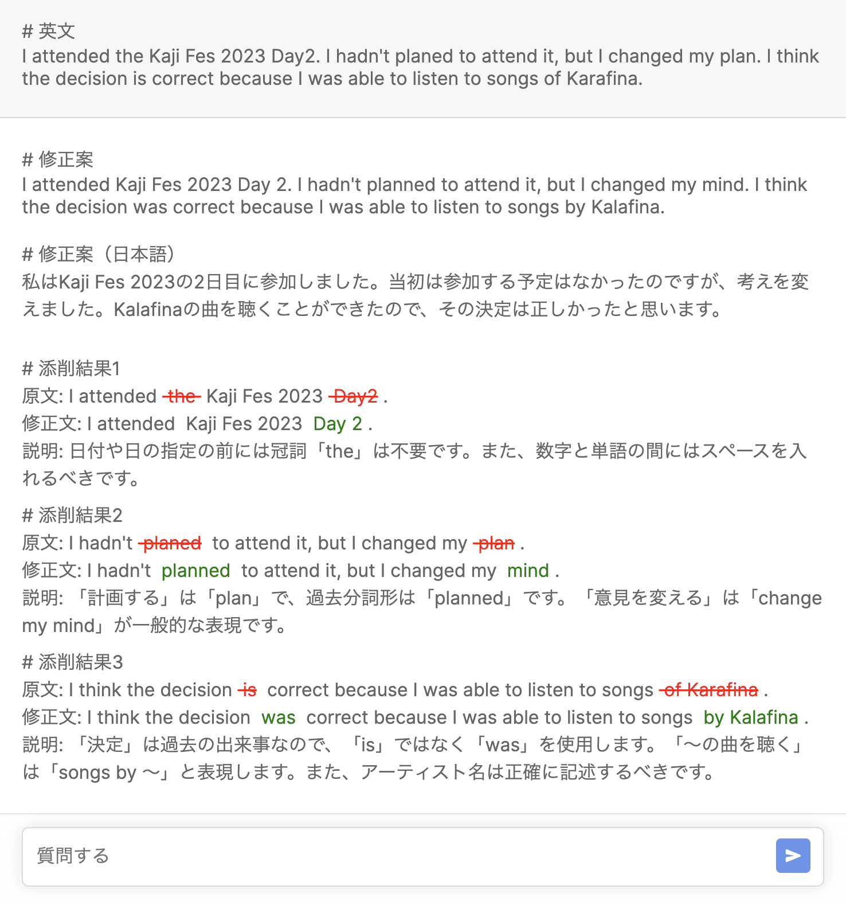

この記事は[YAMAPアドベントカレンダー](https://qiita.com/advent-calendar/2023/yamap-engineers)11日目の記事です。

## はじめに
最近、英語学習の一環として、英語で日記を書いてます。英作文をする上で英語の添削をして欲しかったので、OpenAIのチャットAPIを使って自作の英文添削ツールを開発しています。
アプリケーションはAPI Routeを利用してNext.jsのみで動かすようにしています。Vercelの無料枠で運用したら問題が発生したので、Next.jS+ChatGPTで開発する際に無料でホスティングする際の問題点と無料でホスティングするのにオススメのPaaSを紹介します。

[t\-yng/language\-teacher](https://github.com/t-yng/language-teacher)

## 最初に結論
ホスティング先として[Vercel](https://vercel.com), [Fly.io](https://fly.io/), [Render](https://render.com/)の3つのサービスを試しました。
Vercel,Fly.ioでは無料枠だと問題が発生したので、最終的にはRenderで運用をしています。

## PaaSの比較
|PaaS|実行制限|リソース|デプロイの容易さ|
|---|---|---|---|
|Vercel|あり|◎|◎|
|Fly.io|特になし|△|△|
|Render|特になし|◯|◎|

PaaSの比較としては、Renderが一番バランス的に良かったです。

### Vercelでの問題
Vercelでは[外部へのプロキシリクエストの場合に30秒でタイムアウトする](https://vercel.com/docs/limits/overview)利用制限があります。
GPT4のモデルはAPIのレスポンスに結構な時間がかかり、長い時では30秒を超える場合もあります。そのため、Vercelでホスティングをすると、この利用制限の影響でタイムアウトエラーが発生する事があります。

ストリーミングモードでAPIを利用したら、すぐに結果が返ってくるのでこのタイムアウト問題を解消できるかもしれないですが、自分の場合だとJSONで結果を受け取り加工をしたかったので、ストリーミングモードの利用は難しく、泣く泣くVercelでのホスティングは諦めました。

### Fly.ioでの問題
Fly.ioはVercelのようなプロキシリクエストの制限がないので、タイムアウトでアプリケーションが動作しない問題は発生しなかったので、最低限のアプリケーションを運用することは可能でした。

しかし、[無料枠](https://fly.io/docs/about/pricing/#free-allowances)ではマシンリソースのメモリが256MBに限定されます。このメモリ量の場合にアプリケーションを利用中に頻繁にメモリ不足でマシンが落ちてしまう問題が発生しました。
メモリ管理の問題でアプリケーションを改善すれば解消する問題かもですが、Next.jsは割とメモリを食いがちな印象でマシンリソースを要求される印象を昔から持っていたので、特に調査はしていないです。

他にFly.ioの難点として、Vercelのようなリポジトリを連携したら自動でデプロイ環境が構築される仕組みがなく、HerokuのようにCLIでコマンドを実行してデプロイする必要があるので、デプロイ環境の構築が少し手間でした。

### Renderで問題解消
RenderはFly.ioと同様にプロキシリクエストへの制限が無く無料枠のインスタンスのメモリが512MBとFly.ioの2倍のリソースを利用できます。
256MBで僅かにメモリ不足という状態だったので、Renderでメモリ不足問題が解消されて安定した動作できるようになりました。

また、RenderはVercelと同じようにGitHubのリポジトリを連携するだけで、自動ビルド~デプロイまで自動で実行されるのでFly.ioで問題となっていたデプロイ環境構築の手間も全くありませんでした。

さらに嬉しいことにRenderはVercelと同じようにプルリクエストプレビューの機能も利用することができます！

### Renderのデメリット
当然ですが、Renderにも[無料枠での利用制限](https://render.com/docs/free#free-web-services)は存在します。
- アプリケーションの利用が15分以上ない場合はスリープ状態になる
- インスタンスの稼働時間が750時間/月
- ビルドパイプラインの処理時間が500min/月

インスタンスの稼働時間やパイプラインの処理時間の制約については、個人利用する分には大きな問題はなりませんでした。
アプリケーションがスリープ状態になる制限については、アクセス時の初回起動に気になるレベルで時間がかかってしまうので、完全に満足で利用するのは難しい状態です。
（定期的にアクセスをしてスリープ解除する方法とかはある気がしますが。）

## さいごに
最近はNext.js+Vercelの組み合わせで無料枠のホスティングは問題なかったので、久しぶりにPaaSのサービスを調べてみました。
Fly.ioやRenderなどAPIサーバーを無料でホスティングしたい場合にも利用できそうなPaaS候補が見つかって非常に良かったです！

GitHubリポジトリの連携によるデプロイ環境の自動構築は個人的にかなり欲しいので、今後はVercelのHobby Planだと難しい場合の第2候補としてRenderを使っていこうと思います。
