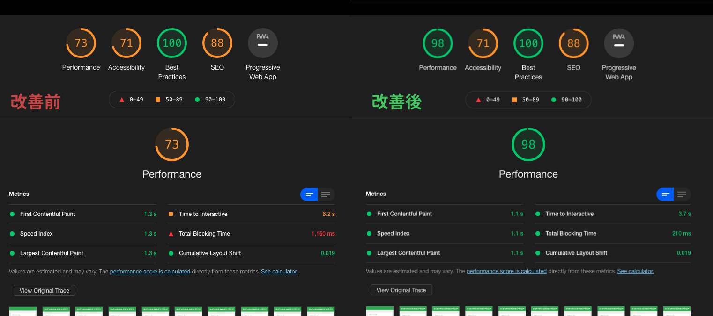
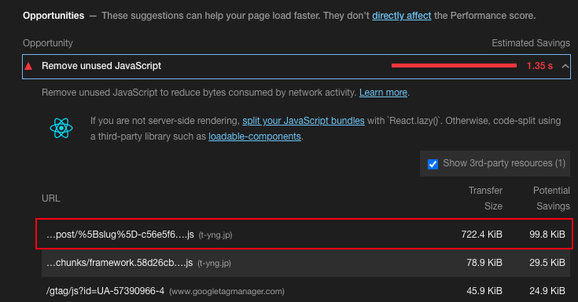
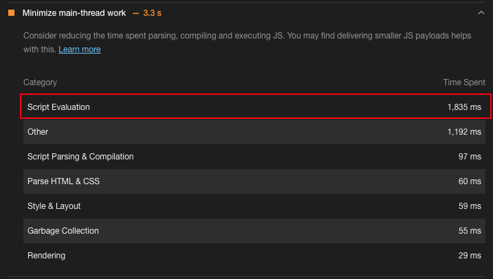
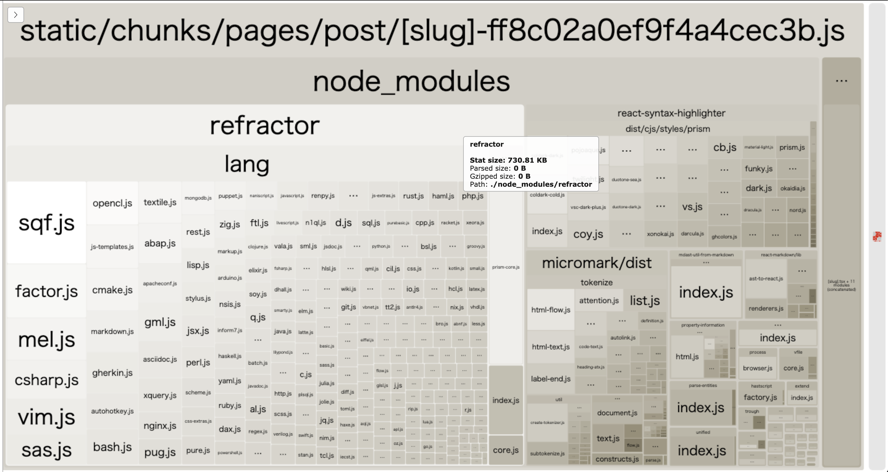
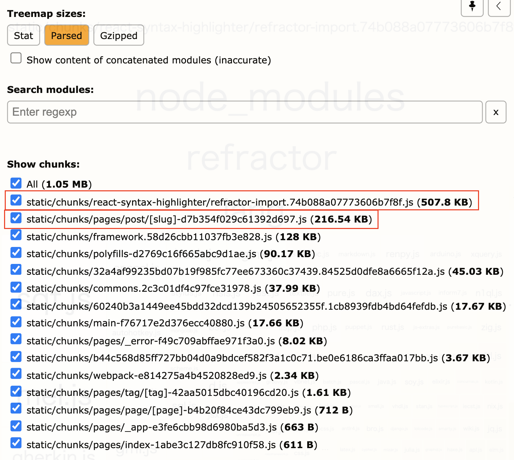
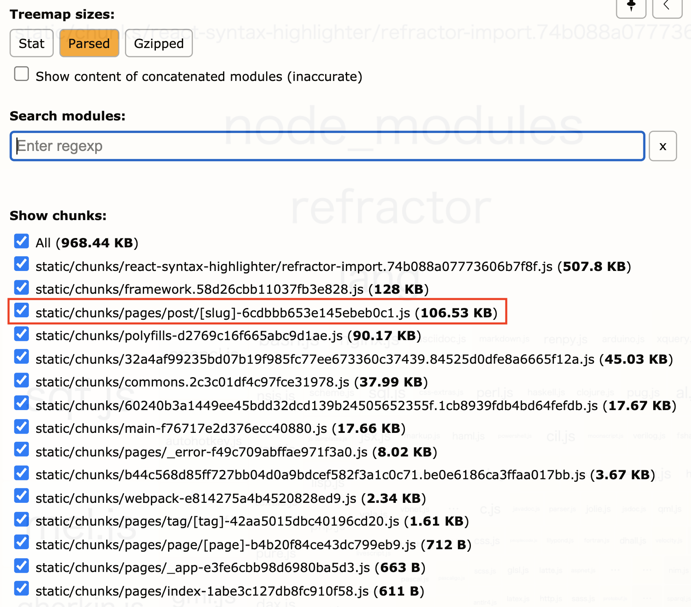

## Introduction

During the year-end holidays, I replaced this tech blog from GatsbyJS to Next.js. As a result, the Lighthouse performance score dropped, so I investigated the cause and made improvements.



## Investigating the cause

### Analyzing the Lighthouse results

Looking at the Lighthouse details, a very large JS file of 722.4kb was being sent. As shown by "Potential Saving 99.8kb," most of this JS file was unused code.



The large JS file also caused "Script Evaluation" to take 1,835ms, blocking rendering for a long time.



### Webpack Bundle Analyzer

The large JS file that caused the problem in the Lighthouse results was `chunks/pages/post/[slug]-xxx.js`. This is a file generated by Next.js's build process for the article detail page. I investigated the modules bundled in this file to find out why it was so large.

Next.js uses Webpack internally for building, so I can use [webpack-contrib/webpack-bundle-analyzer](https://github.com/webpack-contrib/webpack-bundle-analyzer) to visualize the bundle information of the generated JS files.

A Next.js plugin called [@next/bundle-analyzer](https://github.com/vercel/next.js/tree/canary/packages/next-bundle-analyzer) is available, so I used that.

First, install the package.

```bash
$ yarn add -D @next/bundel-analyzer
```

Then add the plugin configuration to `next.config.js`.
I set it up so that the bundle analyzer only runs when the environment variable `ANALYZE=true` is set.

```javascript
const withBundleAnalyzer = require('@next/bundle-analyzer')({
    enabled: process.env.ANALYZE === 'true',
});

const config = {
    // omitted
};

module.exports = withBundleAnalyzer(config);
```

Run it like this:

```bash
$ ANALYZE=true next build
```

I also added it to `package.json` for future use.

```json
{
    "scripts": {
        "bundle-analyzer": "ANALYZE=true next build"
    }
}
```

### Analyzing the Webpack Bundle Analyzer results

Running webpack-bundle-analyzer opens a browser during the build with a visualization of the bundle.
Looking at the result, a module called [refractor](https://github.com/wooorm/refractor) took up most of the space. Loading this module seemed to be the cause of the problem.



Looking at `yarn.lock`, I found that `refractor` is loaded from [react-syntax-highlighter/react-syntax-highlighter](https://github.com/react-syntax-highlighter/react-syntax-highlighter).

```yaml
react-syntax-highlighter@^15.4.3:
  version "15.4.3"
  resolved "https://registry.yarnpkg.com/react-syntax-highlighter/-/react-syntax-highlighter-15.4.3.tgz#fffe3286677ac470b963b364916d16374996f3a6"
  integrity sha512-TnhGgZKXr5o8a63uYdRTzeb8ijJOgRGe0qjrE0eK/gajtdyqnSO6LqB3vW16hHB0cFierYSoy/AOJw8z1Dui8g==
  dependencies:
    "@babel/runtime" "^7.3.1"
    highlight.js "^10.4.1"
    lowlight "^1.17.0"
    prismjs "^1.22.0"
    refractor "^3.2.0"
```

Now that I found the cause of the performance problem, I moved on to fixing it.

## Improving performance

`refractor` includes JS files for each language used in syntax highlighting, and all of them were being loaded at the time of the first render, causing the performance issue. Since `react-syntax-highlighter` supports dynamic imports, I changed it to use dynamic imports to avoid blocking rendering.

However, the total size of files being loaded didn't change, so I'd like to find a better approach in the future.

```typescript
// import { Prism as SyntaxHilighter } from 'react-syntax-highlighter';
import { PrismAsync as SyntaxHilighter } from 'react-syntax-highlighter';
```

After switching to dynamic import, the bundle analyzer shows `refractor-import.xxx.js` as a new separate chunk. The file size of `[slug]-xxx.js` was also reduced from 722.4kb to 216.54kb.



Looking at the contents of the updated `[slug]-xxx.js`, I found another problem. `react-syntax-highlighter` was loading all theme files.

![bundle-analyzer result for [slug]-xxx.js](bundle-analyzer-result-slug.png)

This was also unnecessary, so I changed it to load only the theme file I needed.

```typescript
// import { vscDarkPlus as defaultVscDarkPlus } from 'react-syntax-highlighter/dist/cjs/styles/prism';
import defaultVscDarkPlus from 'react-syntax-highlighter/dist/cjs/styles/prism/vsc-dark-plus';
```

In the end, the file size of `[slug]-xxx.js` was reduced from 722.4kb to 106.5kb — a 1/7 reduction!
This significantly reduced the rendering blocking time, so the Lighthouse performance score also improved.



## Conclusion

This time I focused on the biggest problem and made improvements, but there are still many more things to improve, such as image optimization, lazy loading of images, and removing other unnecessary JavaScript files. Also, the migration to Next.js introduced new libraries that unintentionally caused a performance drop, so I want to set up a system to continuously measure performance going forward, for example using [GoogleChrome/lighthouse-ci](https://github.com/GoogleChrome/lighthouse-ci).
