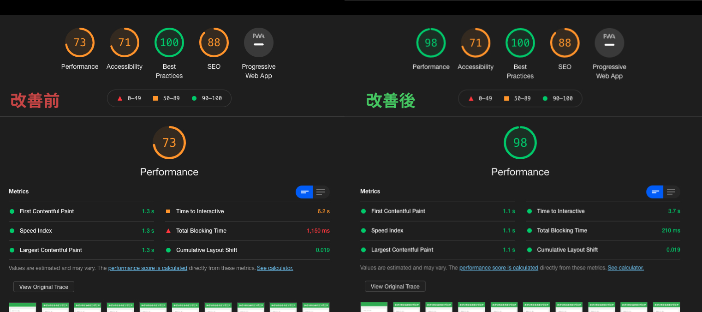
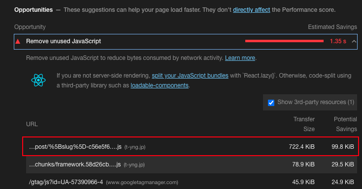
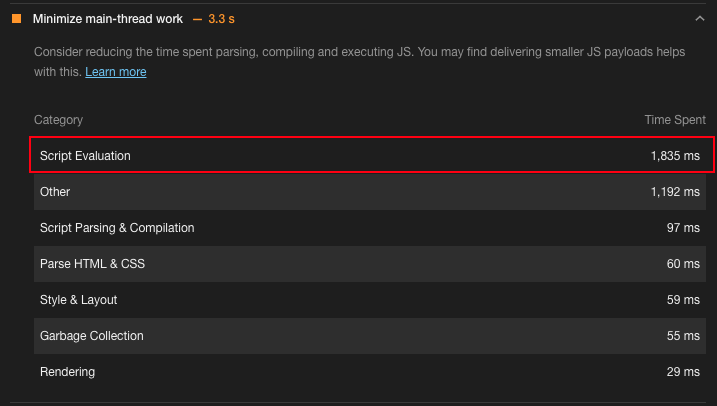
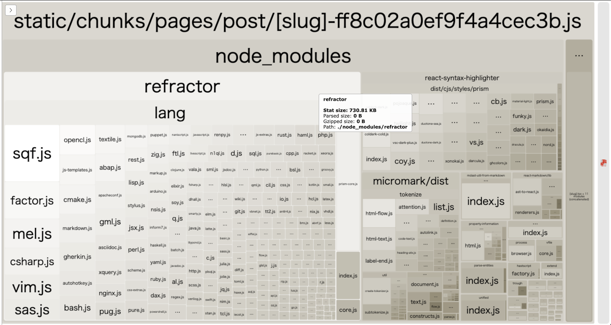
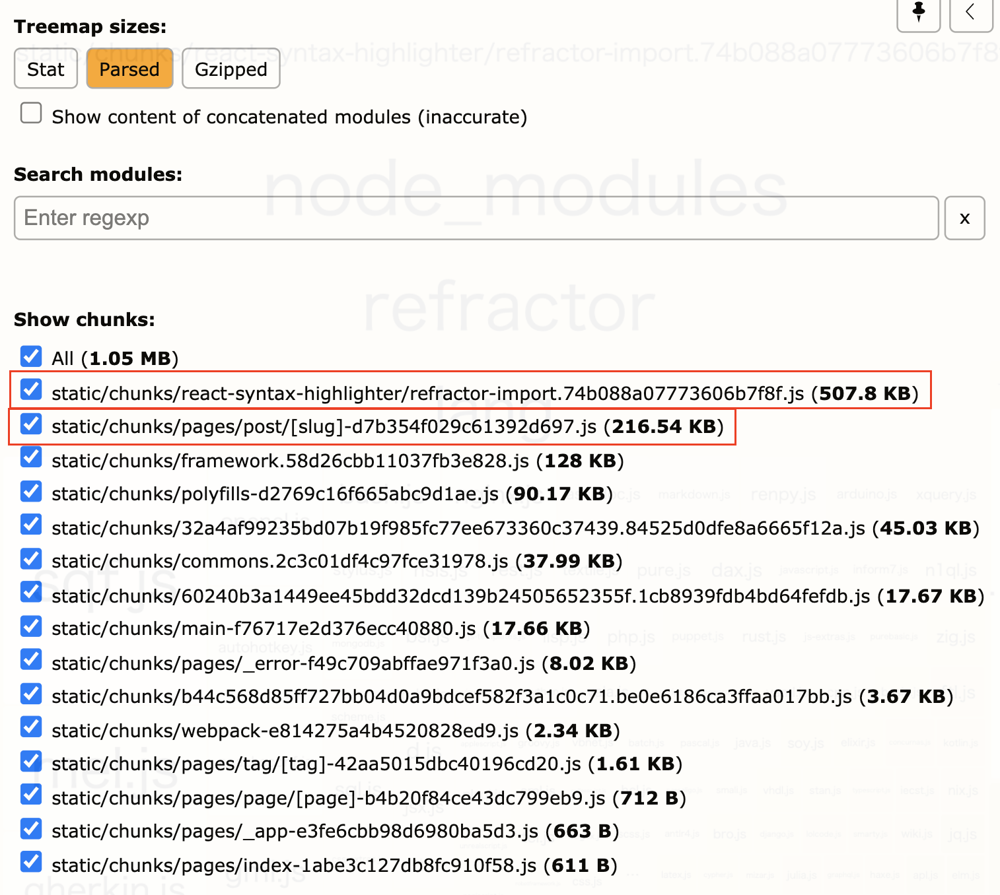
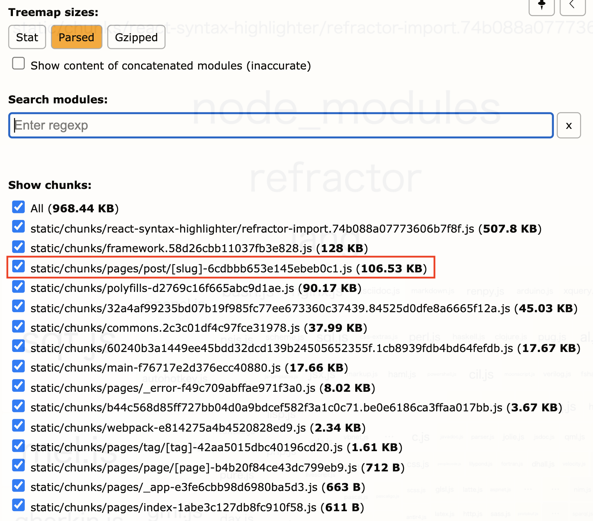

## はじめに
年末年始にこの技術ブログを GatsbyJS から Next.js にリプレースを行っていました。その影響でLighthouseのパフォーマンス結果が低下してしまったので、原因の調査と改善を実施しました。



## 原因調査
### Lighthouseの結果を考察
Lighthouseの詳細を見てみると 722.4kb という巨大なJSファイルが配信されていました。「Potential Saving 99.8kb」とあるように、このJFファイルの中の大部分が未使用コードになっています。



また巨大なjsファイルによりJavaScriptの「Script Evaluation」が 1,835ms と、長時間のレンダリングブロッキングが発生していました。



### Webpack Bundle Analyzer
先ほどのLighthouseの結果で問題になっていた、巨大なjsファイルは chunks/pages/post/[slug]-xxx.js でした。これは記事の詳細ページでNext.jsのビルドにより生成されたファイルです。このファイルにバンドルされているモジュールを調査して、jsファイルが巨大化している原因を特定します。

Next.jsは内部でビルドにWebpackを利用しているので、[webpack\-contrib/webpack\-bundle\-analyzer](https://github.com/webpack-contrib/webpack-bundle-analyzer) を使うことで、生成されたJSファイルのバンドル情報を可視化することができます。

Next.js のプラグインとして [@next/bundle-analyzer](https://github.com/vercel/next.js/tree/canary/packages/next-bundle-analyzer) が提供されているので、今回はこちらを導入していきます。

最初にパッケージをインストールします。

```bash
$ yarn add -D @next/bundel-analyzer
```

続いて Next.config.js にプラグインを利用する設定を書いていきます。  
環境変数として `ANALYZE=true` が指定されていた時だけ、bundle-analyzer を実行するようにしています。

```javascript
const withBundleAnalyzer = require('@next/bundle-analyzer')({
    enabled: process.env.ANALYZE === 'true',
});

const config = {
    // 省略
};

module.exports = withBundleAnalyzer(config);
```

次のように実行することで確認ができます。

```bash
$ ANALYZE=true next build
```

今後のことも考えて実行コマンドは package.json に登録しておきます。

```json
{
    "scripts": {
        "bundle-analyzer": "ANALYZE=true next build"
    }
}
```

### Webpack Bundle Analyzer の結果を考察
webpack-bundle-analyzer を実行することで、ビルド中にブラウザに可視化された情報が表示されます。  
可視化された結果をみてみると [refractor](https://github.com/wooorm/refractor) というモジュールが大部分を占めており、このモジュールの読み込みが今回の問題の原因となっていそうです。



`yarn.lock` を参照すると、 `refractor` は [react\-syntax\-highlighter/react\-syntax\-highlighter](https://github.com/react-syntax-highlighter/react-syntax-highlighter) から読み込まれていることが分かりました。

```yaml
react-syntax-highlighter@^15.4.3:
  version "15.4.3"
  resolved "https://registry.yarnpkg.com/react-syntax-highlighter/-/react-syntax-highlighter-15.4.3.tgz#fffe3286677ac470b963b364916d16374996f3a6"
  integrity sha512-TnhGgZKXr5o8a63uYdRTzeb8ijJOgRGe0qjrE0eK/gajtdyqnSO6LqB3vW16hHB0cFierYSoy/AOJw8z1Dui8g==
  dependencies:
    "@babel/runtime" "^7.3.1"
    highlight.js "^10.4.1"
    lowlight "^1.17.0"
    prismjs "^1.22.0"
    refractor "^3.2.0"
```

これでパフォーマンス問題の原因が特定できたので、残りはこの問題を改修していきます。

## パフォーマンス改善
`reflactor` には、シンタックスハイライトで利用する言語ごとのjsファイルが含まれており、それらが初回レンダリングのタイミングで全て読み込まれることで、パフォーマンス低下を引き起こしていました。`react-syntax-highlighter` は動的インポートにも対応しているので、今回は動的インポートによりレンダリングブロックをしないように修正をします。

ただ、最終的に読み込むファイルの転送量が多いことに変わりないので、将来的には別のアプローチで解決したいです。

```typescript
// import { Prism as SyntaxHilighter } from 'react-syntax-highlighter';
import { PrismAsync as SyntaxHilighter } from 'react-syntax-highlighter';
```

動的インポートに変更した後の bundle anlyzer の結果をみると、 `refractor-import.xxx.js` として `refractor` の読み込みが新しいチャンクとして切り出されています。`[slug]-xxx.js` のファイルサイズ も 722.4kb から 216.54kb に削減されています。



修正後の `[slug]-xxx.js` の中身を見てみると、新たに別の問題が見えてきました。`react-syntax-highlighter`が全てのテーマファイルを読み込んでいます。

![[slug]-xxx.jsのbundle-analyzerの結果](bundle-analyzer-result-slug.png)

この読み込みも不要なので、必要なテーマファイルだけを読み込むように修正します。

```typescript
// import { vscDarkPlus as defaultVscDarkPlus } from 'react-syntax-highlighter/dist/cjs/styles/prism';
import defaultVscDarkPlus from 'react-syntax-highlighter/dist/cjs/styles/prism/vsc-dark-plus';
```

最終的に `[slug]-xxx.js` のファイルサイズが 722.kb から 106.5kb と1/7のサイズ削減できました🎉
これでレンダリングブロッキングの時間が大幅に削減されるので、Ligthouseのパフォーマンス結果も改善されます。



## さいごに
今回は1番大きな問題を対象として改善策を実施しましたが、画像の最適化や画像の遅延ロード、その他の不要なJavaScriptファイルの削除と改善項目はまだまだ沢山あります。また、Next.jsのリプレースによって新しく導入したライブラリにより意図せずにパフォーマンス低下が起きてしまったので、今後は [GoogleChrome/lighthouse\-ci](https://github.com/GoogleChrome/lighthouse-ci) などを導入して継続的にパフォーマンスなどを計測する仕組みを用意していきたいです。
