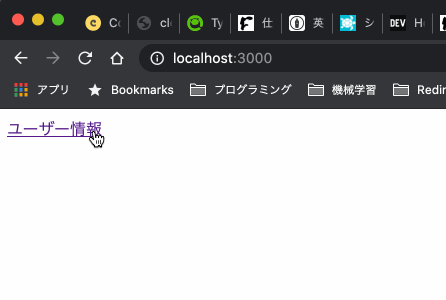

This article summarizes how to use the browser's Storage object in Next.js.

For a reference implementation, see [t-yng/examples/nextjs-localstorage](https://github.com/t-yng/examples/tree/master/nextjs-localstorage).

## Trying to Use the Storage Object

Let's think about an example where we get user information from `sessionStorage` and display it on the screen.

```typescript
// hooks/useUser.ts
import { useState } from "react";
import { User } from "../interfaces";

const readUser = (): User | undefined => {
  const user = sessionStorage.getItem("user");
  return user != null ? JSON.parse(user) : undefined;
};

export const useUser = () => {
  const [user] = useState<User | undefined>(readUser());

  return {
    user,
  };
};
```

```tsx
// pages/index.tsx
import { useUser } from "../hooks/useUser";

const IndexPage = () => {
  const { user } = useUser();

  return (
    <>
      <h1>User Information</h1>
      {user == null ? (
        <p>No user information found</p>
      ) : (
        <>
          <p>ID: {user.id} </p>
          <p>Username: {user.name} </p>
        </>
      )}
    </>
  );
};

export default IndexPage;
```

When you build this code, you get an `undefined sessionStorage` error. In Next.js, pages that don't need SSR are pre-rendered using SSG at build time. This runs on Node.js, and since `sessionStorage` does not exist in Node.js, the following error occurs.

```sh
$ yarn build
Error occurred prerendering page "/". Read more: https://err.sh/next.js/prerender-error
ReferenceError: sessionStorage is not defined
...
```

## Using useEffect

This problem can be solved by reading the user information asynchronously inside `useEffect()`. The `useEffect()` callback only runs in the browser — it does not run during SSR or SSG. Since the loading becomes asynchronous, we add a new `loading` state.

```typescript
// hooks/useUser.ts
export const useUser = () => {
  const [user, setUser] = useState<User | undefined>();
  const [loading, setLoading] = useState(true);

  useEffect(() => {
    setUser(readUser());
    setLoading(false);
  }, []);

  return {
    user,
    loading,
  };
};
```

```tsx
// pages/index.tsx
const IndexPage = () => {
  const { user, loading } = useUser();

  if (loading) {
    return <h1>Loading...</h1>;
  }

  return (
    <>
      <h1>User Information</h1>
      {user == null ? (
        <p>No user information found</p>
      ) : (
        <>
          <p>ID: {user.id} </p>
          <p>Username: {user.name} </p>
        </>
      )}
    </>
  );
};
```

The code above lets us use `sessionStorage`, but there is one problem. Even though we cached data in `sessionStorage`, because we use `useEffect()` we have to load it asynchronously. This means "Loading..." appears every time we navigate to the page.

*(The demo intentionally slows down the display to make this easier to see.)*



## Dynamic Import

In Next.js, you can use [Dynamic import](https://nextjs.org/docs/advanced-features/dynamic-import) to prevent a module from being loaded on the server side. This way, `sessionStorage` is only accessed on the frontend.

```tsx
// pages/user.tsx
import Link from "next/link";
import dynamic from "next/dynamic";
import { useUser } from "../hooks/useUser";

const UserPage = () => {
  const { user } = useUser();

  return (
    <>
      <h1>User Information</h1>
      {user == null ? (
        <p>No user information found</p>
      ) : (
        <>
          <p>ID: {user.id} </p>
          <p>Username: {user.name} </p>
        </>
      )}
      <p>
        <Link href="/">Home</Link>
      </p>
    </>
  );
};

const DynamicUserPage = dynamic(
  {
    loader: async () => UserPage,
  },
  { ssr: false }
);

export default DynamicUserPage;
```

```typescript
// hooks/useUser.ts
import { useState } from "react";
import { User } from "../interfaces";

const readUser = (): User | undefined => {
  const user = sessionStorage.getItem("user");
  return user != null ? JSON.parse(user) : undefined;
};

export const useUser = () => {
  const [user] = useState<User | undefined>(readUser());

  return {
    user,
  };
};
```

Since we no longer need to worry about the server side, we don't need to load asynchronously with `useEffect()`, and there's no need to show "Loading..." anymore.
