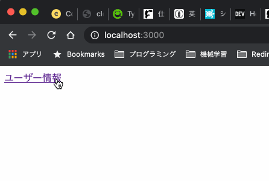

Next.jsでブラウザの Storage オブジェクト を使う時の対応策をまとめています。

参考実装は [t-yng/examples/nextjs-localstorage](https://github.com/t-yng/examples/tree/master/nextjs-localstorage) を参照してください。

## Storage オブジェクトを使ってみる
`sessionStorage` からユーザー情報を取得して画面に表示する例を考えてみます。

```typescript
// hooks/useUser.ts
import { useState } from "react";
import { User } from "../interfaces";

const readUser = (): User | undefined => {
  const user = sessionStorage.getItem("user");
  return user != null ? JSON.parse(user) : undefined;
};

export const useUser = () => {
  const [user] = useState<User | undefined>(readUser());

  return {
    user,
  };
};
```

```tsx
// pages/index.tsx
import { useUser } from "../hooks/useUser";

const IndexPage = () => {
  const { user } = useUser();

  return (
    <>
      <h1>ユーザー情報</h1>
      {user == null ? (
        <p>ユーザー情報が存在しません</p>
      ) : (
        <>
          <p>ID: {user.id} </p>
          <p>ユーザー名: {user.name} </p>
        </>
      )}
    </>
  );
};

export default IndexPage;
```

このコードをビルドすると、`undefined sessionStorage` のエラーが発生します。Next.jsはSSRが不要なページはビルド時にSSGにより Rre Rendering されます。これは、Node.js 上で実行されますが、Node.js には `sessionStorage` が存在しないため下記のエラーが発生するのです。

```sh
$ yarn build
Error occurred prerendering page "/". Read more: https://err.sh/next.js/prerender-error
ReferenceError: sessionStorage is not defined
...
```

## useEffectで実行する
この問題は `useEffect()` 内で非同期でユーザー情報を取得する事で解決できます。`useEffect()` の実行は ブラウザ上でのみ限定され、SSRやSSGのタイミングでは実行されません。実行が非同期になるので、新しく `loading` を状態として追加します。

```typescript
// hooks/useUser.ts
export const useUser = () => {
  const [user] = useState<User | undefined>(readUser());

  const [user, setUser] = useState<User | undefined>();
  const [loading, setLoading] = useState(true);

  useEffect(() => {
    setUser(readUser());
    setLoading(false);
  }, []);

  return {
    user,
    loading,
  };
};
```

```tsx
// pages/index.tsx
const IndexPage = () => {
  const { user, loading } = useUser();

  if (loading) {
    return <h1>読み込み中...</h1>;
  }

  return (
    <>
      <h1>ユーザー情報</h1>
      {user == null ? (
        <p>ユーザー情報が存在しません</p>
      ) : (
        <>
          <p>ID: {user.id} </p>
          <p>ユーザー名: {user.name} </p>
        </>
      )}
    </>
  );
};
```

上記の対応で `sessionStorage` を使えるようになりましたが、一つだけ問題が発生しました。せっかく `sessionStorage` にデータをキャッシュしているのに、`useEffect()` を利用する関係上、非同期で読み込む必要があるので、例えばページ遷移の度に「読み込み中...」が表示されてしまいます。  

※ デモは分かりやすくするために意図的に表示を遅らせています。



## Dynamic import
Next.js は [Dynamic import](https://nextjs.org/docs/advanced-features/dynamic-import) で読み込むことで、サーバーサイドでモジュールを読み込まないようにする事ができます。これにより、フロントでのみ `sessitionStorage` の参照します。

```tsx
// pages/user.tsx
import Link from "next/link";
import dynamic from "next/dynamic";
import { useUser } from "../hooks/useUser";

const UserPage = () => {
  const { user } = useUser();

  return (
    <>
      <h1>ユーザー情報</h1>
      {user == null ? (
        <p>ユーザー情報が存在しません</p>
      ) : (
        <>
          <p>ID: {user.id} </p>
          <p>ユーザー名: {user.name} </p>
        </>
      )}
      <p>
        <Link href="/">ホーム</Link>
      </p>
    </>
  );
};

const DynamicUserPage = dynamic(
  {
    loader: async () => UserPage,
  },
  { ssr: false }
);

export default DynamicUserPage;
```

```typescript
// hooks/useUser.ts
import { useState } from "react";
import { User } from "../interfaces";

const readUser = (): User | undefined => {
  const user = sessionStorage.getItem("user");
  return user != null ? JSON.parse(user) : undefined;
};

export const useUser = () => {
  const [user] = useState<User | undefined>(readUser());

  return {
    user,
  };
};
```

サーバーサイドを意識する必要がなくなったので、`useEffect()` で非同期に読み込む必要がなくなり、「読み込み中...」を表示する必要もなくなりました。