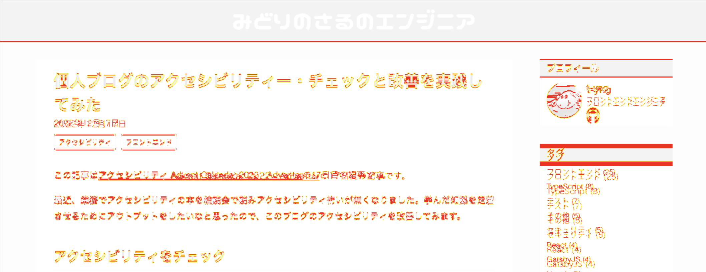

I replaced the CSS library on this blog from VanillaExtract to Linaria.

Since switching to Linaria required migrating all the CSS, I was worried about design issues. So I used Playwright visual regression testing to automatically check that the design didn't break.

You can see the Playwright setup and the Linaria migration in these pull requests:

- [Add visual regression testing with Playwright #543](https://github.com/t-yng/blog/pull/543)
- [Migrate vanilla-extract to linaria #544](https://github.com/t-yng/blog/pull/544)

## Installing and setting up Playwright

You can install Playwright as a package, but using the `create` command automatically generates the configuration file and sets up the environment.

```sh
$ yarn create playwright
```

## Editing the configuration file

I edited the auto-generated configuration file to suit my preferences:

- Set the file path for VRT screenshots to make them easier to manage
- Set the target devices:
  - Desktop Chrome and Mobile Safari iPhone SE
- Add a `webServer` setting to start the local server before running tests

```ts
// playwright.config.ts
import { defineConfig, devices } from '@playwright/test';

/**
 * See https://playwright.dev/docs/test-configuration.
 */
export default defineConfig({
    testDir: './e2e',
    // Set the snapshot file path
    snapshotPathTemplate:
        '{testDir}/__snapshots__/{testFilePath}/{projectName}{ext}',
    /* Run tests in files in parallel */
    fullyParallel: true,
    /* Reporter to use. See https://playwright.dev/docs/test-reporters */
    reporter: 'html',
    /* Shared settings for all the projects below. See https://playwright.dev/docs/api/class-testoptions. */
    use: {
        /* Base URL to use in actions like `await page.goto('/')`. */
        baseURL: 'http://127.0.0.1:3000',

        /* Collect trace when retrying the failed test. See https://playwright.dev/docs/trace-viewer */
        trace: 'on-first-retry',
    },

    // Set the browsers to test
    projects: [
        {
            name: 'Desktop Chrome',
            use: { ...devices['Desktop Chrome'] },
        },
        {
            name: 'Mobile Safari iPhoneSE',
            use: { ...devices['iPhone SE'] },
        },
    ],

    /* Run your local dev server before starting the tests */
    webServer: {
        command: 'yarn dev',
        url: 'http://127.0.0.1:3000',
        reuseExistingServer: !process.env.CI,
    },
});
```

## Creating the visual regression tests

Playwright has built-in image diff comparison, so you can run a visual regression test just by navigating to a page and calling `toHaveScreenshot`.

I created a test file for each page and added test cases that only run the visual regression test.

```ts
// e2e/top.spec.ts
import { test, expect } from '@playwright/test';

test('visual regression', async ({ page }) => {
    await page.goto('/');
    await expect(page).toHaveScreenshot({
        fullPage: true,
        animations: 'disabled',
    });
});
```

```ts
// e2e/post.spec.ts
import { test, expect } from '@playwright/test';

test('visual regression', async ({ page }) => {
    await page.goto('/post/improve-a11y');
    await expect(page).toHaveScreenshot({
        fullPage: true,
        animations: 'disabled',
    });
});
```

## Creating the screenshots

On the first run, there are no baseline screenshots to compare against, so first create the baseline screenshots.

```sh
# Create screenshots for the first time
$ yarn playwright test --update-snapshots
```

## Running the tests

Now that the visual regression setup is ready, let's run the tests.

```sh
# Run tests
$ yarn playwright test

 4 failed
    [chromium] › post.spec.ts:3:5 › visual regression ──────────────────────────────────
    # omitted
```

Running the tests found image differences, and the tests failed.



Looking at the code, when I rewrote the CSS from JS object format to CSS style format for the Linaria migration, the font value was accidentally left as a string.

If I hadn't done visual regression testing, I would have missed this and shipped it as is.

```css
/* Wrong: the font-family value is wrapped in quotes, which is not valid CSS */
font-family: "'Helvetica Neue', Arial, 'Hiragino Kaku Gothic ProN', 'Hiragino Sans', Meiryo, sans-serif";

/* Correct */
font-family: 'Helvetica Neue', Arial, 'Hiragino Kaku Gothic ProN', 'Hiragino Sans', Meiryo, sans-serif;
```

## Summary

Adding visual regression testing was very helpful — it caught the bug before merging.
When working on personal projects, there's usually no code review from others. I was reminded again how valuable it is to automate as much bug detection as possible with automated tests.
