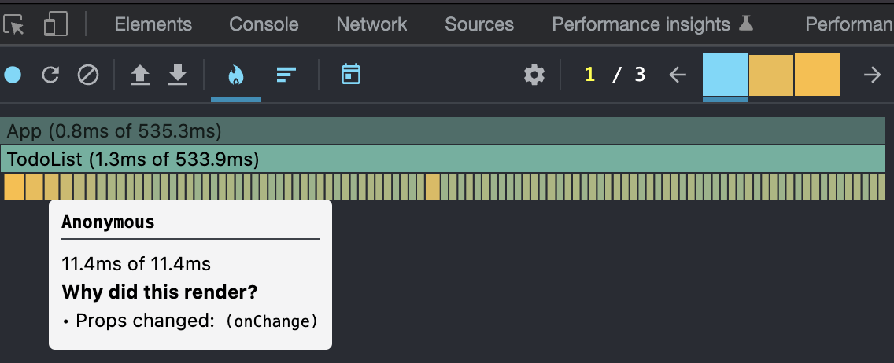

This article is the 14th entry in the [YAMAP Engineer Advent Calendar 2022](https://qiita.com/advent-calendar/2022/yamap-engineers).

I improved the performance of a form implemented in React at work, so I made a practice problem based on that experience.

## The problem

A React app shows a list of `<input>` elements, but typing into them is very slow. The goal is to improve the response speed.

<iframe src="https://stackblitz.com/edit/react-ts-evcw6y?embed=1&file=src/App.tsx" style="width: 100%; height: 400px"></iframe>

Looking at the source code, `App.tsx` manages a list of todos and renders the `TodoList` component.
The `onChange` prop receives `setTodos` to update the todo list.

```tsx
// App.tsx
const initialTodos: TodoModel[] = [...Array(100)].map((_, i) => ({
  id: i,
  text: 'aaa',
}));

const App = () => {
  const [todos, setTodos] = useState(initialTodos);

  return (
    <div>
      <button
        onClick={() => {
          alert(todos[0].text);
        }}
      >
        Save
      </button>
      <TodoList todos={todos} onChange={setTodos} />
    </div>
  );
};
```

Next, let's look at the `TodoList` component.

`TodoList` renders each `Todo` component as an `<input>` element. When an input changes, it receives the updated `Todo` object, builds a new todo list, and calls the `onChange` callback prop to pass the new list to the parent.

```tsx
export const TodoList: FC<TodoListProps> = ({ todos, onChange }) => {
  const handleChange = useCallback(
    (updatedTodo: TodoModel) => {
      const index = todos.findIndex((todo) => todo.id === updatedTodo.id);
      onChange?.([
        ...todos.slice(0, index),
        updatedTodo,
        ...todos.slice(index + 1),
      ]);
    },
    [onChange, todos]
  );

  return (
    <ul>
      {todos.map((todo) => {
        return (
          <li key={todo.id}>
            <Todo todo={todo} onChange={handleChange} />
          </li>
        );
      })}
    </ul>
  );
};
```

Finally, let's look at the `Todo` component.

`Todo` shows the todo text from props as the value of an `<input>` element. When the text changes, it creates a new todo object with the new text and calls `onChange` to pass it to the parent.

`[...Array()]` is added to make the rendering artificially slow for the purpose of this problem. This is pseudo code for the exercise, so please do not remove it.

```tsx
export const Todo: FC<TodoProps> = memo(({ todo, onChange }) => {
  [...Array(100000)].forEach(() => 1 + 1);

  return (
    <input
      type="text"
      defaultValue={todo.text}
      onChange={(evt) => {
        onChange({
          ...todo,
          text: evt.target.value,
        });
      }}
    />
  );
});
```

The render time for this component alone is about 10ms, which is a problem that can happen in real applications too.



## Answer

I plan to write the answer in a separate article. Feel free to try solving it!
