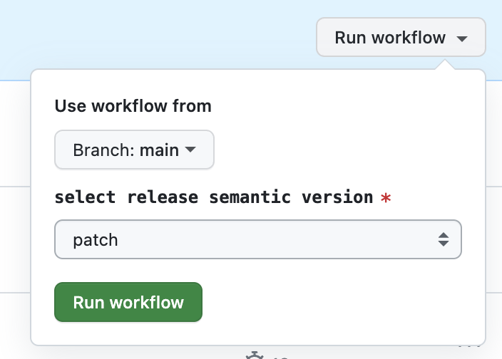

When developing an npm package, releasing a new version can be tedious. This is especially true when managing private packages in a company registry, because publishing requires authentication setup, which can be hard to configure. This means not everyone on the team can easily do a release.

Ideally, the release process should be automated so that anyone can do it easily.

The GitHub Action described in this article can be found at [t-yng/release-npm-package-template](https://github.com/t-yng/release-npm-package-template).

## Prerequisites

This article assumes that the default branch (main) has branch protection enabled and that direct pushes are not allowed.
If this setting is disabled, you can handle everything from updating `package.json` to publishing in a single Action. However, if it is enabled, you need to add steps to create and merge a pull request, which changes how the workflow is built.

## Release flow

1. A GitHub Action automatically creates a PR to update `package.json`
    - The PR is created with auto-merge enabled

2. When the PR is merged, the auto-release workflow runs
    - Creates and pushes a new git tag for the new version
    - Publishes the new version of the package
    - Creates release notes for the new version

## Building the workflows

### Creating the workflow to auto-generate a PR

This workflow creates a PR that updates the version in `package.json`. Merging this PR triggers the release workflow.

GitHub Actions supports the `workflow_dispatch` event, which allows you to trigger an Action manually. You can choose the semantic version type (patch, minor, major) to control which version to update to.

Instead of using `secrets.GITHUB_TOKEN` for auto-generating and auto-merging PRs, this workflow uses a GitHub App token. This is because `GITHUB_TOKEN` doesn't have enough permission to trigger other workflows after a PR is created or merged.
How to issue the token is described in the next section.

The generated PR is given a `release` label to control when the release workflow is triggered.
Auto-merge is also enabled so no manual merging is needed.

```yaml
name: create_release_pr

on:
  workflow_dispatch:
    inputs:
      release-version:
        description: 'select release semantic version'
        required: true
        type: choice
        options:
          - 'patch'
          - 'minor'
          - 'major'

jobs:
  create-release-pr:
    runs-on: ubuntu-latest
    steps:
      - name: Checkout
        uses: actions/checkout@v2

      - name: Setup Node.js
        uses: actions/setup-node@v3
        with:
          node-version: 16

      # Set git account as GitHub Actions
      - name: Git configuration
        run: |
          git config --global user.email "41898282+github-actions[bot]@users.noreply.github.com"
          git config --global user.name "GitHub Actions"

      # Set the new version as an environment variable
      - name: Get new version
        id: new-version
        run: |
          echo "NEW_VERSION=$(npm --no-git-tag-version version ${{ env.RELEASE_VERSION }})" >> $GITHUB_ENV
        env:
          RELEASE_VERSION: ${{ github.event.inputs.release-version }}

      # Update package.json version and commit
      - name: Update package.json version
        run: |
          git add package.json
          git commit -m "chore: release ${{ env.NEW_VERSION }}"

      - name: Generate GitHub App Token
        uses: tibdex/github-app-token@v1
        id: generate-token
        with:
          app_id: ${{ secrets.RELEASE_APP_ID }}
          private_key: ${{ secrets.RELEASE_APP_PRIVATE_KEY }}

      - name: Create Pull Request
        id: cpr
        uses: peter-evans/create-pull-request@v5
        with:
          branch: release/${{ env.NEW_VERSION }}
          title: release ${{ env.NEW_VERSION }}
          labels: release
          # Using GitHub App Token because GITHUB_TOKEN doesn't have enough permission
          # to trigger other workflows after PR creation
          # @see: https://github.com/peter-evans/create-pull-request/issues/48#issuecomment-536184102
          token: ${{ steps.generate-token.outputs.token }}

      - name: Enable Pull Request Automerge
        run: gh pr merge --merge --auto "${{ steps.cpr.outputs.pull-request-number }}"
        env:
          GH_TOKEN: ${{ steps.generate-token.outputs.token }}
```

### Issuing a GitHub App token

1. Go to GitHub account > Settings > Developer settings > GitHub Apps > New GitHub App and create a new GitHub App
    - Enter a GitHub App name
    - Enter a Homepage URL (the repository URL or any value is fine)
    - Uncheck Webhook > Active
    - For `Repository permissions: Contents`, select `access: Read & write`
    - For `Repository permissions: Pull requests`, select `access: Read & write`
2. Generate a new private key and copy the value from the downloaded file
3. Install the created GitHub App on the target repository
4. Add `RELEASE_APP_ID` and `RELEASE_APP_PRIVATE_KEY` to the repository Secrets
    - RELEASE_APP_ID: the GitHub App ID
    - RELEASE_APP_PRIVATE_KEY: the copied private key value

Reference: [authenticating-with-github-app-generated-tokens](https://github.com/peter-evans/create-pull-request/blob/main/docs/concepts-guidelines.md#authenticating-with-github-app-generated-tokens)

### Triggering PR creation via GitHub Actions

You can manually trigger the Action from GitHub Actions to create a release PR as shown in the image.



### Creating the release workflow

This workflow is triggered when a PR with the `release` label is merged into the default branch. It also has a manual trigger as a safety valve, in case something goes wrong and only `package.json` gets updated without a full release.

By default, the GitHub Actions permission settings cause a permission error when pushing a git tag, so you need to change the repository permissions.

1. Go to Settings > Actions > General
2. Under Workflow permissions, select `Read and write permissions`

The generated release notes will show a list of merged pull requests by default.

```yaml
name: release

on:
  pull_request:
    types:
      - closed
    branches:
      - main
  workflow_dispatch:

jobs:
  release:
    runs-on: ubuntu-latest
    # Run when a PR with the 'release' label is merged
    if: |
      github.event_name == 'workflow_dispatch' ||
      (github.event.pull_request.merged == true && contains(github.event.pull_request.labels.*.name, 'release'))
    steps:
      - name: Checkout
        uses: actions/checkout@v2

      - name: Setup Node.js
        uses: actions/setup-node@v3

      - name: Get yarn cache directory path
        id: yarn-cache-dir-path
        run: echo "::set-output name=dir::$(yarn cache dir)"

      - uses: actions/cache@v2
        id: yarn-cache 
        with:
          path: ${{ steps.yarn-cache-dir-path.outputs.dir }}
          key: ${{ runner.os }}-yarn-${{ hashFiles('**/yarn.lock') }}
          restore-keys: |
            ${{ runner.os }}-yarn-

      - name: Install dependencies
        run: yarn install

      - name: Build Package
        run: yarn build

      - name: Set New Version And Release Tag
        run: |
          NEW_VERSION=$(node -pe "require('./package.json').version")
          echo "NEW_VERSION=v${NEW_VERSION}" >> $GITHUB_ENV
          echo "RELEASE_TAG=v${NEW_VERSION}" >> $GITHUB_ENV

      - name: Publish Package
        run: |
          echo "publish package"
          echo "command like 'yarn publish --verbose --access public --tag ${{ env.RELEASE_TAG }}'"

      # Create and push a git tag for the new version
      - name: push new version tag
        run: |
          git tag ${{ env.RELEASE_TAG }}
          git push origin ${{ env.RELEASE_TAG }}

      # Generate release notes
      - name: Release
        uses: softprops/action-gh-release@v1
        with:
          token: ${{ secrets.GITHUB_TOKEN }}
          draft: false
          tag_name: ${{ env.RELEASE_TAG }}
          generate_release_notes: true
```

## Conclusion

With this setup, you can release an npm package with just one button click.
There are more things I'd like to add, such as showing the changes in the release PR description and customizing the look of the release notes, so I plan to update this article as needed.
