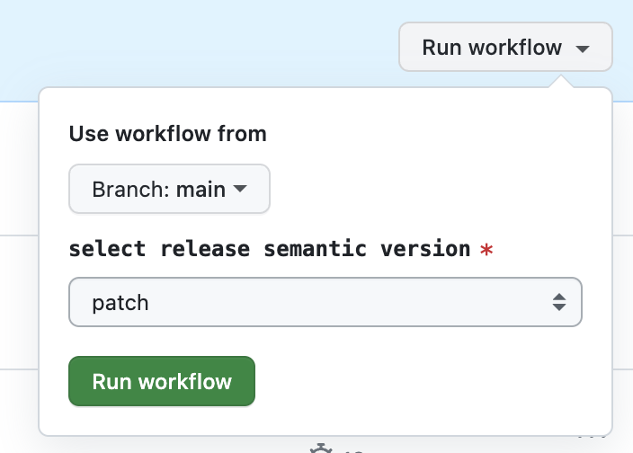

npmパッケージの開発をしていると、新しいバージョンをリリース作業は地味に面倒になります。特に社内レジストリでプライベートパッケージを管理していと、パッケージをパブリッシュするための認証設定が必要となり環境構築の手間などが発生して、メンバー全員がリリースできる状態になってない場合があります。

リリース作業は基本的に自動化して、誰でも簡単にリリース作業ができる状態になっているのが理想です。

この記事で説明しているGitHub Actionは[t-yng/release-npm-package-template](https://github.com/t-yng/release-npm-package-template)で確認できます。

## 前提条件
この記事では、デフォルトブランチ（main）がブランチ保護が有効で、直接プッシュできない状態であることを前提に構築をしています。
この設定が無効な場合は、一つのActionでpackage.jsonの更新からパブリッシュまでを完結できます。しかし、設定が有効な場合はプルリクエストを作成・マージする手順を増やす必要があり構築する仕組みが変わってきます。

## リリースフロー
1. GitHub Actionでpackage.jsonを更新するPRを自動生成
    - PRは自動マージを有効にして作成

2. PRがマージされたパッケージの自動リリースを起動
    - 新しいバージョンのgit tagを作成してプッシュ
    - 新しいバージョンのパッケージをパブリッシュ
    - 新しいバージョンのリリースノートの作成

## ワークフローの構築  

### PRを自動生成するワークフローの作成
このワークフローではpackage.jsonのバージョンを更新するPRを生成します。また、このPRのマージを条件にリリースのワークフローをトリガーします。

GitHub Actionでは`workflow_dispatch`イベントを利用することで、手動でActionをトリガーできます。セマンティックのバージョン patch, minor, major を選択して、どのバージョンにアップデートするかを制御します。

PRの自動生成と自動マージの有効化に`secrets.GITHUB_TOKEN`を利用せずに、GitHub Appトークンを利用をしています。これは`GITHUB_TOKEN`だと権限が足りずにPR作成時やマージ後に他のワークフローがトリガーしない問題が発生するので、その回避策です。
トークンの発行方法は次で紹介をします。

自動リリースのワークフローのトリガーを制御するために、生成するPRには`release`ラベルを付与しています。
また、自動マージを有効化して手動でのマージ作業を無くしています。

```yaml
name: create_release_pr

on:
  workflow_dispatch:
    inputs:
      release-version:
        description: 'select release semantic version'
        required: true
        type: choice
        options:
          - 'patch'
          - 'minor'
          - 'major'

jobs:
  create-release-pr:
    runs-on: ubuntu-latest
    steps:
      - name: Checkout
        uses: actions/checkout@v2

      - name: Setup Node.js
        uses: actions/setup-node@v3
        with:
          node-version: 16

      # GitHub Actionsとしてgitアカウントを設定
      - name: Git configuration
        run: |
          git config --global user.email "41898282+github-actions[bot]@users.noreply.github.com"
          git config --global user.name "GitHub Actions"

      # アップデート後のバージョンを環境変数にセット
      - name: Get new version
        id: new-version
        run: |
          echo "NEW_VERSION=$(npm --no-git-tag-version version ${{ env.RELEASE_VERSION }})" >> $GITHUB_ENV
        env:
          RELEASE_VERSION: ${{ github.event.inputs.release-version }}

      # package.jsonのバージョンをアップデートしてコミット
      - name: Update package.json version
        run: |
          git add package.json
          git commit -m "chore: release ${{ env.NEW_VERSION }}"

      - name: Generate GitHub App Token
        uses: tibdex/github-app-token@v1
        id: generate-token
        with:
          app_id: ${{ secrets.RELEASE_APP_ID }}
          private_key: ${{ secrets.RELEASE_APP_PRIVATE_KEY }}

      - name: Create Pull Request
        id: cpr
        uses: peter-evans/create-pull-request@v5
        with:
          branch: release/${{ env.NEW_VERSION }}
          title: release ${{ env.NEW_VERSION }}
          labels: release
          # GITHUB_TOKENでは権限が足りなくPR生成後に他のワークフローがトリガーされないため、GitHub App Tokenを使用
          # @see: https://github.com/peter-evans/create-pull-request/issues/48#issuecomment-536184102
          token: ${{ steps.generate-token.outputs.token }}

      - name: Enable Pull Request Automerge
        run: gh pr merge --merge --auto "${{ steps.cpr.outputs.pull-request-number }}"
        env:
          GH_TOKEN: ${{ steps.generate-token.outputs.token }}
```

### GitHub Appトークンの発行
1. GitHubアカウント > Settings > Developer settings > GitHub Apps > New GitHub App からGitHub Appを新しく作成
    - GitHub App nameを入力
    - Homepage URL（リポジトリのURLなど適当な値）を入力
    - Webhook > Active のチェックを外す
    - `Repository permissions: Contents`で`access: Read & write`を選択
    - `Repository permissions: Pull requests`で`access: Read & write`を選択
2. プライベートキーを新しく発行して、発行されたプライベートキーのファイルの値をコピー
3. 作成したGitHub Appを対象のリポジトリにインストール
4. リポジトリのSecretsに`RELEASE_APP_ID`、`RELEASE_APP_PRIVATE_KEY`を設定
    - RELEASE_APP_ID: GitHub App ID
    - RELEASE_APP_PRIVATE_KEY: コピーしたプライベートキーの値

参考: [authenticating-with-github-app-generated-tokens](https://github.com/peter-evans/create-pull-request/blob/main/docs/concepts-guidelines.md#authenticating-with-github-app-generated-tokens)

### GitHub ActionでPR生成をトリガーする
GitHub Actionで画像のように手動でリリース用のPRを生成できます。


### リリース用のワークフローの作成
このワークフローは`release`タグが付いたPRがデフォルトブランチにマージされた時にトリガーされます。また、ワークフロー中に問題が発生してリリースに失敗した時に、package.jsonだけ更新される可能性があるため、緊急ハッチとして手動でのトリガーも有効にしています。

リポジトリの初期設定ではGitHub Actionの権限の問題で、Git Tagのプッシュで権限エラーが発生するので、リポジトリの権限を変更する必要があります。

1. Settings > Actions > General を開く
2. Workflow permissionsで`Read and write permissions`を選択

作成されるリリースノートは、デフォルトではマージされたプルリクエストが一覧で表示されます。

```yaml
name: release

on:
  pull_request:
    types:
      - closed
    branches:
      - main
  workflow_dispatch:

jobs:
  release:
    runs-on: ubuntu-latest
    # releaseラベルが付いているPRがマージされたときに実行
    if: |
      github.event_name == 'workflow_dispatch' ||
      (github.event.pull_request.merged == true && contains(github.event.pull_request.labels.*.name, 'release'))
    steps:
      - name: Checkout
        uses: actions/checkout@v2

      - name: Setup Node.js
        uses: actions/setup-node@v3

      - name: Get yarn cache directory path
        id: yarn-cache-dir-path
        run: echo "::set-output name=dir::$(yarn cache dir)"

      - uses: actions/cache@v2
        id: yarn-cache 
        with:
          path: ${{ steps.yarn-cache-dir-path.outputs.dir }}
          key: ${{ runner.os }}-yarn-${{ hashFiles('**/yarn.lock') }}
          restore-keys: |
            ${{ runner.os }}-yarn-

      - name: Install dependencies
        run: yarn install

      - name: Build Pacakge
        run: yarn build

      - name: Set New Version And Release Tag
        run: |
          NEW_VERSION=$(node -pe "require('./package.json').version")
          echo "NEW_VERSION=v${NEW_VERSION}" >> $GITHUB_ENV
          echo "RELEASE_TAG=v${NEW_VERSION}" >> $GITHUB_ENV

      - name: Publish Package
        run: |
          echo "publish package"
          echo "command like 'yarn publish --verbose --access public --tag ${{ env.RELEASE_TAG }}'"

      # アップデート後のバージョンのタグを生成してプッシュ
      - name: push new version tag
        run: |
          git tag ${{ env.RELEASE_TAG }}
          git push origin ${{ env.RELEASE_TAG }}

      # リリースノートを生成
      - name: Release
        uses: softprops/action-gh-release@v1
        with:
          token: ${{ secrets.GITHUB_TOKEN }}
          draft: false
          tag_name: ${{ env.RELEASE_TAG }}
          generate_release_notes: true
```

## さいごに
以上でnpmパッケージのリリース作業をボタン一つで作業できるようになります。
生成したリリースPRの概要に変更内容を表示したり、リリースノートの見た目の変更など他にもやりたい事があるので、必要に応じてこの記事を更新予定です。