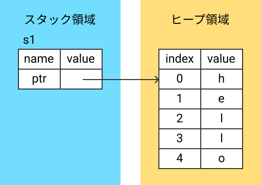
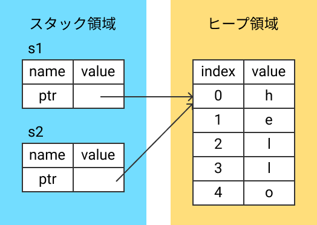
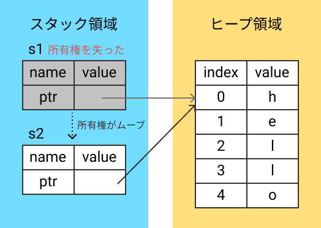
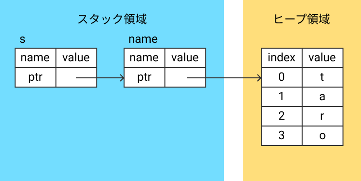

Rust achieves memory safety without a garbage collector by using the ownership system. Understanding this is important for using Rust, because without it, it is hard to know why a compile error occurred.

I read through the documentation and got a good understanding of the overview, so I'll write an explanation to organize my thoughts.

## What is ownership?

There are generally two common ways to manage memory in programs.
The first is for the programmer to manually allocate and free memory, as in C or C++. The second is to use a garbage collector that periodically frees unused memory, as in Java or Go.
The first approach requires programmers to always think about memory, which is costly. It also carries the risk of errors like dangling pointers or double-free when memory management goes wrong. The second approach can have the garbage collector interfering with the application's performance.

In Rust, the compiler checks memory safety at compile time based on the ownership system, which guarantees memory safety automatically without needing a garbage collector.

### Ownership rules

The ownership system has the following rules:

- Rule 1: Each value in Rust has a variable that is its owner.
- Rule 2: There can only be one owner at a time.
- Rule 3: When the owner goes out of scope, the value is dropped.

### Memory and variable scope

```rust
fn main() {
    let s1 = String::from("hello");  // s1 is valid here
    println!("{}", s1);
} // s1 goes out of scope here, so "hello" is dropped
```

The `String` type here holds a variable-size value, so its size cannot be determined at compile time, and the value is placed on the heap.
By the rule "when the owner goes out of scope, the value is dropped," when `s1` goes out of scope, the memory for "hello" is freed.



### Move of ownership

Next, let's think about what happens to memory when a variable is assigned to another variable.

```rust
fn main() {
    let s1 = String::from("hello");
    let s2 = s1;
}
```

Thinking about memory freeing as before: first, when `s2` goes out of scope, the memory for "hello" is freed. Then `s1` goes out of scope and would also try to free the same memory.

In other languages, this would cause an error because "hello" was already freed, and freeing it again would mean freeing invalid memory.



However, in Rust, this code compiles and runs correctly.
Why?

Remember the rule "there can only be one owner at a time." In fact, at `let s2 = s1;`, the ownership of "hello" moves from `s1` to `s2`. After the move, `s1` no longer owns the value and becomes invalid. So Rust doesn't need to free memory when `s1` goes out of scope, and only frees it when `s2` goes out of scope — which is correct.

This is called a **move of ownership**.



With this in mind, what happens with this code?

```rust
fn main() {
    let s1 = String::from("hello");
    let s2 = s1;
             -- value moved here
    println!("{}", s1);
                   ^^ value borrowed here after move
}
```

This causes a compile error. The ownership of "hello" moved from `s1` to `s2`, and `s1` is now invalid. Using an invalid variable causes a compile error.

Move of ownership also happens when you pass a value to a function.

```rust
fn hello(s: String) {
    println!("hello! {}", s);
}

fn main() {
    let name = String::from("taro");
    hello(name);
          ---- value moved here
    println!("{}", name);
                   ^^^^ value borrowed here after move
}
```

### Borrowing

So what do you do when you want to pass a value to a function without losing ownership?
This problem can be solved using **borrowing**. Borrowing is expressed with `&`.

```rust
fn hello(s: &String) {
    println!("hello! {}", s);
}

fn main() {
    let name = String::from("taro");
    hello(&name);
    println!("{}", name);
}
```

Borrowing creates a reference to `name` without taking ownership. This means `s` does not own the value, so when `s` goes out of scope, memory is not freed. The memory is only freed when `name` goes out of scope.
This tells the compiler: "s is only borrowing the value, so there's no need to free memory when s goes out of scope."

The memory state looks like this:



By using borrowing, you can access a value without moving ownership.

## References

- [What is Ownership? - The Rust Programming Language](https://doc.rust-lang.org/book/ch04-01-what-is-ownership.html)
- [所有権とは？ - The Rust Programming Language](https://doc.rust-jp.rs/book/second-edition/ch04-01-what-is-ownership.html) (Official Japanese translation)

## Summary

Understanding ownership and borrowing in Rust took me quite a long time. But once you understand it, it feels surprisingly simple.
This article is just my own way of explaining what I learned from the reference documents, so reading the official documentation is better for a more detailed explanation.
