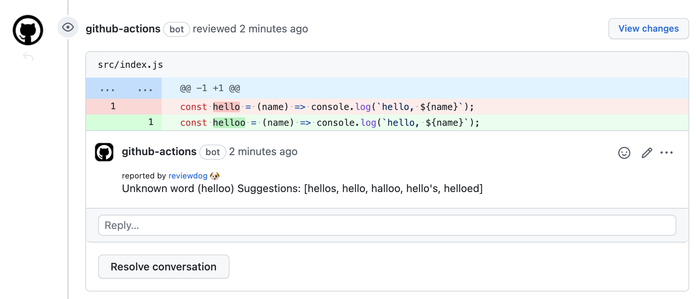

This article is the 14th entry in the [YAMAP Engineer Advent Calendar 2021](https://qiita.com/advent-calendar/2021/yamap-engginers).

## Background

At some point, I started noticing more and more spelling mistakes being pointed out during code reviews.

Since machines are better at checking spelling than people, I tried setting up automated spell checking in CI to automatically catch spelling mistakes in code reviews. Here is a summary of how I set it up and the results.

All the code in this article can be found at [t-yng/ci-spell-check-sample](https://github.com/t-yng/ci-spell-check-sample).

## Choosing a tool

### Existing GitHub Actions

One option was to use an existing GitHub Action from the marketplace.
I tried a few, but they didn't give me the results I wanted, so I ended up building a custom GitHub Action using a spell check library.

- [Typo CI](https://typoci.com/)
  - Can add spell checking to a repository via GitHub Actions
  - During my research, the GitHub link returned 404, so I didn't look into it in detail
  - It was accessible when I checked again at the time of writing (2021/12/13)
- [Check spelling](https://github.com/marketplace/actions/check-spelling)
  - Was in beta at the time of my research
- [misspell-fixer-action](https://github.com/marketplace/actions/misspell-fixer-action)
  - There was a recommended article about this on Developers.io

### Building a custom GitHub Action with a spell check library

I decided to build a custom GitHub Action using [cspell](https://github.com/streetsidesoftware/cspell).

- [misspell](https://github.com/client9/misspell)
  - I tried it, but it didn't detect spelling mistakes as expected
  - It didn't seem to support languages like JavaScript
- [misspell-fixer](https://github.com/vlajos/misspell-fixer)
  - The library used by the misspell-fixer-action mentioned above
  - The setup looked complicated, so I didn't try it
- [cspell](https://github.com/streetsidesoftware/cspell)
  - The library used by [Code Spell Checker](https://marketplace.visualstudio.com/items?itemName=streetsidesoftware.code-spell-checker), which is a very popular VSCode extension
  - Easy to run from the CLI and proven through the VSCode extension
  - The only downside is that library names and proper nouns like `prismjs` are flagged as spelling mistakes (you can add them to a word dictionary to skip them)

## Setting up the CI

### Installing cspell and creating an npm script

Install cspell:

```shell
$ yarn add -D cspell
```

Create the cspell configuration file (`.cspell.json`):

```json
// .cspell.json
{
  "version": "0.2",
  "language": "en",
  "words": [], // Add proper nouns and other words to skip checking
  "dictionaries": [
    "softwareTerms", 
    "misc",
    "companies",
    "typescript", 
    "node", 
    "html", 
    "css", 
    "fonts", 
    "filetypes", 
    "npm"
  ],
  "ignorePaths": [
    "**/node_modules/**",
    "**/.git/**",
    "**/.vscode/**",
    "**/.next/**",
    "**/__generated__/**",
    "**/package.json",
    "**/yarn-error.log",
    "**/yarn.lock"
  ]
}
```

Create an npm script:

```json
{
  "scripts": {
    "spell-check": "cspell lint -c .cspell.json --show-suggestions"
  }
}
```

Let's create some code with a typo and run it.
The spell check works and suggests corrections:

```javascript
// src/index.js
const heloo = (name) => console.log(`hello, ${name}`);
```

```shell
$ yarn spell-check
1/1 ./src/index.js 597.00ms X
/Users/tomohiro/workspace/examples/ci-spell-check/src/index.js:1:7 - Unknown word (heloo) Suggestions:  [helot, helio, hello, Helot, holo]
```

### Implementing the GitHub Action

Now that the spell check script is ready, all that's left is to run it in GitHub Actions.
Create `.github/workflows/spell-check.yaml` to run the spell check on every push.

```yaml
# .github/workflows/spell-check.yaml
name: review-on-push

on: push

jobs:
  spell-check:
    runs-on: ubuntu-latest
    steps:
      - uses: actions/checkout@v2

      - uses: actions/setup-node@v1
        with:
          node-version: '16.x'

      - name: Install Dependencies
        run: yarn install
        env:
          NODE_AUTH_TOKEN: ${{ secrets.AUTH_TOKEN_FOR_GITHUB_PKG }}

      - name: execute spell-check
        run: yarn spell-check
```

### Posting PR comments with Reviewdog

In its current state, it's hard to see where the spelling mistakes are. I used Reviewdog to post comments directly on the PR.
Also, cspell exits with an error when it finds a spelling mistake, which would cause the CI to fail. Using Reviewdog avoids this issue.

```yaml
# .github/workflows/spell-check.yaml
- uses: reviewdog/action-setup@v1
- run: reviewdog -version

(omitted)

- name: execute spell-check
  env:
    REVIEWDOG_GITHUB_API_TOKEN: ${{ secrets.GITHUB_TOKEN }}
  run: |
    yarn spell-check \
      | reviewdog -level=warning -efm="%f:%l:%c - %m" -reporter=github-pr-review
```

Now Reviewdog automatically comments on PRs when there are spelling mistakes.



### Running spell check only on changed files

As the repository grows, running spell check on all files takes longer. I changed it to only check the files that were changed in the PR.

```yaml
- uses: actions/checkout@v2
  with:
    fetch-depth: 0 # Fetch all branches to get the diff

(omitted)

- name: execute spell-check
  env:
    REVIEWDOG_GITHUB_API_TOKEN: ${{ secrets.GITHUB_TOKEN }}
  run: |
    git diff remotes/origin/$GITHUB_BASE_REF --name-only \ 
      | yarn spell-check \
      | reviewdog -level=warning -efm="%f:%l:%c - %m" -reporter=github-pr-review
```

## Results after introducing CI

After introducing it, spelling mistakes were automatically found in PRs, and it had a certain effect.

However, as mentioned in the downsides section, library names and proper nouns were flagged as spelling mistakes, and words that weren't actually mistakes were being commented on. This was very noisy and made code reviews harder, so we eventually decided to remove the CI.

## What we did instead

In the end, each person installed a spell check extension as a plugin in their own development editor. This allowed everyone to notice spelling mistakes while coding. As a result, spelling mistakes in code reviews almost completely disappeared!

To be honest, I thought this was probably the right solution from the start. But I personally didn't want a solution that depends on each person's local environment, which is why I tried the CI approach.

Even though we ended up removing the CI, the awareness of the problem increased in the team and the spelling mistake issue was resolved, so it was a good outcome overall.
