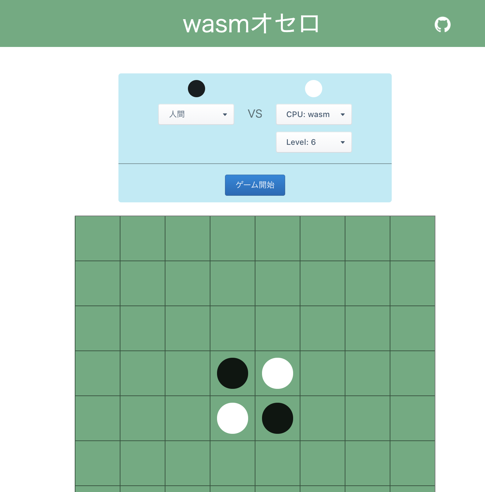
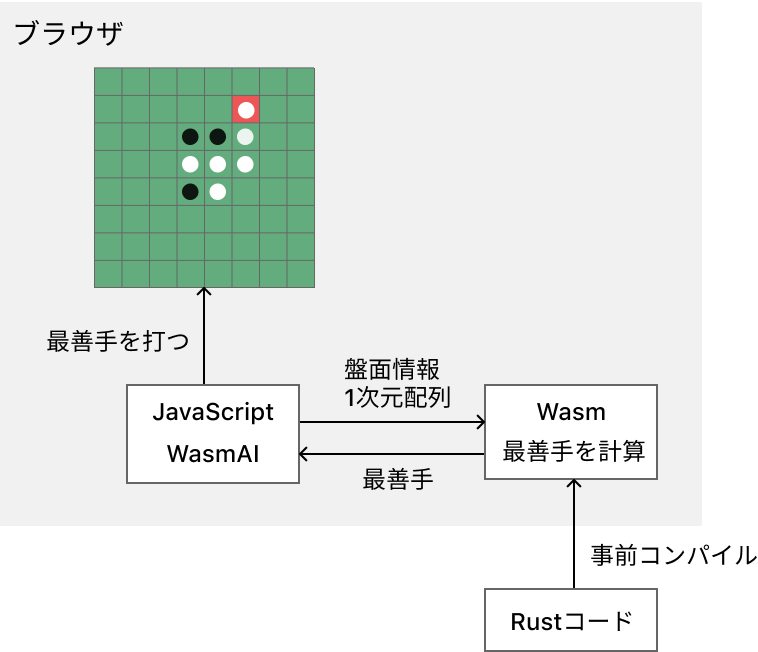
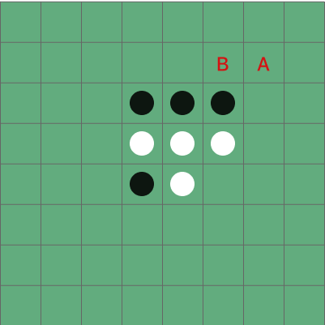
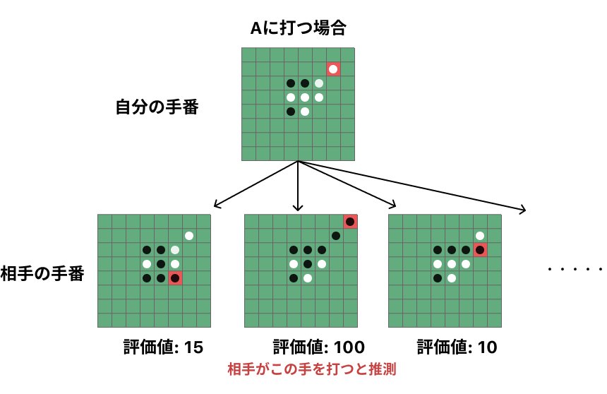
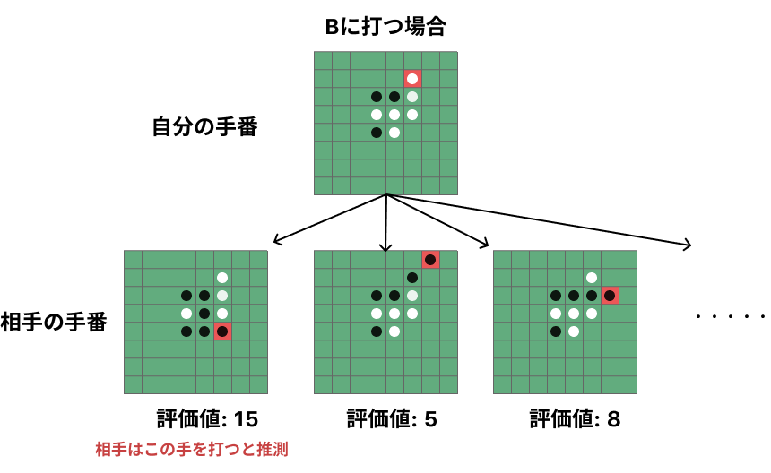
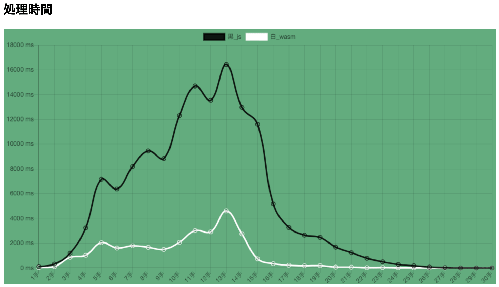

This article is the 3rd entry in the [Hamee Advent Calendar 2020](https://qiita.com/advent-calendar/2020/hamee).

You can play the Othello game at the URL below:
[https://wasm-othello.t-yng.jp/](https://wasm-othello.t-yng.jp/)

Level 6, the hardest level, is genuinely strong! The CPU algorithm is based on how I personally think when playing Othello, so if you can't beat Level 6, you probably can't beat me in real life either. (Probably.)

All the source code is at [t-yng/wasm-othello](https://github.com/t-yng/wasm-othello).

I actually implemented this around March 2020, which was quite a while ago, but I decided to write it up now.

## Introduction

I wanted to experience how much faster WebAssembly is compared to JavaScript in the browser, so I implemented an Othello CPU in both TypeScript and WebAssembly and compared their speeds.

For the WebAssembly implementation, I used Rust. The main reason I chose Rust is that I wanted to write it in Rust, but it also has the advantage that Rust does not have a garbage collector, so the compiled `.wasm` binary is lighter.

## What is WebAssembly?

> WebAssembly is a low-level programming language designed to run as client-side scripts in web browsers. It is also called wasm, and its key feature is that it can run in a binary format in the browser.
>
> [WebAssembly - Wikipedia](https://en.wikipedia.org/wiki/WebAssembly)

Since it runs in binary format, it achieves faster processing speeds than JavaScript. Languages like Rust, C/C++, and TypeScript can be compiled to WebAssembly, which means you can write the business logic for web frontends in languages other than JavaScript.

## How WebAssembly Works in This Project

I implemented the business logic for searching the best move in Rust, compiled it, and output it as a `.wasm` binary file. This file is served the same way as a JavaScript file and loaded in the browser. By calling the wasm binary code from JavaScript, part of the business logic runs in WebAssembly.

## Implementing the CPU with the Minimax Algorithm

The minimax algorithm is one of the most commonly used search techniques for implementing game algorithms like Othello or Shogi. It uses an evaluation function to calculate a score for each board position. On the CPU's turn, it picks the move that maximizes the score; on the opponent's turn, it picks the move that minimizes the score.

For example, let's think about the best move for White on the following board. For simplicity, we search only two possible moves (A and B) and look two steps ahead.

Since we assume the opponent always plays the best move, if we play A, the opponent will place a stone at the position with a score of 100. If we play B, the opponent will place a stone at a position with a score of 15. Since playing B leaves us in a better position, we choose B as the best move.

The deeper you search ahead (more moves), the better the best move found. However, as the search depth increases, the number of positions to evaluate grows explosively, so computation time becomes very large. For this reason, the search is stopped at a certain depth. Conversely, the faster the processing speed, the deeper you can search, which makes the CPU stronger.

In this Othello game, the CPU level matches the search depth, so the higher the level, the more positions are searched and the more the CPU's computation time depends on processing speed.

There are many references for the minimax algorithm, so please check them for more details:
- [Minimax - Wikipedia](https://en.wikipedia.org/wiki/Minimax)
- [web帳 | 5分で覚えるAI Minimax（ミニマックス）法とalpha-beta法](https://www.webcyou.com/?p=6997)

The evaluation function I implemented uses the following rules:

- During the middle game: more opponent stones means a higher score
- During the late game: more own stones means a higher score
- Own stone at a corner: +500
- Opponent stone at a corner: -500
- Own stone above/below a corner: -30
- Opponent stone above/below a corner: +30
- Own stone diagonally adjacent to a corner: -100
- Opponent stone diagonally adjacent to a corner: +100

## Speed Results

I visualized the processing speed of the TypeScript implementation vs. the WebAssembly (Rust) implementation in a graph.

Depending on the board position, WebAssembly was about 7–8 times faster. I was amazed at the speed of WebAssembly.

## Conclusion

I thought I implemented the Othello game around June, but it was actually around March — time flies faster than I imagined. Implementing it in Rust introduced new concepts I hadn't known, like ownership and lifetimes, which was interesting.

I summarized Rust's ownership in [Understanding Ownership and Borrowing in Rust](https://t-yng.jp/posts/rust-ownership/), so check it out if you're interested.
