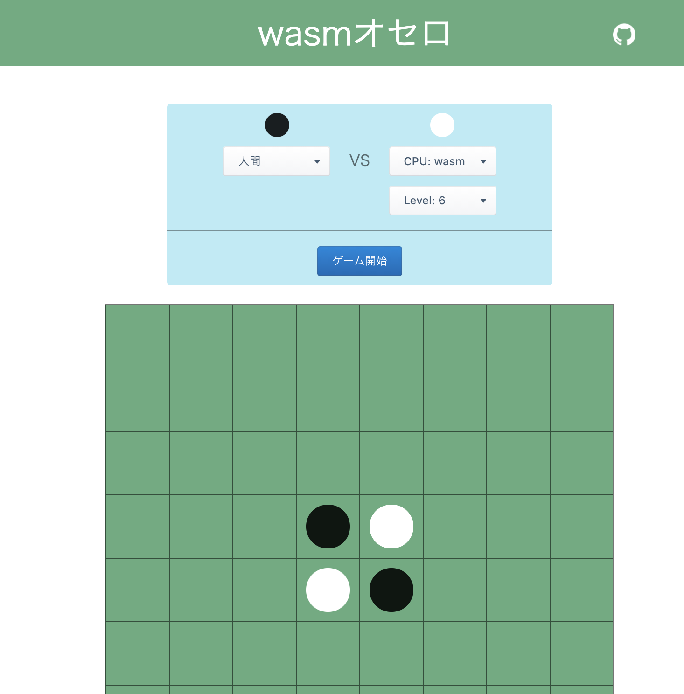
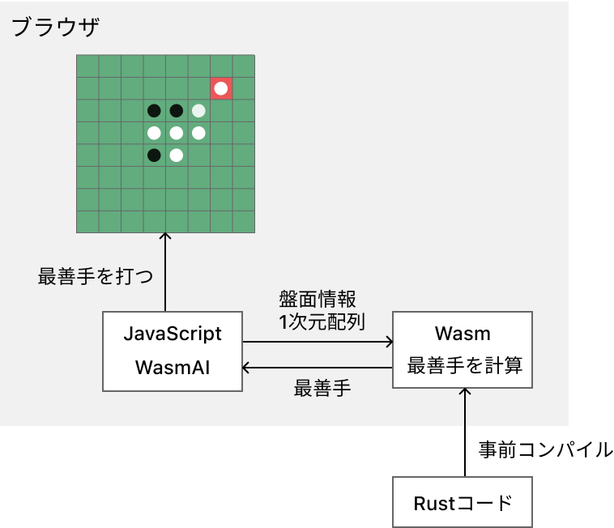
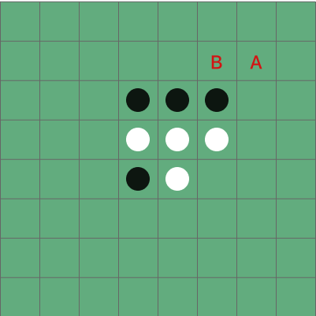
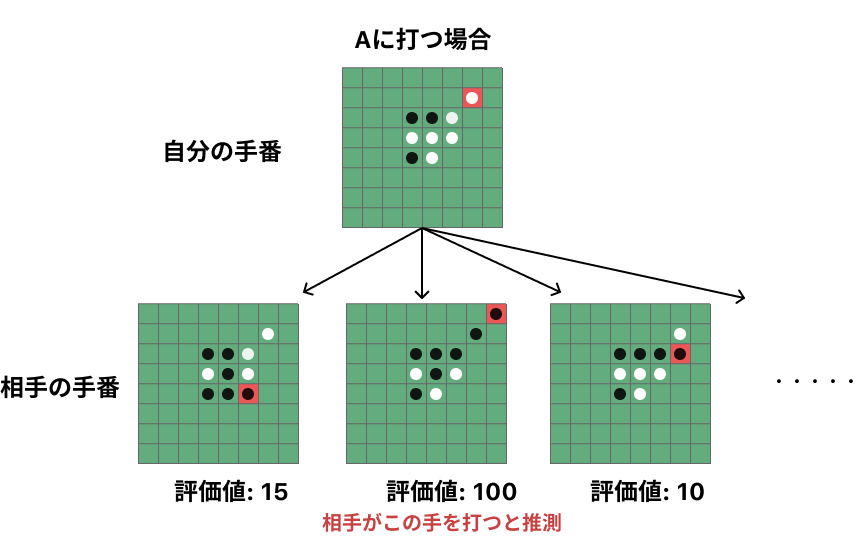
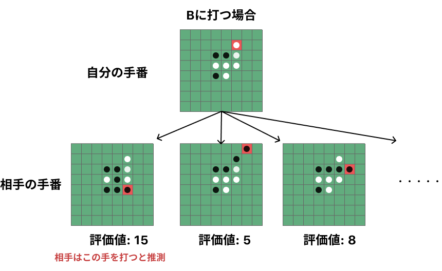
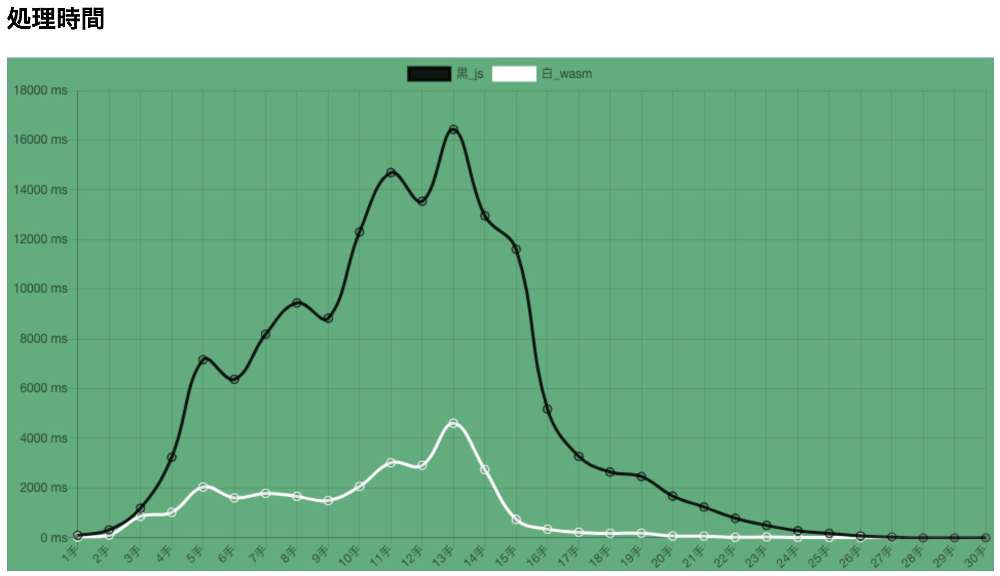

↓のURLからオセロが遊べるので、ぜひ遊んでみてください！  
https://wasm-othello.t-yng.jp/

最上位のレベル6は普通に強いです！CPUのアルゴリズムは自分の普段の思考をベースにしているので、レベル6に勝てない人はリアルで僕とオセロをやっても勝てないレベルです。(多分)

全体のソースコードは [t-yng/wasm-othello](https://github.com/t-yng/wasm-othello) に置いてあります。

この記事は [Hamee Advent Calendar 2020](https://qiita.com/advent-calendar/2020/hamee)の3日目の記事です。

## はじめに

ブラウザでのWebAssemblyの処理速度がJavaScriptと比較してどれだけ向上するのかを体感したく、オセロのCPUをTypeScriptとWebAssemblyで実装して速度比較をしてみました。

WebAssemblyの実装にはRustを利用しています。Rustを選択した理由は自分がRustを書きたかったのが一番の理由ですが、Rustは言語の仕組みとしてガベージコレクションを持たないため、.wasm にコンパイルしたバイナリコードを軽量化できる特徴があります。

## WebAssemblyとは？
> WebAssemblyは、ウェブブラウザのクライアントサイドスクリプトとして動作するプログラミング言語（低水準言語）である。wasmとも称されており、ブラウザ上でバイナリフォーマットの形で実行可能であることを特徴とする。
> 
> [WebAssembly - Wikipedia](https://ja.wikipedia.org/wiki/WebAssembly)

バイナリ形式で実行されるので、JavaScriptと比較してより高速な処理速度が実現できます。RustやC/C++やTypeScriptなどの言語からコンパイルできるため、WebフロントエンドのビジネスロジックをJavaScript以外の言語で記述することができるのも一つの特徴です。

## WebAssemblyを利用した動作イメージ
最善手を探索するビジネスロジック部分をRustで実装・コンパイルして .wasm 形式のバイナリコードを出力します。このファイルをJavaScriptファイルを同じ要領で配信して、ブラウザ上で読み込ます。JavaScriptからwasmのバイナリコードを呼び出すことで、一部のビジネスロジックをWebAssemblyで実行できます。

## ミニマックス法を用いたCPUの実装
ミニマックス法とは、オセロや将棋などのゲームアルゴリズムを実装する時に利用される事の多い探索手法の一つです。評価関数を用いて盤面の評価値を計算して、自分の手番では評価値が最大となり、相手の手番では評価値が最小となる最善手を選択するアルゴリズムです。

例えば、次の盤面での白の打つべき最善手を考えてみます。ここでは、簡略化のためにAとBの2箇所に絞って探索を行い、2手先までを探索してみます。

相手は常に最前手を打つと予測するので、Aを打った場合は最大評価値は100となる位置に石を置いてきます。これに対してBに打った場合は最大評価値は15の位置に石を置いてきます。ここではBに打った方が自分が有利なので、Bを最善手として決定します。

このアルゴリズムではよりN手先を探索する方が精度が上がり最善手の精度が高くなります。しかし、探索の深さが増えるほどに探索範囲が爆発的に増えて計算時間が膨大になるため、ある一定の深さで探索を打ち切るという事をします。逆に言えば、処理速度を向上させればそれだけ探索範囲を深くできるためCPUを強くすることができます。  

今回のオセロではCPUのレベルを探索の深さと合わせてあります。

ミニマックス法は参考となるサイトが沢山あるので、詳細はそちらを参照してください。  
- [ミニマックス法 \- Wikipedia](https://ja.wikipedia.org/wiki/%E3%83%9F%E3%83%8B%E3%83%9E%E3%83%83%E3%82%AF%E3%82%B9%E6%B3%95)
- [web帳 \| 5分で覚えるAI Minimax（ミニマックス）法とalpha\-beta法](https://www.webcyou.com/?p=6997)

実装したオセロのアルゴリズムでは次の評価ルールに基づいて評価関数を実装しました。

- 中盤までは相手の石が多い方が評価値を高くする
- 後半は自分の石が多い方が評価値を高くする
- 自分の石が角にある +500
- 相手の石が角にある - 500
- 自分の石が角の上下にある -30
- 相手の石が角の上下にある +30
- 自分の石が角の斜めにある -100
- 相手の石が角の斜めにある +100

## 速度結果
TypeScript実装とWebAssembly（Rust実装）での処理速度をグラフで可視化してみました。

盤面によっては7~8倍ぐらいの速度差が出ておりWebAssemblyの速度に驚きました。

## さいごに
オセロを実装したのは6月ぐらいだと思っていたのですが、実際は3月頃で想像以上の月日の流れの速さに驚きました。Rustで実装してみると所有権やライフタイムなど自分の知らない新しい概念が出てきて面白かったです。

Rustの所有権については、[Rustの所有権と借用を理解する](https://t-yng.jp/posts/rust-ownership/)でまとめているので、興味があったら読んでみてください。